<!-- generated-by: gsd-doc-writer -->

# RSS Reader

基于 Go + Nuxt 4 的个人 RSS 阅读器，三栏阅读界面，支持 AI 智能增强与主题图谱。

你知道的，我一直想追踪一些事件的蛛丝马迹，比如事件之间的关联、事件的时间线发展（比如伊朗战争）
互联网没有记忆，很多事情会随着时间沉淀在互联网的大海深处，打捞非常困难
但是对于我们现在来说，使用AI去重、整理、打标签、梳理事件链路是一件相对来说有意义、并且有可行性的事情
让垃圾信息见ai去吧！你只需要看结果（ps.此情况只针对广告较多但是还是有真金白银的rss）


## 🎯 语义标签板块（v1.3）

把 RSS 订阅文章自动归类到几个「长期话题板块」里，每个板块每天生成一份叙事简报——就像雇了个编辑，每天帮你盯几个赛道。

> **举例**：你关注金价，新建一个「金价」板块。系统不是靠关键词硬匹配"金价"两个字，而是通过 AI 提取的小标签（黄金、美联储、贵金属、汇率…）在**语义层面**筛选相关文章，每天自动生成一份叙事报告——这个板块今天发生了什么。

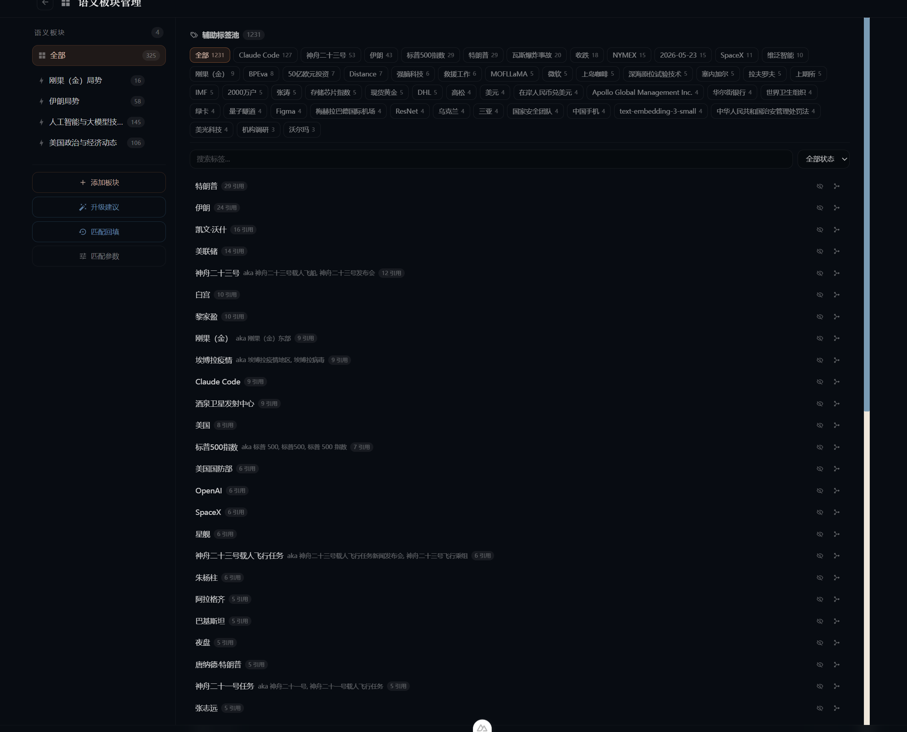

### 1. 手动建板块，即刻生效

知道自己想要什么？直接创建板块，填个名字（比如「中东局势」），系统会根据名称+描述**自动推荐最相关的标签**给你勾选。确认后触发回填，历史文章马上归位。

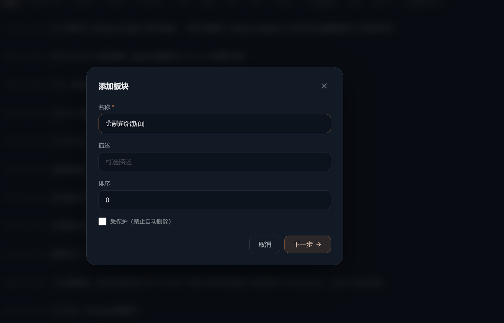
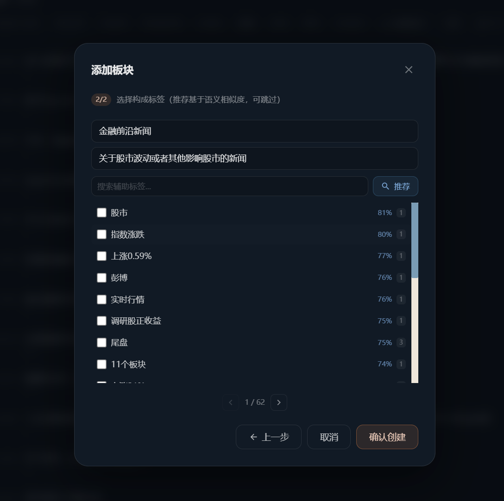

### 2. 板块升级建议 — AI 帮你"长出新板块"

不知道手动加什么？点一下「✨ 升级建议」，大模型会分析你订阅的新闻里哪些话题频繁出现，自动聚类后给出板块创建建议——就像系统在跟你说"你最近看了很多 AI 的内容，要不要建个 AI 板块？"

建议分三种：🟢 创建新板块 / 🔵 合并到已有板块 / ⚪ 跳过（太碎片化不值得）。你挑着确认，不满意的直接跳过。

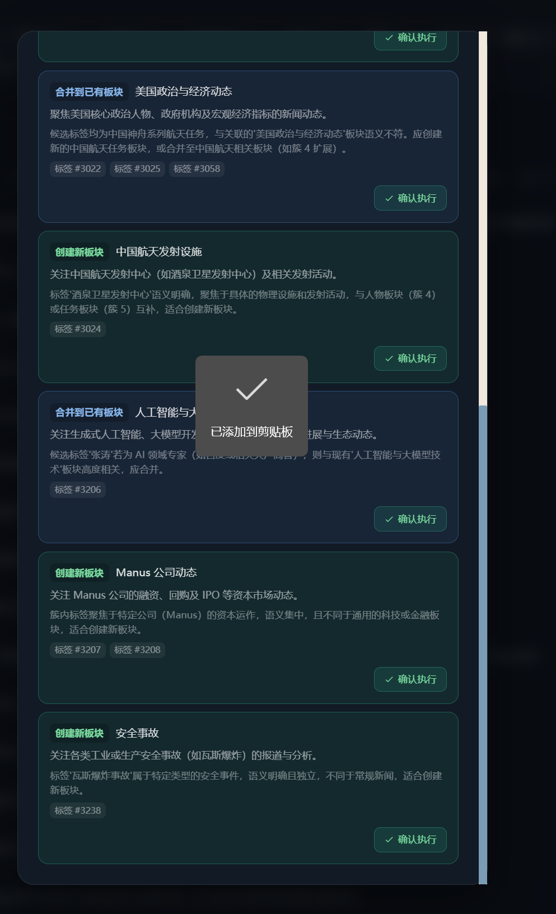

### 3. 智能标签推荐 — 板块不够丰满？

感觉板块内容少、不相关？打开构成标签面板，LLM 按相似度推荐更多相关小标签，你自己勾选哪些要加进来，板块覆盖范围随手调。

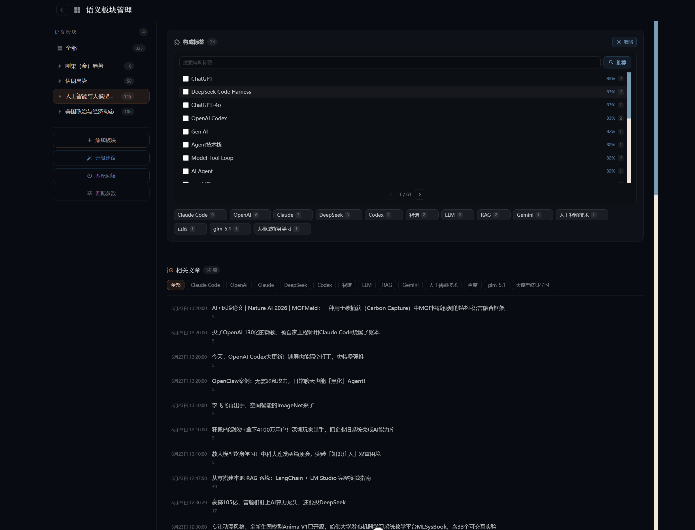
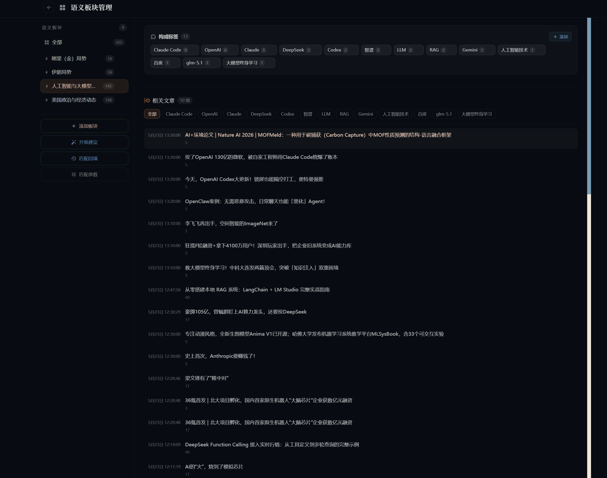

### 4. 每日叙事简报

每个板块每天自动生成一份叙事报告。不是冷冰冰的摘要堆砌，而是连贯的叙述——"这个板块今天发生了什么，有什么趋势"。

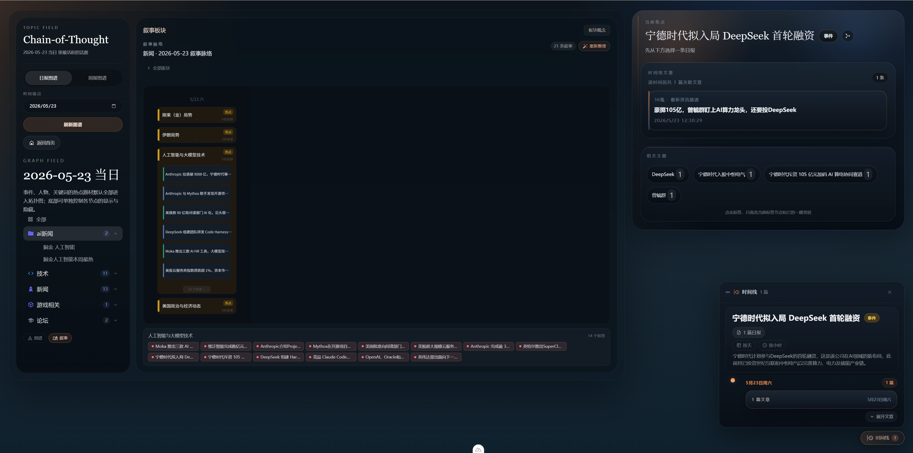

### 🤔 和其他 RSS 阅读器有什么不同？

| 普通 RSS 阅读器 | 本项目的语义标签板块 |
|---|---|
| 关键词硬匹配 → 死板，"苹果"到底是水果还是公司？ | AI 提取语义标签 → 理解上下文 |
| 每天看文章列表 → 信息过载，大海捞针 | 每天看板块简报 → 几个赛道一目了然 |
| LLM 只做单篇总结 → 碎片化，看完就忘 | LLM 按板块生成叙事报告 → 连贯，有脉络 |
| 文章当知识库 → RAG 检索，每次都得提问 | 板块自动追踪 → 坐等推送，持续积累 |

### 🔍 和搜索引擎有什么不同？

| 搜索引擎 | 语义标签板块 |
|---|---|
| 你要**主动提问**才能获取信息 | 系统**主动推送**你关心的话题 |
| 搜索结果是"你搜的那一刻"互联网的样子 | 板块简报是**一段时间内**该话题的发展脉络 |
| 搜"金价" → 一堆网页，质量参差不齐 | 板块「金价」→ 你订阅的优质信源中，AI 筛选+整理 |
| 看完就忘，下次再搜，零积累 | 标签和板块持续演化，越用越聪明 |

## ✨ 更多功能

### 主题图谱
- **图谱可视化**：日/周双视图，事件/人物/关键词三类节点与关联边，支持权重计算与时间窗口切换
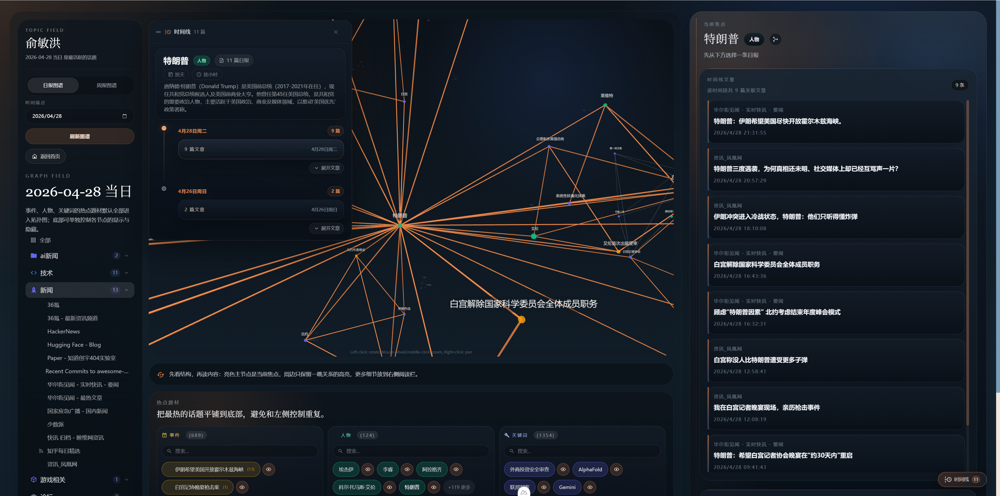
- **AI 主题分析**：按标签类型（事件/人物/关键词）生成 AI 分析，含时间线、人物画像、关键词云等
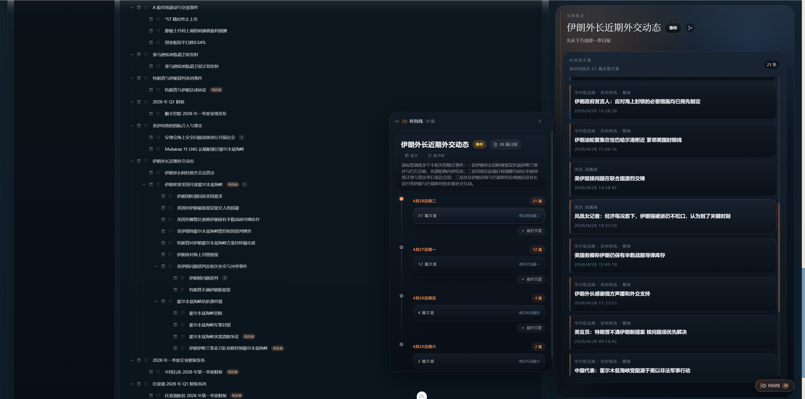
- **叙事线追踪**：主题演变状态（新出现/持续/分裂/合并/结束）与时间线回溯
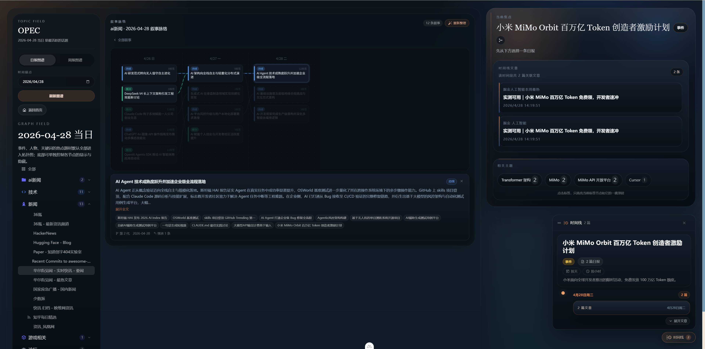


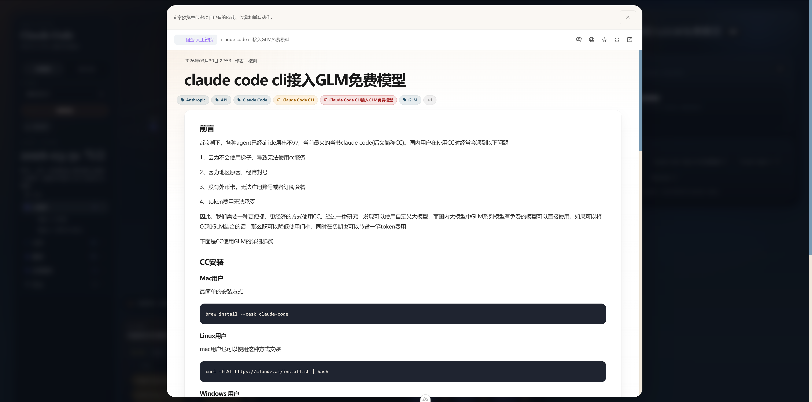

### 📰 订阅管理
- Feed 管理：添加、编辑、删除、手动刷新、全量刷新
- 分类管理：自定义名称、图标、颜色
- OPML 导入导出
- 可配置自动刷新间隔


### 📖 文章阅读
- FeedBro 风格三栏布局
- 收藏、已读标记、全屏阅读
- 预览模式与 iframe 模式切换
- 上一篇/下一篇快速导航


### 🤖 智能增强
- Firecrawl 全文抓取，补全 RSS 摘要内容
- AI 内容整理，生成结构化正文
- 内容源切换：原始内容 / Firecrawl 全文 / AI 整理稿

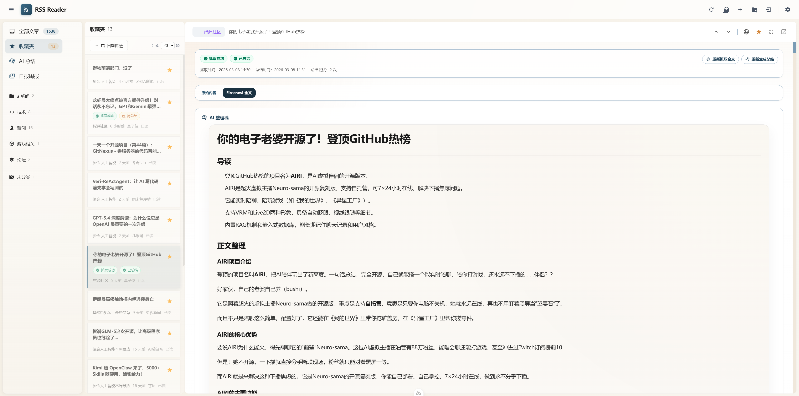

### ⚙️ 全局配置
- **AI Provider 路由**：多模型管理，按能力（总结/正文补全/主题提取/嵌入）分配不同 Provider，支持主备与拖拽排序
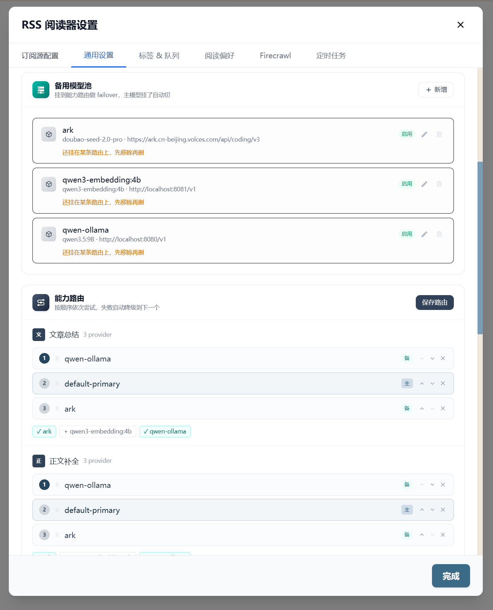
- **Firecrawl 服务**：配置 API 地址、Key、抓取模式、超时与内容长度限制
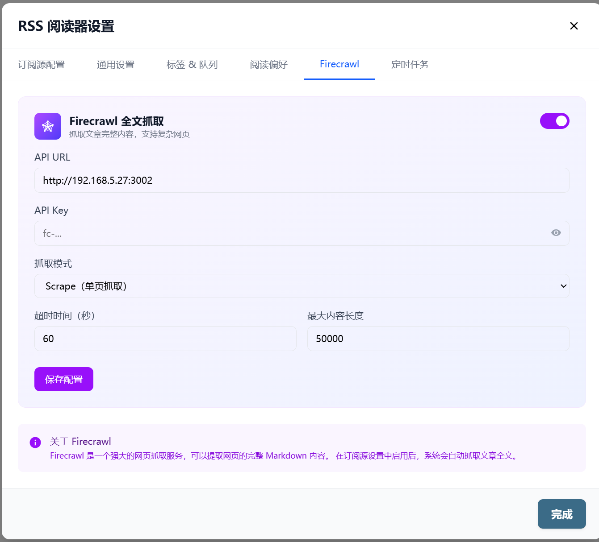
- **调度器监控**：查看 AI 总结、Feed 刷新等定时任务状态，支持手动触发与间隔调整
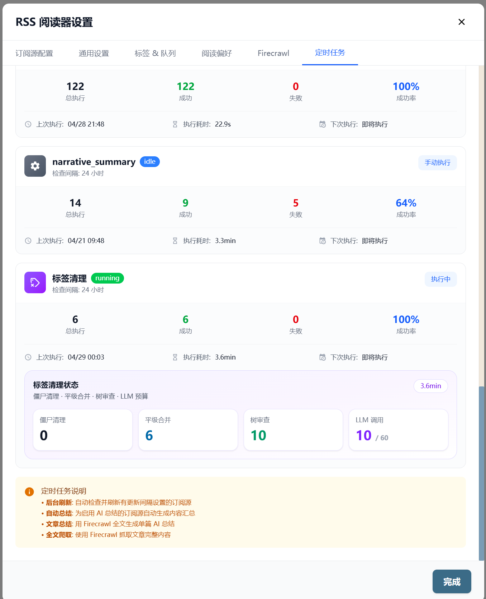
- **队列管理**：实时监控标签打标队列、Embedding 队列的任务状态与失败重试
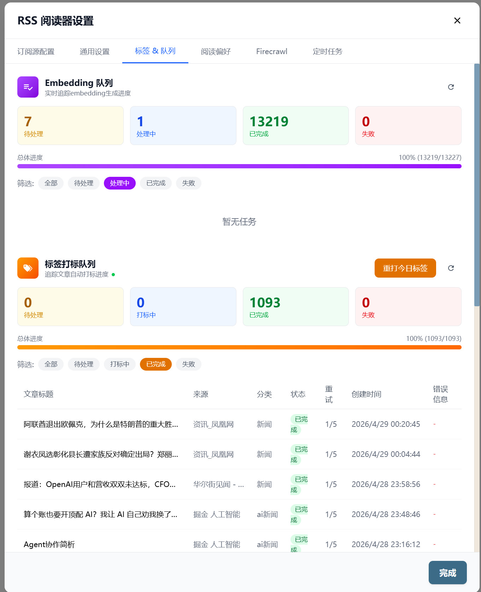
- **Feed 级设置**：单独配置每个订阅源的刷新间隔、最大保留文章数、AI 摘要开关
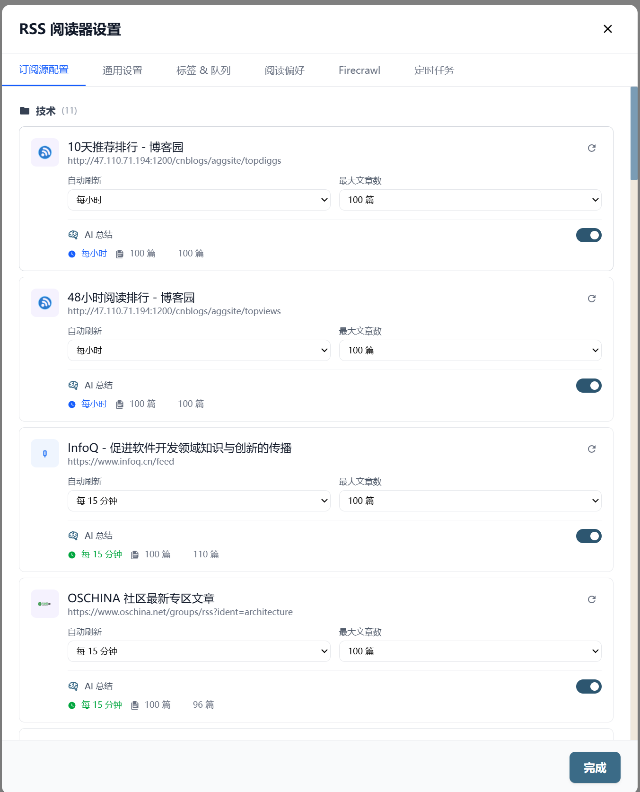

### 📊 阅读偏好
- 自动追踪阅读行为（打开、关闭、滚动、收藏）
- 偏好分数计算，优化排序
- 阅读统计展示
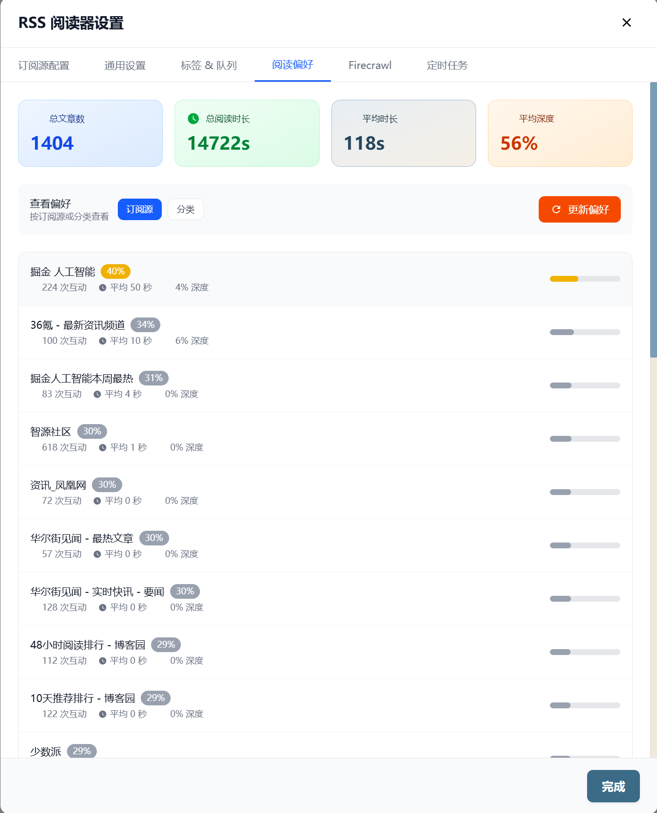

## 🛠 技术栈

| 层级 | 技术 |
|------|------|
| 前端 | Nuxt 4 + Vue 3 + TypeScript + Pinia + Tailwind CSS v4 |
| 后端 | Go + Gin + GORM + Postgres |
| AI | OpenAI 兼容 API |

## 🚀 快速开始

### 前置条件

- [Node.js](https://nodejs.org/) >= 18
- [pnpm](https://pnpm.io/) >= 10
- [Go](https://go.dev/) >= 1.25
- [Docker](https://www.docker.com/)（可选，用于容器化部署）

### Docker Compose（推荐）

得用pg的版本，不要用sqlite的，那个归档用

- 前端默认地址：`http://localhost:3000`
- 后端默认地址：`http://localhost:5000`
- postgres的存储文件位置默认在./data下,
- 如需自定义端口或代理，在 `.env` 中配置 `FRONT_PORT`、`BACKEND_PORT`、`GOPROXY`、`NPM_CONFIG_REGISTRY` 等

```bash
docker compose up -d
```

### 前端

```bash
cd front
pnpm install
pnpm dev
```

前端开发服务器默认运行在 `http://localhost:3000`。

### 后端

```bash
cd backend-go
go mod tidy
go run cmd/server/main.go
```

后端默认运行在 `http://localhost:5000`。

## 📂 项目结构

```
ZanebonoRssReader/
├── front/                    # Nuxt 4 前端（Vue 3 + TypeScript + Pinia）
├── backend-go/               # Go + Gin 后端（GORM + POSTGRES ）
├── docs/                     # 项目文档
├── tests/                    # Python 集成测试
├── docker/                   # Docker 构建配置
├── img/                      # 截图和图片资源
├── data/                     # SQLite 数据库文件（运行时生成）
├── docker-compose.sqlite.yml # Docker Compose（SQLite 模式）
└── docker-compose.yml        # Docker Compose（PostgreSQL + pgvector）
```

## 📚 文档

### 架构
- [项目总览](docs/reference/architecture/overview.md) — 架构与运行关系
- [前端架构](docs/reference/architecture/frontend.md) — Nuxt 4 前端结构
- [后端架构](docs/reference/architecture/backend.md) — Go 后端结构
- [数据流](docs/reference/architecture/data-flow.md) — 数据流转与处理流程

### 操作指南
- [快速上手](docs/getting-started.md) — 环境搭建与首次运行
- [配置说明](docs/reference/configuration.md) — 环境变量与配置项
- [开发指南](docs/reference/development.md) — 本地开发、构建、测试
- [测试指南](docs/reference/testing.md) — 测试框架与运行方式
- [部署指南](docs/reference/deployment.md) — 容器化部署与生产配置

### 功能说明
- [内容处理](docs/reference/content-processing.md) — Firecrawl 与 AI 增强流程
- [主题图谱](docs/v1.2-tag-intelligence/user-guide/topic-graph.md) — 主题图谱功能说明
- [阅读偏好](docs/reference/reading-preferences.md) — 偏好追踪与排序

### API
- [API 参考](docs/reference/api/_index.md) — 后端 API 接口文档
- [主题图谱 API](docs/reference/api/topic-graph.md) — 主题图谱接口说明

## 🤝 贡献

参见 [CONTRIBUTING.md](CONTRIBUTING.md) 了解贡献指南。

## License

[GNU General Public License v3.0](LICENSE)
