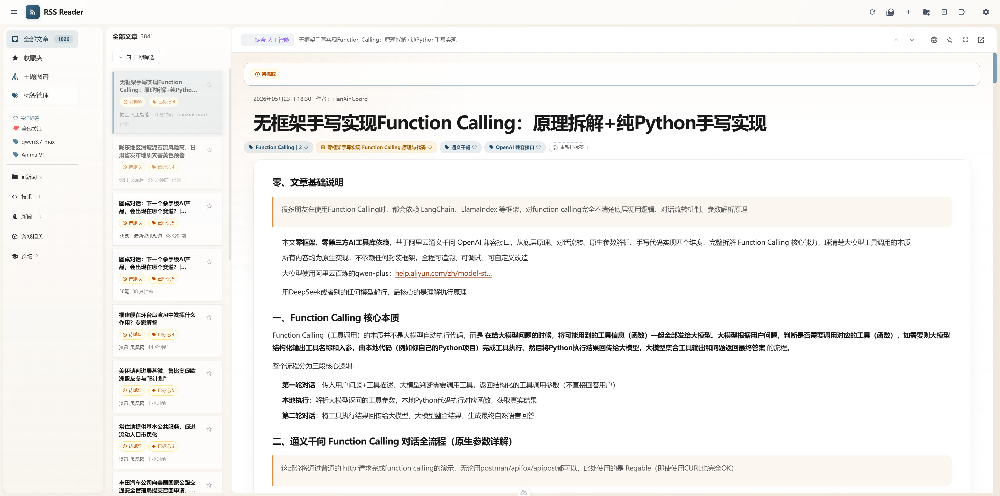
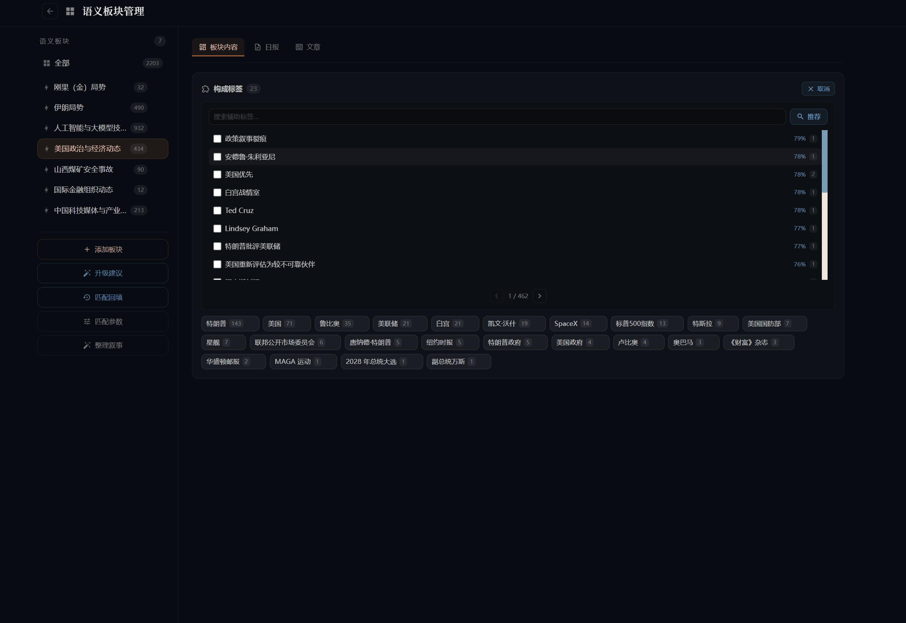
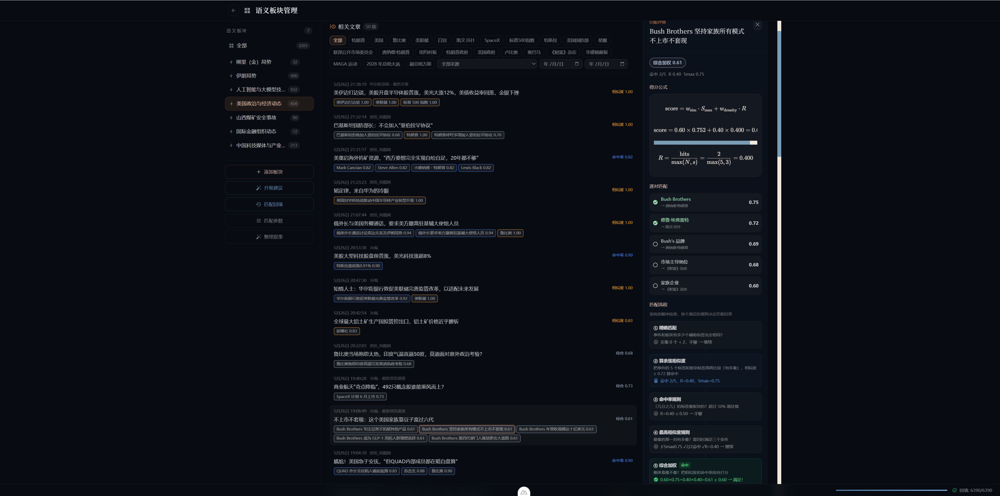
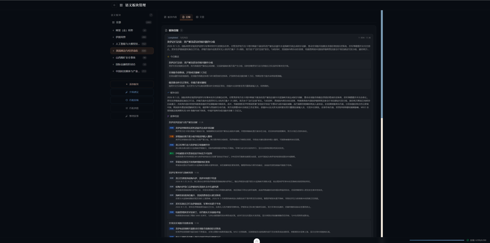
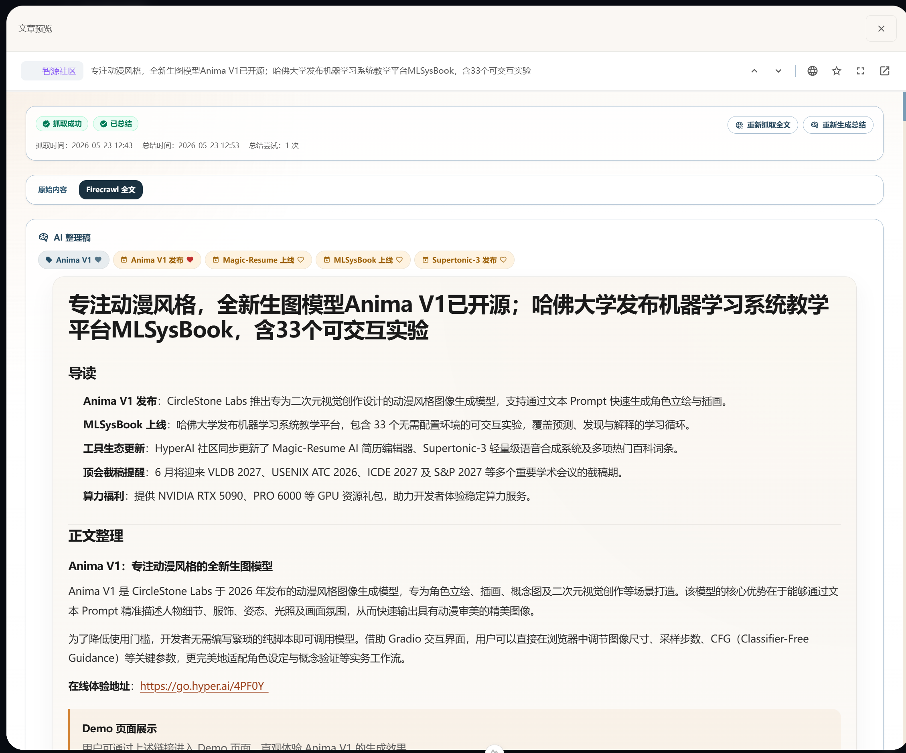

<p align="center"></p>

# Syntopica

*Where feeds become topics*

基于 Go + Nuxt 4 的个人 RSS 阅读器，三栏阅读界面，支持 AI 智能增强与主题图谱。

- 我一直想追踪一些事件的蛛丝马迹，比如事件之间的关联、事件的时间线发展（比如伊朗战争）
- 但是互联网没有记忆，很多事情会随着时间沉淀在互联网的大海深处，打捞非常困难
- 对于我们现在来说，这个时候本地AI的作用就出来了——————
- 让垃圾信息见ai去吧！你只需要看你关心的东西
- ps 因为产品快速迭代，每次更新可能会break changes（字面意思会爆炸）



## 🎯 语义标签板块（v1.3）

把 RSS 订阅文章自动归类到几个「长期话题板块」里，每个板块每天生成一份叙事简报——就像雇了个编辑，每天帮你盯几个赛道。

> **举例**：你关注金价，新建一个「金价」板块。系统不是靠关键词硬匹配"金价"两个字，而是通过 AI 提取的小标签（黄金、美联储、贵金属、汇率…）在**语义层面**筛选相关文章，每天自动生成一份叙事报告——这个板块今天发生了什么。


### 1. 手动建板块，即刻生效

知道自己想要什么？直接创建板块，填个名字（比如「中东局势」），系统会根据名称+描述**自动推荐最相关的标签**给你勾选。确认后触发回填，历史文章马上归位。


### 2. 板块升级建议 — AI 帮你"长出新板块"

不知道手动加什么？点一下「✨ 升级建议」，大模型会分析你订阅的新闻里哪些话题频繁出现，自动聚类后给出板块创建建议——就像系统在跟你说"你最近看了很多 AI 的内容，要不要建个 AI 板块？"

建议分三种：🟢 创建新板块 / 🔵 合并到已有板块 / ⚪ 跳过（太碎片化不值得）。你挑着确认，不满意的直接跳过。


### 3. 智能标签推荐 — 板块不够丰满？

感觉板块内容少、不相关？打开构成标签面板，LLM 按相似度推荐更多相关小标签，你自己勾选哪些要加进来，板块覆盖范围随手调。




### 4. 每日叙事简报

每个板块每天自动生成一份叙事报告。不是冷冰冰的摘要堆砌，而是连贯的叙述——"这个板块今天发生了什么，有什么趋势"。



### 🤔 和其他 RSS 阅读器有什么不同？

| 普通 RSS 阅读器 | 本项目的语义标签板块 |
|---|---|
| 关键词硬匹配 → 死板，"苹果"到底是水果还是公司？ | AI 提取语义标签 → 理解上下文 |
| 每天看文章列表 → 信息过载，大海捞针 | 每天看板块简报 → 几个赛道一目了然 |
| LLM 只做单篇总结 → 碎片化，看完就忘 | LLM 按板块生成叙事报告 → 连贯，有脉络 |
| 文章当知识库 → RAG 检索，每次都得提问 | 板块自动追踪 → 坐等推送，持续积累 |

### 🔍 和搜索引擎有什么不同？

| 搜索引擎 | 语义标签板块 |
|---|---|
| 你要**主动提问**才能获取信息 | 系统**主动推送**你关心的话题 |
| 搜索结果是"你搜的那一刻"互联网的样子 | 板块简报是**一段时间内**该话题的发展脉络 |
| 搜"金价" → 一堆网页，质量参差不齐 | 板块「金价」→ 你订阅的优质信源中，AI 筛选+整理 |
| 看完就忘，下次再搜，零积累 | 标签和板块持续演化，越用越聪明 |

## ✨ 更多功能

### 主题图谱
- **图谱可视化**：日/周双视图，事件/人物/关键词三类节点与关联边，支持权重计算与时间窗口切换

- **特别关注标签**：按标签类型（事件/人物/关键词）支持特别关注，后续可直接筛选仅包含该标签的文章



### 📰 订阅管理
- Feed 管理：添加、编辑、删除、手动刷新、全量刷新
- 分类管理：自定义名称、图标、颜色
- OPML 导入导出
- 可配置自动刷新间隔


### 📖 文章阅读
- FeedBro 风格三栏布局
- 收藏、已读标记、全屏阅读
- 预览模式与 iframe 模式切换
- 上一篇/下一篇快速导航


### 🤖 智能增强
- Firecrawl 全文抓取，补全 RSS 摘要内容
- AI 内容整理，生成结构化正文
- 内容源切换：原始内容 / Firecrawl 全文 / AI 整理稿


### ⚙️ 全局配置
- **AI Provider 路由**：多模型管理，按能力（总结/正文补全/主题提取/嵌入）分配不同 Provider，支持主备与拖拽排序

- **Firecrawl 服务**：配置 API 地址、Key、抓取模式、超时与内容长度限制

- **调度器监控**：查看 AI 总结、Feed 刷新等定时任务状态，支持手动触发与间隔调整

- **队列管理**：实时监控标签打标队列、Embedding 队列的任务状态与失败重试

- **Feed 级设置**：单独配置每个订阅源的刷新间隔、最大保留文章数、AI 摘要开关


### 📊 阅读偏好
- 自动追踪阅读行为（打开、关闭、滚动、收藏）
- 偏好分数计算，优化排序
- 阅读统计展示


## 🛠 技术栈

| 层级 | 技术 |
|------|------|
| 前端 | Nuxt 4 + Vue 3 + TypeScript + Pinia + Tailwind CSS v4 |
| 后端 | Go + Gin + GORM + Postgres |
| AI | OpenAI 兼容 API |

## 🚀 快速开始

### 前置条件

- [Docker](https://www.docker.com/) + Docker Compose

### 一键部署（推荐）

使用 `init.sh` 脚本自动完成环境初始化、容器启动和 AI 服务配置：

```bash
- bash init.sh  （linux用这个）
- init.ps1   （windows用这个）
```

脚本会引导完成以下步骤：

1. **基础服务** — 检查 Docker，收集端口/密码配置，启动 PostgreSQL + Syntopica 容器
2. **AI 服务**（可选）— 配置 AI 连接信息（安装和模型下载参见下方「AI 模型配置指南」）：
   - **Ollama** — 连接本地 Ollama 实例
   - **llama.cpp** — 连接本地 llama.cpp 服务
   - **远程 API** — 使用 OpenAI 兼容的云端 API（如 OpenAI、DeepSeek）
   - **跳过** — 之后通过 Web UI 手动配置
3. **Firecrawl**（可选）— 全文抓取服务：
   - **自部署** — 通过 `docker-compose.firecrawl.yml` 启动本地 Firecrawl 实例
   - **云 API** — 使用 Firecrawl 云服务
   - **跳过** — RSS 摘要模式，不抓取全文

### 手动构建与部署

**1. 交叉编译后端二进制（Linux amd64）**

```bash
cd backend-go
$env:CGO_ENABLED="0"; $env:GOOS="linux"; $env:GOARCH="amd64"; go build -o syntopica ./cmd/server
```

**2. 构建 Docker 镜像并推送**

```bash
docker build -t zanebonoalter/syntopica:latest .
docker push zanebonoalter/syntopica:latest
```

> 镜像构建时会自动编译前端（`pnpm generate`），最终镜像为单容器：Go 后端同时 serve API 和前端静态文件，端口 5000。

**3. 启动服务**

```bash
# 启动核心服务（PostgreSQL + Syntopica）
docker compose up -d

# 可选：启动 Firecrawl 全文抓取服务
docker compose -f docker-compose.firecrawl.yml up -d
# 可选：启动 RssHub 服务 获取rss源
docker compose -f docker-compose.rsshub.yml up -d
```

- 访问地址：`http://localhost:5000`
- PostgreSQL 数据持久化在 `./data/` 目录
- 自定义端口/密码：在 `.env` 中配置 `BACKEND_PORT`、`POSTGRES_PASSWORD` 等

### 本地开发

```bash
# 1. 启动 PostgreSQL（需要 Docker，仅启动数据库）
docker compose -f docker-compose.pg.yml up -d

# 2. 前端
cd front && pnpm install && pnpm dev    # http://localhost:3000

# 3. 后端（需先启动 PostgreSQL）
cd backend-go && go mod tidy && go run cmd/server/main.go  # http://localhost:5000
```

### 配套服务

以下服务均为可选，无需在本地开发阶段提前启动，所有配置均可通过 Web UI 完成。

| 服务 | 本地开发选项 |
|------|-------------|
| **Firecrawl**（全文抓取） | 不启动 → RSS 摘要模式（够用）；或 `docker compose -f docker-compose.firecrawl.yml up -d` 自部署；或配置云 API |
| **LLM**（AI 增强） | 推荐 [llama.cpp](https://github.com/ggml-org/llama.cpp) 本地推理（OpenAI 兼容 API）；或 Ollama；或远程 API（OpenAI / DeepSeek 等）；或不配先用，Web UI 里配 |
| **RSSHub**（RSS 源代理） | 可选，`docker compose -f docker-compose.rsshub.yml up -d`，默认 `http://localhost:1200`。在 Feed 添加页面填入 RSSHub 实例地址即可使用 |

启动后端后访问 `http://localhost:5000` → 设置 → AI Provider 中配置 LLM 端点。例如 llama.cpp 默认地址为 `http://localhost:8080/v1`，选好模型即可使用。

## 🧠 AI 模型配置指南

`init.sh` / `init.ps1` 仅配置 AI 连接信息（IP、端口、模型名），不下载二进制或模型文件。安装和模型下载请参考以下指南。

### Ollama

1. 安装：[ollama.com](https://ollama.com)
2. 拉取模型：
   ```bash
   ollama pull qwen3:8b           # 文本模型
   ollama pull nomic-embed-text   # 嵌入模型
   ```
3. 启动服务：`ollama serve`
4. 因为ollama对json的支持不是强制的，可能导致效果一般，所以不太建议用ollama

### llama.cpp

1. 下载预编译二进制：[GitHub Releases](https://github.com/ggml-org/llama.cpp/releases)
   - Windows + NVIDIA GPU：`llama-*-bin-win-cuda-*.zip`
   - Windows CPU：`llama-*-bin-win-*.zip`
   - macOS：`llama-*-bin-macos-*.zip`
   - Linux：`llama-*-bin-linux-*.zip`
2. 下载模型文件（见下方推荐表），来源：[ModelScope](https://modelscope.cn) / [HuggingFace](https://huggingface.co)
3. 启动文本服务：
   ```bash
   ./llama-server -m model/Qwen3.5-9B-UD-Q6_K_XL.gguf -c 49152 -ngl 999 --cache-type-k q8_0 --cache-type-v q8_0 --flash-attn on --port 8080 --host 0.0.0.0 --jinja --reasoning-format deepseek --chat-template-kwargs '{\"enable_thinking\":false}' -np 2 > $null 2>&1
   ```
4. 启动嵌入服务（新终端）：
   ```bash
   ./llama-server -m model/Qwen3-Embedding-4B-Q6_K.gguf -c 8192 --embeddings --host 0.0.0.0 --pooling mean --port 8081 -ngl 0 > $null 2>&1
   ```
   > `-ngl 99` 表示全部层卸载到 GPU，无 GPU 时去掉此参数。

### VRAM 推荐模型表

| GPU VRAM | 推荐文本模型 | 推荐嵌入模型 |
|----------|-------------|-------------|
| 无 GPU | Qwen3-4B-Q4 (2.5GB) CPU | Qwen3-Emb-0.6B (0.4GB) |
| 4 GB | Qwen3-4B-Q4 (2.5GB) | Qwen3-Emb-0.6B (0.4GB) |
| 6 GB | Qwen3-8B-Q4 (4.9GB) | Qwen3-Emb-0.6B (0.4GB) |
| **8 GB** | **Qwen3-8B-Q4_K_M (4.9GB) ★** | **Qwen3-Emb-4B (3.2GB)** |
| **12 GB** | **Qwen3.5-9B-Q6 (8.0GB) ★** | **Qwen3-Emb-4B (3.2GB)** |
| 16 GB | Qwen3-14B-Q4 (9.0GB) | Qwen3-Emb-4B (3.2GB) |
| 24 GB+ | Qwen3-32B-Q4 (18GB) | Qwen3-Emb-4B (3.2GB) |

> 实际占用受 KV cache 和 context length 影响，以上为模型文件大小。

### Docker 网络说明

当 Syntopica 后端运行在 Docker 容器内时，AI 服务运行在宿主机上。后端需要通过**宿主机 IP**（而非 `localhost`）访问 AI 服务。`init.sh` 会自动检测本机 IP 并作为默认值。

手动配置时请使用宿主机局域网 IP（如 `192.168.x.x`）：
- Ollama：`http://192.168.1.100:11434/v1`
- llama.cpp 文本：`http://192.168.1.100:8080/v1`
- llama.cpp 嵌入：`http://192.168.1.100:8081/v1`

## 📂 项目结构

```
Syntopica/
├── front/                              # Nuxt 4 前端（Vue 3 + TypeScript + Pinia）
├── backend-go/                         # Go + Gin 后端（GORM + PostgreSQL）
├── docs/                               # 项目文档
├── tests/                              # Python 集成测试
├── docker/                             # Docker 构建配置
├── img/                                # 截图和图片资源
├── data/                               # PostgreSQL 数据持久化（运行时生成）
├── init.sh                             # 一键部署初始化脚本
├── docker-compose.yml                  # Docker Compose（PostgreSQL + 前后端）
├── docker-compose.pg.yml               # Docker Compose（仅 PostgreSQL，本地开发用）
├── docker-compose.firecrawl.yml        # Docker Compose（Firecrawl 全文抓取，可选）
└── docker-compose.rsshub.yml           # Docker Compose（RSSHub + Redis + Browserless，可选）
```

## 📚 文档

### 架构
- [项目总览](docs/reference/architecture/overview.md) — 架构与运行关系
- [前端架构](docs/reference/architecture/frontend.md) — Nuxt 4 前端结构
- [后端架构](docs/reference/architecture/backend.md) — Go 后端结构
- [数据流](docs/reference/architecture/data-flow.md) — 数据流转与处理流程

### 操作指南
- [快速上手](docs/getting-started.md) — 环境搭建与首次运行
- [配置说明](docs/reference/configuration.md) — 环境变量与配置项
- [开发指南](docs/reference/development.md) — 本地开发、构建、测试
- [测试指南](docs/reference/testing.md) — 测试框架与运行方式
- [部署指南](docs/reference/deployment.md) — 容器化部署与生产配置

### 功能说明
- [内容处理](docs/reference/content-processing.md) — Firecrawl 与 AI 增强流程
- [主题图谱](docs/v1.2-tag-intelligence/user-guide/topic-graph.md) — 主题图谱功能说明
- [阅读偏好](docs/reference/reading-preferences.md) — 偏好追踪与排序

### API
- [API 参考](docs/reference/api/_index.md) — 后端 API 接口文档
- [主题图谱 API](docs/reference/api/topic-graph.md) — 主题图谱接口说明

## 🤝 贡献

参见 [CONTRIBUTING.md](CONTRIBUTING.md) 了解贡献指南。

## License

[GNU General Public License v3.0](LICENSE)
