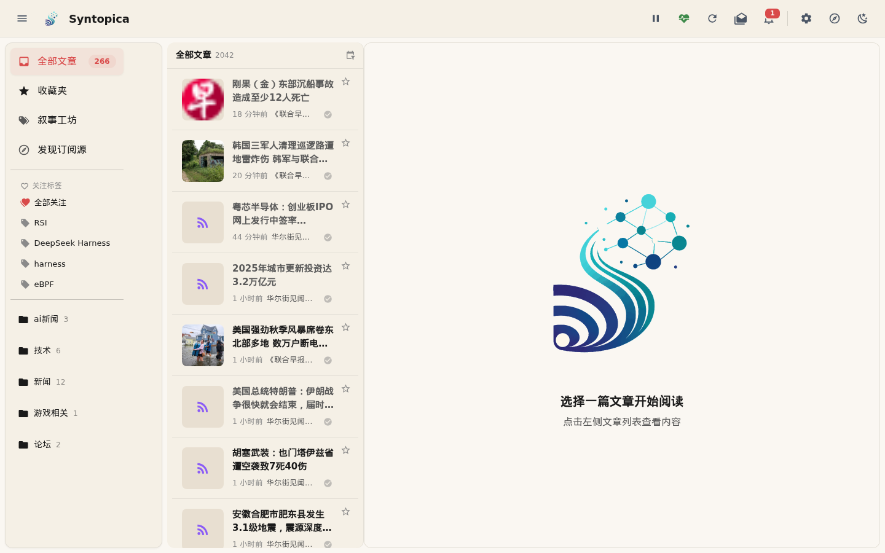
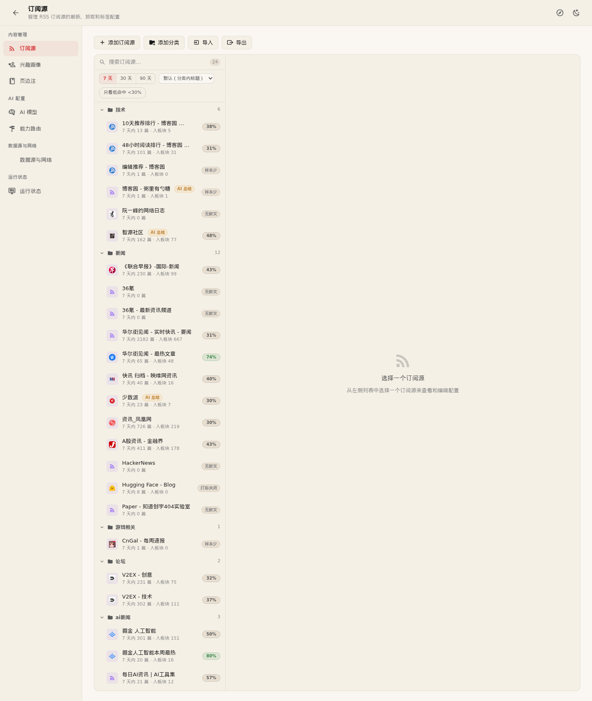
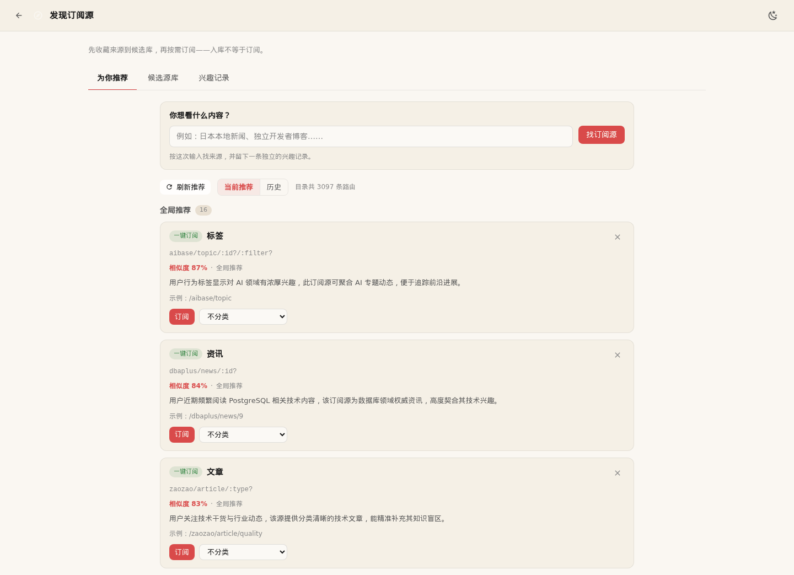
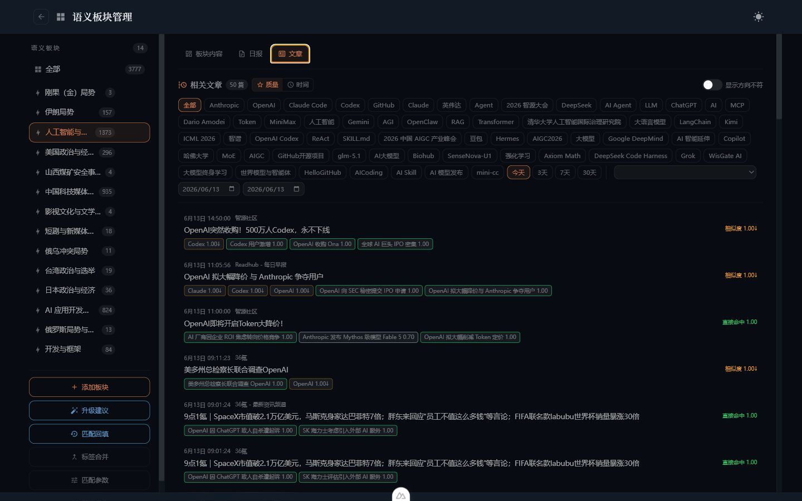
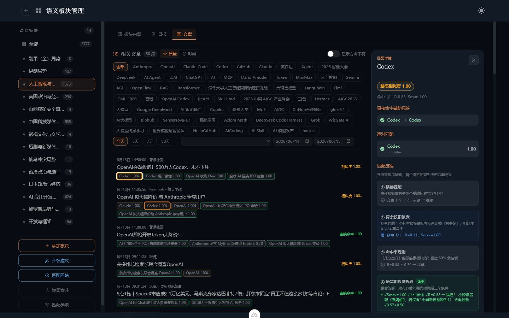
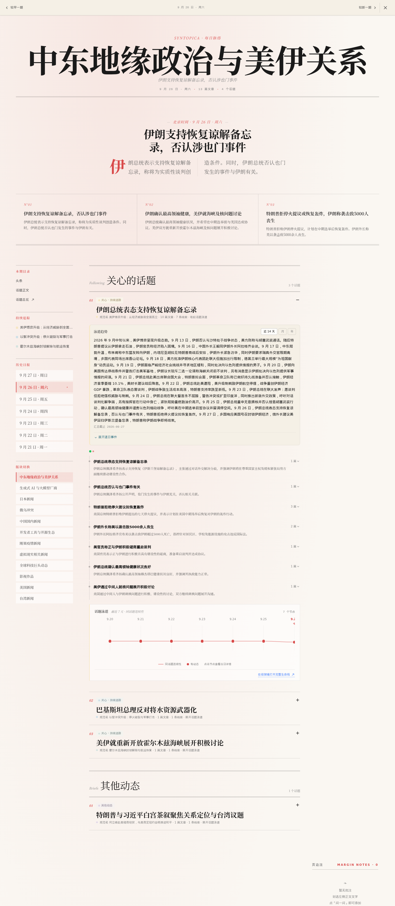
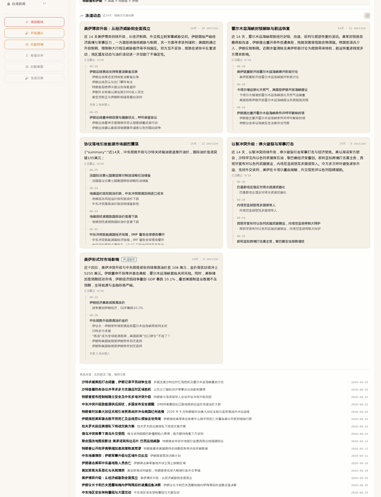
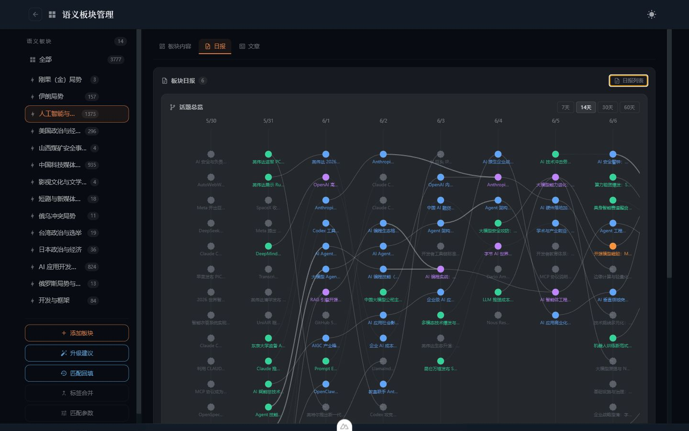
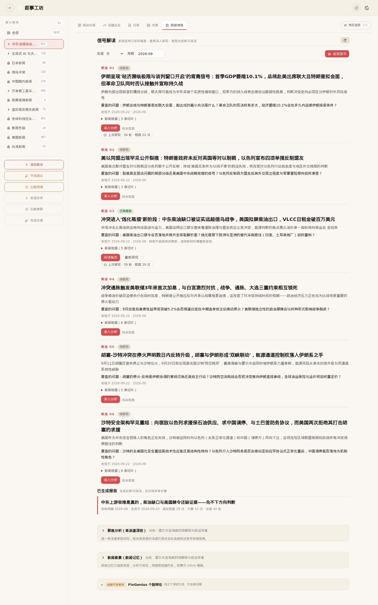
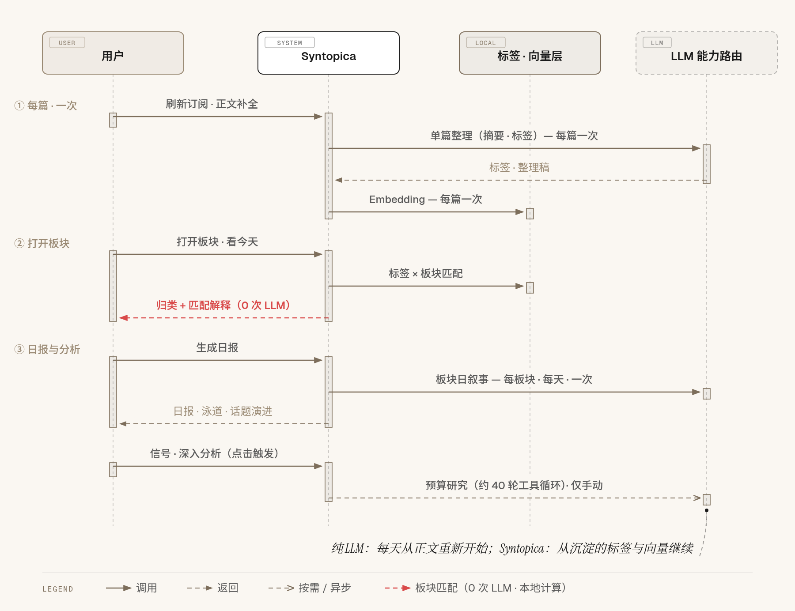

<p align="center">
  
</p>

<h1 align="center">Syntopica</h1>

<p align="center">
  <strong>把分散的信息，整理成可以持续追踪的主题脉络。</strong>
</p>

<p align="center">
  本地优先 · 自选信息源 · 语义板块 · 每日叙事 · 话题演进 · 数据增强
</p>

[Demo演示地址](http://zanebono.top/)

Syntopica 是一个面向个人研究与深度阅读的开源信息工作台。

它从 RSS、RSSHub 和网页等自选信息源持续采集内容，补全正文，生成摘要与语义标签；再把分散的文章归入用户维护的语义板块，形成板块日报、叙事线索、跨日话题演进和主题图谱。

Syntopica 想回答的不是“今天又有多少篇新文章”，而是：

> 我长期关注的领域今天发生了什么？
>
> 哪些内容其实属于同一个事件？
>
> 一个话题是刚刚出现、持续发展，还是正在分化与结束？

<p align="center">
  
</p>
<p align="center">
  
</p>

## 为什么做 Syntopica

信息工具已经很多：RSS 阅读器把不同网站收进一个列表，热点聚合器告诉你大家正在讨论什么，搜索引擎和 RAG 能回答一次查询。但对长期关注一个领域的人，真正耗费精力的是后续工作——同一个事件被不同来源反复报道，同一主题每天换一批关键词，单篇摘要看完即散，未读数字不断增长而注意力并没有变得更有方向。

让 AI 总结一篇文章并不难，难的是把几十篇文章放在一起，判断哪些内容相关、为什么相关、哪些值得形成一个长期板块，并在第二天继续沿着昨天的线索整理。因此 Syntopica 没有把聊天框作为核心界面，而是选择了一个更慢、更可维护的对象：**语义板块**。板块由用户定义边界，AI 负责持续整理，匹配结果保留解释，重要结论可以回到原文复核。

## 一次完整的用户旅程

假设你长期关注 AI Agent、模型基础设施和开发工具。

### 1. 先订阅你信任的信息源

添加、分类、刷新 RSS Feed，或通过 OPML 批量导入。系统内置 readability 进程内抓取作为正文补全主力，Firecrawl 作为可选兜底，可以在每个 Feed 上单独开启。这里的数据边界由用户决定：Syntopica 不追求默认覆盖整个公开网络，而是优先整理你主动选择、愿意长期保留的信息源。

<p align="center">
  
</p>

### 2. 发现新的订阅源（兴趣画像 + RSSHub）

知道自己关注什么，却不一定知道该订哪些源——Syntopica 用你的阅读行为反向推荐。阅读行为（收藏、深读、普通打开）按版块聚合成**兴趣画像**：每个版块一个偏好向量，定期由向量算术重算，不消耗 LLM。

发现页从你接入的 RSSHub 实例同步全量路由目录，向量粗筛 + LLM 精排给出一组带理由的推荐卡片，标注相似度与匹配版块，区分「直订」「需填参数」「未验证」；接受后自动建源，不感兴趣可 dismiss 进入冷却。也可以直接用自然语言提问，模型即时检索匹配源并写回画像。一个明确的边界：路由参数的取值只来自人工录入或官方文档抓取，模型只负责推荐路由，不编造参数值。

<p align="center">
  
</p>

### 3. 语义板块：文章归位，但匹配不是黑盒

系统综合精确标签命中、命中率、最高语义相似度和加权规则，将文章归入板块。刚开始不知道该建哪些板块时，「升级建议」会持续观察标签池与近期共现，把散落标签整理成附证据的候选方案；你也可以直接创建板块并执行历史回填，过去的文章同样归位。

点击文章上的匹配标签，可以看到它为什么进入当前板块：直接命中了哪个辅助标签、相似度是多少、逐对匹配结果如何，以及最终命中了哪条规则。AI 可以帮助组织内容，但用户应当能够看到组织依据，并调整标签和阈值。

<p align="center">
  
</p>
<p align="center">
  
</p>

### 4. 日报与泳道动态

当一天积累了足够内容，Syntopica 会为板块生成日报：先去重和筛选标签，再以持久话题为锚聚类成事件分组，生成今日重点和叙事线索，并按匹配质量区分核心事件、相关事件和其他动态。阅读日报时可以在正文上划选文本落下**页边旁注**，对批注继续追问，把当天的判断留在原文旁边。

板块内容页的**泳道动态**把最近两周各话题的动向排成泳道卡片：每条泳道有滚动窗口的态势快照和按日事件时间线，一眼看出哪条线索在升温、哪条在沉寂。

<p align="center">
  
</p>
<p align="center">
  
</p>

### 5. 话题演进总览

单日总结解决了“今天发生什么”，长期研究还需要知道一个话题如何变化。话题总览把连续多天的叙事分组排列在时间轴上，并根据语义关系连接相邻节点；节点状态区分新兴、持续、分化、合并和结束。点击节点可查看当天的叙事摘要与关联文章。除了系统自动识别的话题，也可以手动新增持久话题，把零散的叙事线索归并到长期主题上。

<p align="center">
  
</p>

### 6. 数据增强：从信号到认知

话题与板块之上，Syntopica 叠加了一层严格隔离的认知处理。主视图是**板块信号解读工作台**：先「发现信号」——系统扫描板块近况，给出值得关注的候选信号列表，此步只保存候选、不消耗研究预算；你对感兴趣的候选逐条点「深入分析」，Agent 才带着预算启动研究，产出带事实层、图表与推演见解的解读报告，附录保留每次数据调用与计算，重要判断可回溯复核。同一工作台还有板块简报、问题调查与跨版块关系发现；对已生成的报告可以多轮追问。

后台始终跑着两个循环：**新闻记忆（自动）**按周、月、年滚动汇总话题新闻，形成客观背景；**分析认知（手动）**随每次分析对比反思、自我修正。两者的隔离是有意为之——分析结论永远不会回写污染新闻记忆。研究数据源已接入 EIA、JODI、WDI、Comtrade 四源（alpha，测试调研用）。

<p align="center">
  
</p>

## 运转方式：LLM 花在哪里

Syntopica 同样需要 LLM 来理解文章——摘要、语义标签、Embedding 都是每篇文章进入时做一次的加工，没有绕开这一步。多出来的这层结构不是目的，而是让后续的组织可以复用：创建或调整板块时，用已有标签和语义匹配把历史文章重新归位；文章为什么进这个板块，可以展开看命中的标签、相似度与规则。板块匹配本身不调用 LLM——标签命中、向量相似度与加权规则在本地算出，每条结果带解释。

LLM 的触点因此收敛在三个位置：单篇整理（每篇一次）、板块日报叙事（每板块每天一次）、信号深入研究（手动点击才触发，带轮数预算）。同一份内容不被反复加工——已有的标签、向量与缓存能复用的就复用，把机器时间留给新内容和确实需要生成的部分。对照「把文章直接交给 AI、每天从零归并事件」的做法：那也完全可行，甚至更省事；差别在于整理结果是否会被后续阅读反复用到——板块持续存在，第二天的话题接得上前一天，调整范围时历史文章能重新归位。

<p align="center">
  
</p>

## 与相邻产品的对比，以及适合谁

| 产品形态 | 更擅长的任务 | 主要组织单位 |
|---|---|---|
| 传统 RSS 阅读器 | 集中订阅、管理未读、按时间阅读 | Feed 与文章 |
| 热点榜单与舆情工具 | 发现正在流行的内容、监控关键词、及时提醒 | 平台热榜与关键词 |
| 搜索 / RAG | 围绕一个明确问题检索和生成回答 | 查询与回答 |
| **Syntopica** | 对自选信息源做长期语义组织，追踪主题如何变化 | 语义板块、日报与叙事线索 |

与 [TrendRadar](https://github.com/sansan0/TrendRadar) 这类热点聚合工具相比：它更适合回答“现在有哪些热点值得立即关注？”，Syntopica 更偏向个人研究工作台，回答“我长期关注的方向最近发生了什么变化？”。两者可以服务同一个用户的不同阶段：前者偏发现和提醒，后者偏整理、阅读、复核与沉淀。

Syntopica 更适合：

- 长期跟踪技术、行业、政策、学术或竞争动态的个人研究者；
- 已经积累较多 RSS 订阅，但不想只靠未读列表管理注意力的人；
- 需要把多来源报道整理为事件线索的开发者、分析者和内容创作者；
- 愿意维护信息源、标签和板块边界，逐步建立个人信息系统的人。

它目前不太适合：

- 只需要开箱即用热榜和手机推送的轻量用户；
- 需要全网分钟级监测、告警和完整舆情覆盖的业务；
- 需要多人协作、权限、租户和企业审计的团队；
- 把 AI 输出直接作为事实结论、而不回看原文的高风险场景。

## 当前边界与不足

Syntopica 仍在持续迭代。下面这些不是隐藏条件：

- **单用户、无认证。** 默认用于本机或可信内网，不应直接暴露到公网。
- **部署成本高于普通阅读器。** PostgreSQL + pgvector 是核心依赖；全文抓取、本地模型和队列会增加资源消耗。
- **冷启动需要内容积累。** 没有足够的文章、标签和 Embedding 时，升级建议与板块日报不会立刻产生高质量结果。
- **AI 管线存在等待时间。** 正文补全、摘要、打标、Embedding、信号研究和日报生成都可能耗时。
- **结果依赖输入和模型。** RSS 完整度、正文抓取质量、模型指令遵循能力与阈值配置都会影响最终结果。
- **语义组织仍可能犯错。** 匹配解释能帮助发现问题，但不能保证所有文章归类和叙事关系都正确；图谱是观察工具，不是事实数据库，重要判断需要回到原文验证。
- **当前更偏 Web 工作台。** 多渠道推送、移动端体验和团队协作不是现阶段专精方向。

## 功能全景

### 订阅与阅读

- Feed 添加、编辑、删除、手动刷新与全量刷新；分类名称、图标与颜色管理；OPML 导入与导出；
- 自动刷新间隔和单 Feed 保留策略；
- 三栏阅读布局、收藏、已读标记和日期筛选；正文预览、原网页 iframe、全屏、上一篇与下一篇；
- 文章超限自动**归档降级而非物理删除**（正文永久保留，日报线索仍可反查）；
- 正文与封面外链图片经同源代理加载（根治图床防盗链 403 图裂，带磁盘缓存）；
- 订阅源来源质量观测：列表「入板块率」+ 详情 7/30/90 天三分解，只读。

### 兴趣画像与订阅源发现

- 按版块聚合阅读行为生成兴趣画像（偏好向量，向量算术重算不消耗 LLM）；
- 从 RSSHub 实例同步全量路由目录与可用性校验；向量粗筛 + LLM 精排的推荐卡片流（直订 / 需填参数 / 未验证）；
- 问答式探索：自然语言提问即时推荐并写回种子画像；候选源库、推荐历史与恢复入口；卡片接受、dismiss 冷却、已订阅去重；
- 路由参数字典：人工录入或文档抓取，模型不编造取值。

### 内容增强

- readability 进程内抓取为正文补全主力，Firecrawl 可选兜底（每 Feed 单独开启）；
- RSS 原始内容、抓取正文与 AI 整理稿切换；
- 单篇摘要与语义标签生成；文章重新抓取、重新总结和重新打标；标签关注与按关注标签筛选文章。

### 语义板块

- 手动创建板块与智能推荐构成标签；
- 从辅助标签池生成冷启动升级建议（附证据与冷却期，高置信合并免模型落地）；
- 历史文章匹配回填；构成标签、辅助标签与组合标签维护；匹配参数、方向不符降级和来源/日期筛选；
- 文章匹配分数、逐对相似度与命中规则解释。

### 日报与话题演进

- 每个板块按日生成叙事报告：今日重点、叙事线索、核心/相关/其他分层；
- 以持久话题为锚的事件聚类；泳道动态视图（态势快照 + 按日事件时间线 + 候选栏）；
- 日报页边旁注：划选落批注、对批注追问、可删除；
- 7/14/30/60 天话题总览；新兴、持续、分化、合并与结束状态；
- 手动新增与维护持久话题。

### 数据增强与认知闭环

- 信号解读报告（主视图，两阶段人工：发现只存候选，逐条点击才启动预算研究）；板块简报与问题调查；跨版块关系发现；报告追问（报告不可变，多轮追问可沉淀笔记）；
- 研究数据源：EIA / JODI / WDI / Comtrade 四源取数（alpha，测试调研用）；
- 循环 A 新闻记忆：按周/月/年滚动汇总话题新闻，形成客观背景；循环 B 分析认知：手动触发，两次分析间对比反思自我修正，分析不回写污染事实。

### AI 与运行管理

- 多 AI Provider 管理；按文章总结、正文补全、主题提取和 Embedding 等能力配置路由；
- 主模型、备用模型、优先级和失败降级；Embedding 模型与语义匹配阈值；
- 标签、Embedding 等任务队列监控；Feed 刷新、正文补全、日报等定时任务；
- Firecrawl 地址、Key、抓取模式与内容限制；全局出站代理；
- OpenTelemetry 自动埋点与可观测性（DB、出站 HTTP、方法级 span）。

## 快速开始

### 前置条件

- Docker 与 Docker Compose；本地开发需要 Go、Node.js、Corepack 和 `pnpm`；
- 可选：OpenAI 兼容 API、Ollama 或 llama.cpp；Firecrawl（网页正文抓取）；RSSHub（扩展订阅源）。

### 初始化脚本

初始化脚本会引导完成基础服务、AI Provider 和可选 Firecrawl 配置。

Windows：

```powershell
.\deploy\init.ps1
```

Linux：

```bash
bash deploy/init.sh
```

启动后访问 `http://localhost:5100`。

### Docker Compose

```bash
# PostgreSQL + Syntopica（在仓库根执行）
docker compose --project-directory . -f deploy/compose/docker-compose.yml up -d

# 可选：Firecrawl 全文抓取
docker compose --project-directory . -f deploy/compose/docker-compose.firecrawl.yml up -d

# 可选：RSSHub + Redis + Browserless
docker compose --project-directory . -f deploy/compose/docker-compose.rsshub.yml up -d
```

PostgreSQL 数据默认持久化在 `./data/`。端口和数据库密码可通过 `.env` 调整（应用端口默认 `${PORT:-5100}`）。

### Go 单进程同域（本地日常形态）

除 Docker 外，还支持**Go 单进程同域**部署：后端在 `:5100` 同时托管前端静态产物、API、WebSocket 与 feed 图标，浏览器只面对一个 origin，无需跨域配置。前端改动后一条命令重建：

```bash
bash scripts/dev/deploy-frontend.sh   # 构建静态产物 → 铺 backend-go/frontend/ → 重启后端
```

### 本地开发

```bash
# 1. 启动 PostgreSQL + pgvector
docker compose -f docker-compose.pg.yml up -d

# 2. 启动 Go 后端
cd backend-go && go run cmd/server/main.go

# 3. 新终端启动 Nuxt 前端
cd front && pnpm install && pnpm dev
```

- 前端开发地址：`http://localhost:3000`
- 后端 API：`http://localhost:5100/api`
- WebSocket：`ws://localhost:5100/ws`

## AI 模型配置

模型、API Key、Embedding、能力路由和备用 Provider 都可以在 Web UI 中配置，不需要写入前端配置文件。

### 可选方案

| 方案 | 适合场景 | 说明 |
|---|---|---|
| OpenAI Compatible API | 希望快速使用云模型 | 可连接 OpenAI、DeepSeek 等兼容接口 |
| llama.cpp | 本地部署、希望更强控制力 | OpenAI 兼容接口，文本与 Embedding 可分开部署 |
| Ollama | 本地模型快速试用 | 配置简单，但部分模型的结构化 JSON 遵循能力可能影响效果 |
| 暂不配置 | 先体验基础阅读 | AI 增强、语义板块和日报能力会受限 |

### Ollama 示例

```bash
ollama pull qwen3:8b
ollama pull nomic-embed-text
ollama serve
```

llama.cpp 的完整命令行示例（文本 / Embedding 服务）与 GPU 显存参考表见 [部署指南 · 本地 AI 推理](docs/reference/deployment.md#本地-ai-推理llamacpp)。

## 技术架构

- **Frontend:** Nuxt 4、Vue 3、TypeScript、Pinia、Tailwind CSS v4
- **Backend:** Go、Gin、GORM
- **Storage:** PostgreSQL、pgvector
- **Optional services:** Redis、Firecrawl、RSSHub、Browserless
- **Realtime:** WebSocket
- **AI integration:** OpenAI Compatible、Ollama、llama.cpp、按能力路由和主备降级
- **Observability:** OpenTelemetry（自动埋点 DB / 出站 HTTP / 方法级 span，ParentBased 采样）

```text
Syntopica/
├── front/                              # Nuxt 4 前端
├── backend-go/                         # Go + Gin 后端
├── docs/reference/                     # 当前架构、API、数据库和开发文档
├── docs/v1.x/                          # 版本设计与里程碑记录
├── docs/experience/                    # 产品体验与演示材料
├── tests/workflow/                     # 工作流集成测试
├── tests/firecrawl/                    # Firecrawl 集成测试
├── docker/                             # Docker 构建配置
├── deploy/                             # 部署制品（compose / docker / init 脚本）
├── scripts/                            # dev/harness/deploy/db 脚本
├── img/                                # README 图片
└── docker-compose.pg.yml               # 本地开发 PostgreSQL（留在根目录）
```

## 文档

- [架构与业务域地图](docs/reference/architecture/map.md)
- [业务流程文档（flow/）](docs/reference/flow/)
- [部署指南](docs/reference/deployment.md)（含 llama.cpp 本地推理与显存参考）
- [配置说明](docs/reference/configuration.md)
- [API 索引](docs/reference/api/_index.md) · [数据库文档](docs/reference/database/_index.md)
- [代码规范（standard/）](docs/reference/standard/)

## 贡献

欢迎通过 Issue 描述真实使用场景、信息源兼容问题、错误归类或可复现缺陷。提交代码前请阅读根目录以及 `front/`、`backend-go/` 下的 `AGENTS.md`，并保持改动范围聚焦。

## License

[GNU General Public License v3.0](LICENSE)
