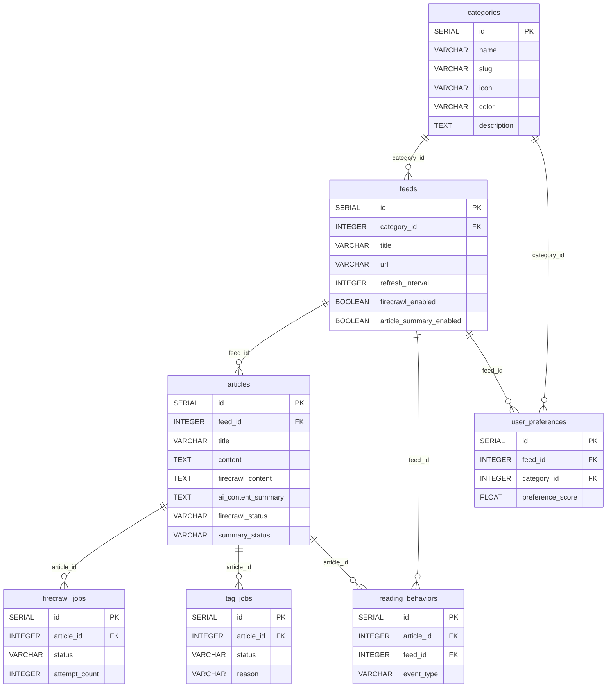
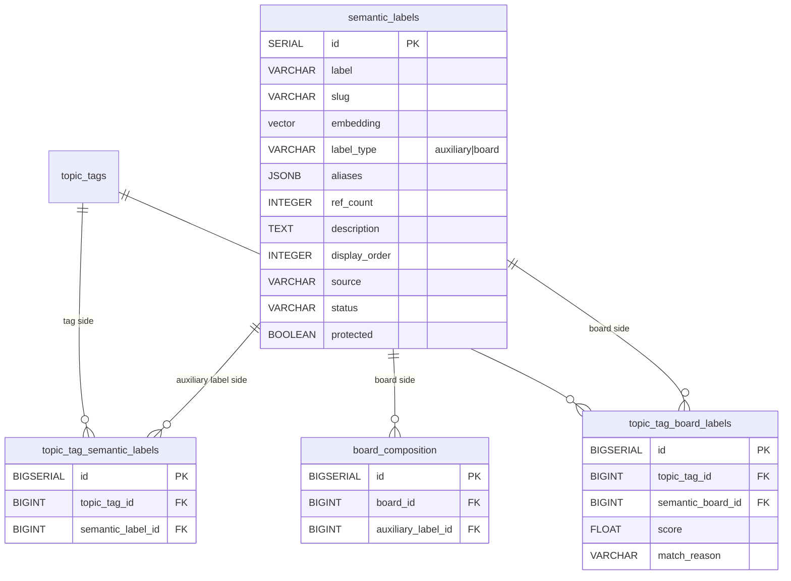
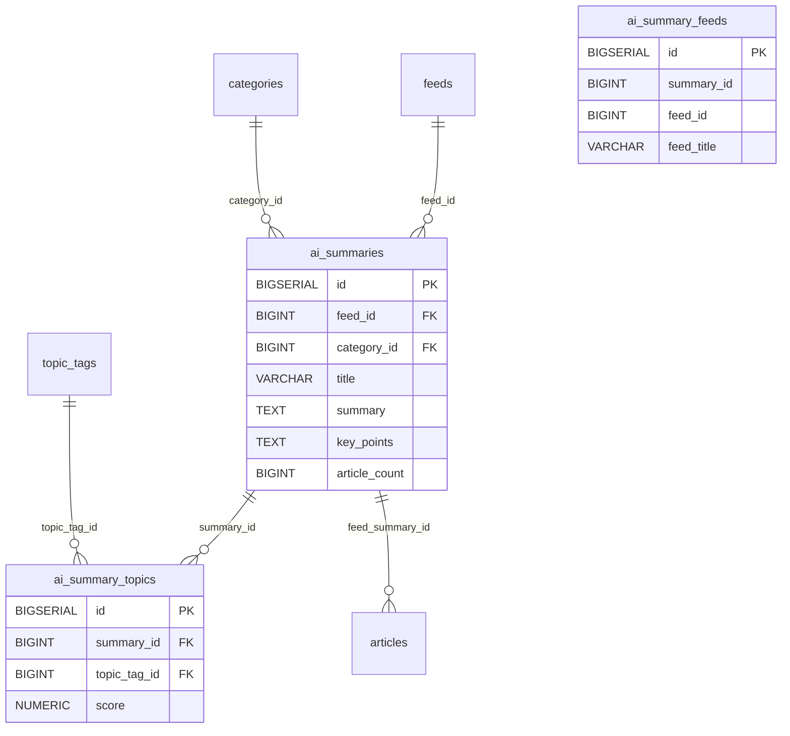
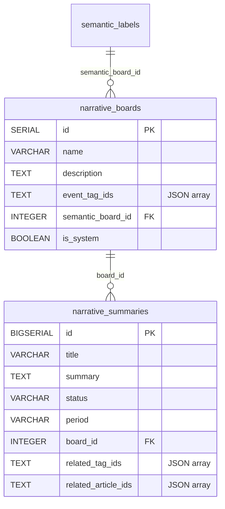

# 全局实体关系图

本文档提供 Syntopica 数据库的全局实体关系图，覆盖 35 张表、30 条 FK 约束，按 5 个业务域组织。

> 域级 ER 图使用 Mermaid `erDiagram` 语法，渲染依赖 GitHub/VSCode Mermaid 插件。全局概览图使用纯 ASCII 作为 fallback。

---

## 全局域级概览

```
┌─────────────────┐       ┌─────────────────────┐
│     Core        │       │    Topic Tags        │
│  ┌───────────┐  │  FK   │  ┌─────────────────┐ │
│  │ categories│──┼───────┼─→│   topic_tags     │ │  ← 10 incoming FKs (hub)
│  ├───────────┤  │       │  ├─────────────────┤ │
│  │   feeds   │  │       │  │ topic_tag_       │ │
│  ├───────────┤  │       │  │   embeddings     │ │
│  │ articles  │  │       │  ├─────────────────┤ │
│  ├───────────┤  │       │  │ article_topic_   │ │
│  │ reading_  │  │       │  │   tags           │ │
│  │  behaviors│  │       │  ├─────────────────┤ │
│  ├───────────┤  │       │  │ embedding_queues │ │
│  │ user_     │  │       │  ├─────────────────┤ │
│  │ preferences│ │       │  │ merge_reembedding│ │
│  ├───────────┤  │       │  │   _queues        │ │
│  │ firecrawl_│  │       │  ├─────────────────┤ │
│  │   jobs    │  │       │  │ topic_tag_       │ │
│  ├───────────┤  │       │  │   analyses       │ │
│  │ tag_jobs  │  │       │  ├─────────────────┤ │
│  ├───────────┤  │       │  │ topic_analysis_  │ │
│  │ schema_   │  │       │  │   cursors        │ │
│  │ migrations│  │       │  ├─────────────────┤ │
│  └───────────┘  │       │  │ topic_analysis_  │ │
└─────────────────┘       │  │   jobs           │ │
                          │  ├─────────────────┤ │
                          │  │ topic_tag_       │ │
                          │  │   semantic_       │ │
                          │  │   labels         │ │
                          │  ├─────────────────┤ │
                          │  │ topic_tag_board_ │ │
                          │  │   labels         │ │
                          │  └─────────────────┘ │
                          └─────────────────────┘

┌─────────────────┐       ┌─────────────────────┐       ┌─────────────────┐
│  AI Summaries   │       │  Semantic Label     │  FK   │   Narrative     │
│  ┌───────────┐  │  FK   │  ┌─────────────────┐ │───────┼─→│ narrative_     │
│  │ai_summaries│ │───→───┼──│ semantic_labels  │ │       │  │  boards        │
│  ├───────────┤  │ topic │  ├─────────────────┤ │       │  ├───────────────┤ │
│  │ai_summary_ │ │  tags │  │ board_           │ │       │  │ narrative_     │
│  │  feeds     │ │       │  │   composition    │ │       │  │  summaries    │
│  ├───────────┤  │       │  └────────┬──────────┘ │       │  └───────────────┘ │
│  │ai_summary_ │ │       └───────────┼────────────┘       └─────────────────┘
│  │  topics    │─┼───→───┼───────────┘
│  └───────────┘  │       │
└─────────────────┘       │

┌─────────────────┐
│ AI Infrastructure│
│  ┌───────────┐  │
│  │ai_providers│ │
│  ├───────────┤  │
│  │ ai_routes │ │
│  ├───────────┤  │
│  │ai_route_  │  │
│  │ providers │ │
│  ├───────────┤  │
│  │ai_call_   │  │
│  │  logs     │  │
│  ├───────────┤  │
│  │ai_settings│  │
│  ├───────────┤  │
│  │scheduler_ │  │
│  │  tasks    │  │
│  ├───────────┤  │
│  │otel_spans │ │
│  └───────────┘  │
└─────────────────┘
```

- 实线箭头 → 表示 FK 引用（源域引用目标域的表）
- `semantic_labels` 是语义标签中心表，辅助标签和 SemanticBoard 共存于此表
- `topic_tags` 通过 `topic_tag_semantic_labels` 和 `topic_tag_board_labels` 两张桥接表与 `semantic_labels` 关联
- `narrative_boards` 通过 `semantic_board_id` 直接引用 `semantic_labels`

---

## 域级 ER 图

### Core（核心数据面）



### Topic Tags（主题标签面）

```mermaid
erDiagram
    topic_tags ||--o{ topic_tag_embeddings : "topic_tag_id"
    topic_tags ||--o{ article_topic_tags : "topic_tag_id"
    topic_tags ||--o{ embedding_queues : "tag_id"
    topic_tags ||--o{ merge_reembedding_queues : "source_tag_id"
    topic_tags ||--o{ merge_reembedding_queues : "target_tag_id"
    topic_tags ||--o{ topic_tag_analyses : "topic_tag_id"
    topic_tags ||--o{ topic_analysis_cursors : "topic_tag_id"
    topic_tags ||--o{ topic_analysis_jobs : "topic_tag_id"
    topic_tags ||--o{ topic_tag_semantic_labels : "topic_tag_id"
    topic_tags ||--o{ topic_tag_board_labels : "topic_tag_id"
    articles ||--o{ article_topic_tags : "article_id"

    topic_tags {
        SERIAL id PK
        VARCHAR slug
        VARCHAR label
        VARCHAR category
        VARCHAR status
    }
    topic_tag_embeddings {
        SERIAL id PK
        INTEGER topic_tag_id FK
        vector embedding
        INTEGER dimension
        VARCHAR model
    }
    article_topic_tags {
        SERIAL id PK
        INTEGER article_id FK
        INTEGER topic_tag_id FK
        FLOAT score
    }
    embedding_queues {
        BIGSERIAL id PK
        BIGINT tag_id FK
        VARCHAR status
    }
    merge_reembedding_queues {
        BIGSERIAL id PK
        BIGINT source_tag_id FK
        BIGINT target_tag_id FK
        VARCHAR status
    }
    topic_tag_analyses {
        BIGSERIAL id PK
        BIGINT topic_tag_id FK
        VARCHAR analysis_type
        VARCHAR window_type
    }
    topic_analysis_cursors {
        BIGSERIAL id PK
        BIGINT topic_tag_id FK
        BIGINT last_summary_id
    }
    topic_analysis_jobs {
        VARCHAR id PK
        BIGINT topic_tag_id FK
        VARCHAR status
    }
    topic_tag_semantic_labels {
        BIGSERIAL id PK
        BIGINT topic_tag_id FK
        BIGINT semantic_label_id FK
    }
    topic_tag_board_labels {
        BIGSERIAL id PK
        BIGINT topic_tag_id FK
        BIGINT semantic_board_id FK
        FLOAT score
        VARCHAR match_reason
    }
```



### Semantic Label（语义标签面）



### AI Summaries（AI 摘要面）



### Narrative（叙事摘要面）



### AI Infrastructure（AI 基础设施）


---

## FK 引用矩阵

| source_table | fk_column | target_table | target_column | constraint_name |
|---|---|---|---|---|
| `feeds` | `category_id` | `categories` | `id` | `fk_categories_feeds` |
| `articles` | `feed_id` | `feeds` | `id` | `fk_feeds_articles` |
| `articles` | `feed_summary_id` | `ai_summaries` | `id` | `articles_feed_summary_id_fkey` |
| `ai_summaries` | `category_id` | `categories` | `id` | `fk_ai_summaries_category` |
| `ai_summaries` | `feed_id` | `feeds` | `id` | `fk_ai_summaries_feed` |
| `ai_summary_topics` | `summary_id` | `ai_summaries` | `id` | `fk_ai_summaries_summary_topics` |
| `ai_summary_topics` | `topic_tag_id` | `topic_tags` | `id` | `fk_ai_summary_topics_topic_tag` |
| `article_topic_tags` | `article_id` | `articles` | `id` | `fk_article_topic_tags_article` |
| `article_topic_tags` | `topic_tag_id` | `topic_tags` | `id` | `fk_article_topic_tags_topic_tag` |
| `topic_tag_embeddings` | `topic_tag_id` | `topic_tags` | `id` | `fk_topic_tags_embedding` |
| `ai_route_providers` | `route_id` | `ai_routes` | `id` | `fk_ai_routes_route_providers` |
| `ai_route_providers` | `provider_id` | `ai_providers` | `id` | `fk_ai_route_providers_provider` |
| `reading_behaviors` | `article_id` | `articles` | `id` | `fk_reading_behaviors_article` |
| `reading_behaviors` | `feed_id` | `feeds` | `id` | `fk_reading_behaviors_feed` |
| `user_preferences` | `feed_id` | `feeds` | `id` | `fk_user_preferences_feed` |
| `user_preferences` | `category_id` | `categories` | `id` | `fk_user_preferences_category` |
| `firecrawl_jobs` | `article_id` | `articles` | `id` | `fk_firecrawl_jobs_article` |
| `tag_jobs` | `article_id` | `articles` | `id` | `fk_tag_jobs_article` |
| `embedding_queues` | `tag_id` | `topic_tags` | `id` | `embedding_queue_tag_id_fkey` |
| `merge_reembedding_queues` | `source_tag_id` | `topic_tags` | `id` | `merge_reembedding_queues_source_tag_id_fkey` |
| `merge_reembedding_queues` | `target_tag_id` | `topic_tags` | `id` | `merge_reembedding_queues_target_tag_id_fkey` |
| `narrative_summaries` | `board_id` | `narrative_boards` | `id` | `fk_narrative_summaries_board` |
| `narrative_boards` | `semantic_board_id` | `semantic_labels` | `id` | `fk_narrative_boards_semantic_board` |
| `topic_tag_semantic_labels` | `topic_tag_id` | `topic_tags` | `id` | `fk_tag_semantic_label_tag` |
| `topic_tag_semantic_labels` | `semantic_label_id` | `semantic_labels` | `id` | `fk_tag_semantic_label_label` |
| `topic_tag_board_labels` | `topic_tag_id` | `topic_tags` | `id` | `fk_tag_board_label_tag` |
| `topic_tag_board_labels` | `semantic_board_id` | `semantic_labels` | `id` | `fk_tag_board_label_board` |
| `board_composition` | `board_id` | `semantic_labels` | `id` | `fk_board_comp_board` |
| `board_composition` | `auxiliary_label_id` | `semantic_labels` | `id` | `fk_board_comp_aux` |

---

## 关系模式说明

### 桥接表（Many-to-Many）

- **`article_topic_tags`**：连接 `articles` ↔ `topic_tags`，桥接表 + 关联评分
- **`ai_summary_topics`**：连接 `ai_summaries` ↔ `topic_tags`
- **`ai_summary_feeds`**：连接 `ai_summaries` ↔ `feeds`（含快照字段）
- **`ai_route_providers`**：连接 `ai_routes` ↔ `ai_providers`，附带优先级
- **`topic_tag_semantic_labels`**：连接 `topic_tags` ↔ `semantic_labels`（auxiliary），tag 与辅助标签多对多
- **`topic_tag_board_labels`**：连接 `topic_tags` ↔ `semantic_labels`（board），tag 与 SemanticBoard 多对多，含 score 和 match_reason
- **`board_composition`**：连接 `semantic_labels`（board）↔ `semantic_labels`（auxiliary），SemanticBoard 的构成标签

### 自引用（Self-Referential FK）

- **`semantic_labels`**：辅助标签和 SemanticBoard 共存于同一张表，通过 `label_type` 区分

### 反规范化（Denormalized）

- **`ai_call_logs`**：存储 `route_name` 和 `provider_name`（冗余）以保留调用时的上下文快照，即使后续路由/供应商被修改或删除
- **`ai_summary_feeds`**：存储 `feed_title`、`feed_icon`、`feed_color` 摘要生成时的快照

### JSON-stored ID Lists（无 FK 约束的关系）

以下字段使用 JSON 数组存储关联 ID，不通过 FK 约束保证完整性：

- **`narrative_boards.event_tag_ids`** → `topic_tags.id`：关联的 event 标签
- **`narrative_boards.prev_board_ids`** → `narrative_boards.id`：前日关联 Board
- **`narrative_summaries.parent_ids`** → `narrative_summaries.id`：父叙事
- **`narrative_summaries.related_tag_ids`** → `topic_tags.id`：关联标签
- **`narrative_summaries.related_article_ids`** → `articles.id`：关联文章
- **`ai_summaries.articles`** → `articles.id`：覆盖文章列表

---

## 更新日志

### 2026-05-22

- 语义标签/板块体系重构：移除 Hierarchy 域、board_concepts、topic_tag_relations
- 新增 Semantic Label 域（semantic_labels, topic_tag_semantic_labels, topic_tag_board_labels, board_composition）
- narrative_boards 新增 semantic_board_id，移除 abstract_tag_id 和 board_concept_id
- FK 引用矩阵更新
- 表数从 38 更新为 35

### 2026-05-14

- 初始版本：全局 ASCII 概览图、6 个业务域 Mermaid ER 图、35 行 FK 引用矩阵、关系模式说明

---

## 相关文档

- [数据库字段说明](DATABASE_FIELDS.md) — 35 张表的完整字段字典
- [数据生命周期](DATA_LIFECYCLE.md) — 数据链路的状态字段流转
- [项目架构总览](../architecture/overview.md) — 系统架构全局视角
- [数据流](../architecture/data-flow.md) — 代码执行流和 API 调用链