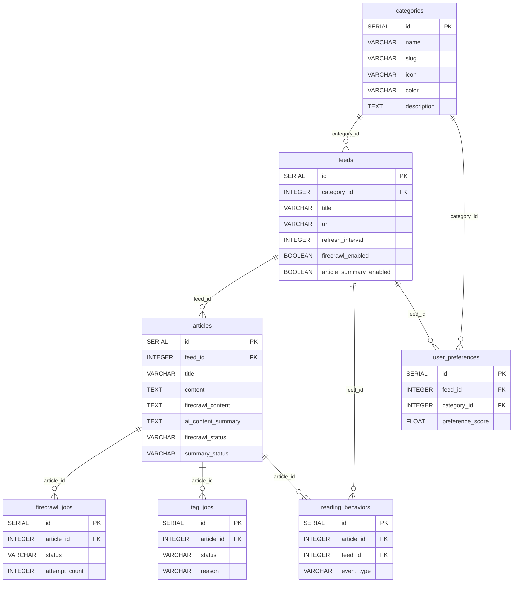
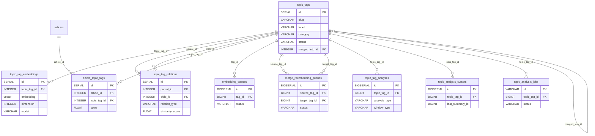
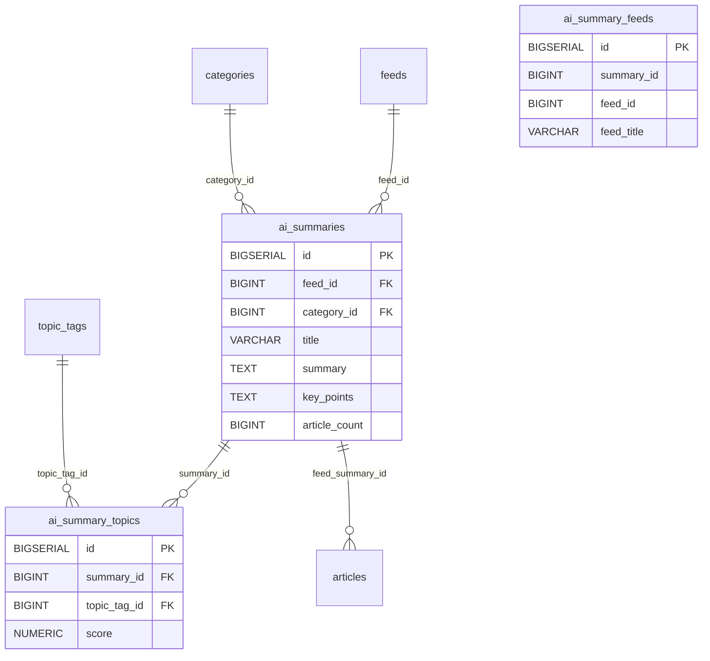
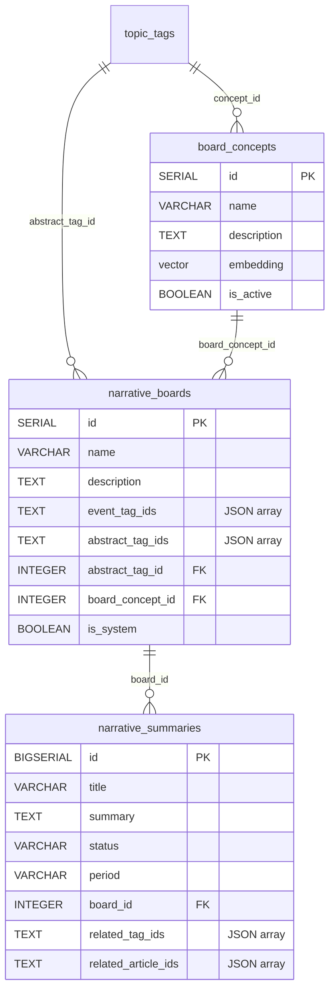
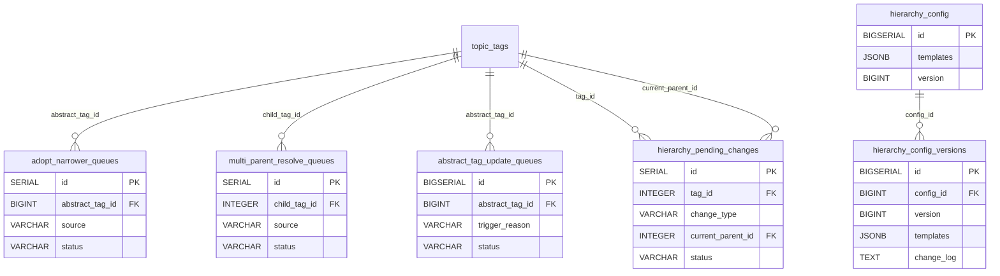
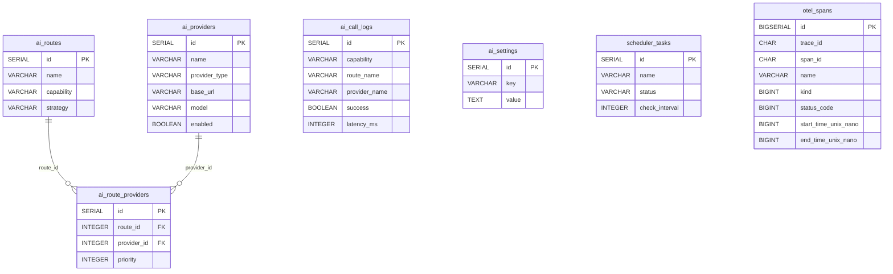

# 全局实体关系图

本文档提供 RSS Reader 数据库的全局实体关系图，覆盖 38 张表、35 条 FK 约束，按 6 个业务域组织。

> 域级 ER 图使用 Mermaid `erDiagram` 语法，渲染依赖 GitHub/VSCode Mermaid 插件。全局概览图使用纯 ASCII 作为 fallback。

---

## 全局域级概览

```
┌─────────────────┐       ┌─────────────────────┐
│     Core        │       │    Topic Tags        │
│  ┌───────────┐  │  FK   │  ┌─────────────────┐ │
│  │ categories│──┼───────┼─→│   topic_tags     │ │  ← 12 incoming FKs (hub)
│  ├───────────┤  │       │  ├─────────────────┤ │
│  │   feeds   │  │       │  │ topic_tag_       │ │
│  ├───────────┤  │       │  │   embeddings     │ │
│  │ articles  │  │       │  ├─────────────────┤ │
│  ├───────────┤  │       │  │ topic_tag_       │ │
│  │ reading_  │  │       │  │   relations (★)  │─┼───┐
│  │  behaviors│  │       │  ├─────────────────┤ │   │
│  ├───────────┤  │       │  │ article_topic_   │ │   │
│  │ user_     │  │       │  │   tags           │ │   │
│  │ preferences│ │       │  ├─────────────────┤ │   │
│  ├───────────┤  │       │  │ embedding_queues │ │   │
│  │ firecrawl_│  │       │  ├─────────────────┤ │   │
│  │   jobs    │  │       │  │ merge_reembedding│ │   │
│  ├───────────┤  │       │  │   _queues        │ │   │
│  │ tag_jobs  │  │       │  ├─────────────────┤ │   │
│  ├───────────┤  │       │  │ topic_tag_       │ │   │
│  │ schema_   │  │       │  │   analyses       │ │   │
│  │ migrations│  │       │  ├─────────────────┤ │   │
│  └───────────┘  │       │  │ topic_analysis_  │ │   │
└─────────────────┘       │  │   cursors        │ │   │
                          │  ├─────────────────┤ │   │
                          │  │ topic_analysis_  │ │   │
                          │  │   jobs           │ │   │
                          │  └─────────────────┘ │   │
                          └─────────────────────┘   │
                                     ↑               │
                                     │ self-ref      │ FK (hierarchy)
┌─────────────────┐       ┌─────────────────────┐   │
│  AI Summaries   │       │    Hierarchy         │   │
│  ┌───────────┐  │       │  ┌─────────────────┐ │   │
│  │ai_summaries│ │  FK   │  │ hierarchy_config│ │   │
│  ├───────────┤  │───→───│  ├─────────────────┤ │   │
│  │ai_summary_ │ │ topic │  │ hierarchy_config│ │   │
│  │  feeds     │ │ tags  │  │   _versions     │ │   │
│  ├───────────┤  │       │  ├─────────────────┤ │   │
│  │ai_summary_ │ │       │  │ adopt_narrower_ │←┼───┘
│  │  topics    │─┼───→───┼──│   queues        │ │
│  └───────────┘  │       │  ├─────────────────┤ │
└─────────────────┘       │  │ multi_parent_   │ │
                          │  │   resolve_queues│ │
┌─────────────────┐       │  ├─────────────────┤ │
│   Narrative      │       │  │ abstract_tag_   │ │
│  ┌───────────┐  │  FK   │  │   update_queues │ │
│  │ narrative_ │──┼───→───┼──│                 │ │
│  │  boards    │  │ topic │  ├─────────────────┤ │
│  ├───────────┤  │ tags  │  │ hierarchy_      │ │
│  │ narrative_ │  │       │  │   pending_      │ │
│  │ summaries  │  │       │  │   changes       │ │
│  ├───────────┤  │       │  └─────────────────┘ │
│  │ board_    │  │       └─────────────────────┘
│  │ concepts  │  │
│  └───────────┘  │
└─────────────────┘

┌─────────────────┐
│ AI Infrastructure│
│  ┌───────────┐  │
│  │ai_providers│ │
│  ├───────────┤  │
│  │ ai_routes │  │
│  ├───────────┤  │
│  │ai_route_  │  │
│  │ providers │  │
│  ├───────────┤  │
│  │ai_call_   │  │
│  │  logs     │  │
│  ├───────────┤  │
│  │ai_settings│  │
│  ├───────────┤  │
│  │scheduler_ │  │
│  │  tasks    │  │
│  ├───────────┤  │
│  │otel_spans │  │
│  └───────────┘  │
└─────────────────┘
```

- 实线箭头 → 表示 FK 引用（源域引用目标域的表）
- `topic_tags` 是数据库枢纽，有 12 条入边（10 张表引用）
- `topic_tag_relations` 通过 `parent_id` 和 `child_id` 双线自引用 `topic_tags`
- 虚线边界表示域内的队列表与主表之间的逻辑归属

---

## 域级 ER 图

### Core（核心数据面）



### Topic Tags（主题标签面）



### AI Summaries（AI 摘要面）



### Narrative（叙事摘要面）



### Hierarchy（层级关系面）



### AI Infrastructure（AI 基础设施）



---

## FK 引用矩阵

| source_table | fk_column | target_table | target_column | constraint_name |
|---|---|---|---|---|
| `feeds` | `category_id` | `categories` | `id` | `fk_categories_feeds` |
| `articles` | `feed_id` | `feeds` | `id` | `fk_feeds_articles` |
| `articles` | `feed_summary_id` | `ai_summaries` | `id` | `articles_feed_summary_id_fkey` |
| `ai_summaries` | `category_id` | `categories` | `id` | `fk_ai_summaries_category` |
| `ai_summaries` | `feed_id` | `feeds` | `id` | `fk_ai_summaries_feed` |
| `ai_summary_topics` | `summary_id` | `ai_summaries` | `id` | `fk_ai_summaries_summary_topics` |
| `ai_summary_topics` | `topic_tag_id` | `topic_tags` | `id` | `fk_ai_summary_topics_topic_tag` |
| `article_topic_tags` | `article_id` | `articles` | `id` | `fk_article_topic_tags_article` |
| `article_topic_tags` | `topic_tag_id` | `topic_tags` | `id` | `fk_article_topic_tags_topic_tag` |
| `topic_tags` | `merged_into_id` | `topic_tags` | `id` | `fk_topic_tags_merged_into` |
| `topic_tags` | `concept_id` | `board_concepts` | `id` | `topic_tags_concept_id_fkey` |
| `topic_tag_embeddings` | `topic_tag_id` | `topic_tags` | `id` | `fk_topic_tags_embedding` |
| `topic_tag_relations` | `parent_id` | `topic_tags` | `id` | `topic_tag_relations_parent_id_fkey` |
| `topic_tag_relations` | `child_id` | `topic_tags` | `id` | `topic_tag_relations_child_id_fkey` |
| `topic_analysis_jobs` | `topic_tag_id` | `topic_tags` | `id` | (FK inferred) |
| `ai_route_providers` | `route_id` | `ai_routes` | `id` | `fk_ai_routes_route_providers` |
| `ai_route_providers` | `provider_id` | `ai_providers` | `id` | `fk_ai_route_providers_provider` |
| `reading_behaviors` | `article_id` | `articles` | `id` | `fk_reading_behaviors_article` |
| `reading_behaviors` | `feed_id` | `feeds` | `id` | `fk_reading_behaviors_feed` |
| `user_preferences` | `feed_id` | `feeds` | `id` | `fk_user_preferences_feed` |
| `user_preferences` | `category_id` | `categories` | `id` | `fk_user_preferences_category` |
| `firecrawl_jobs` | `article_id` | `articles` | `id` | `fk_firecrawl_jobs_article` |
| `tag_jobs` | `article_id` | `articles` | `id` | `fk_tag_jobs_article` |
| `embedding_queues` | `tag_id` | `topic_tags` | `id` | `embedding_queue_tag_id_fkey` |
| `merge_reembedding_queues` | `source_tag_id` | `topic_tags` | `id` | `merge_reembedding_queues_source_tag_id_fkey` |
| `merge_reembedding_queues` | `target_tag_id` | `topic_tags` | `id` | `merge_reembedding_queues_target_tag_id_fkey` |
| `adopt_narrower_queues` | `abstract_tag_id` | `topic_tags` | `id` | `fk_adopt_narrower_queues_abstract_tag` |
| `multi_parent_resolve_queues` | `child_tag_id` | `topic_tags` | `id` | `fk_mprq_child_tag` |
| `abstract_tag_update_queues` | `abstract_tag_id` | `topic_tags` | `id` | `fk_abstract_tag_update_queues_abstract_tag` |
| `hierarchy_pending_changes` | `tag_id` | `topic_tags` | `id` | `hierarchy_pending_changes_tag_id_fkey` |
| `hierarchy_pending_changes` | `current_parent_id` | `topic_tags` | `id` | `hierarchy_pending_changes_current_parent_id_fkey` |
| `narrative_boards` | `abstract_tag_id` | `topic_tags` | `id` | `narrative_boards_abstract_tag_id_fkey` |
| `narrative_boards` | `board_concept_id` | `board_concepts` | `id` | `narrative_boards_board_concept_id_fkey` |
| `narrative_summaries` | `board_id` | `narrative_boards` | `id` | `fk_narrative_summaries_board` |

---

## 关系模式说明

### 桥接表（Many-to-Many）

- **`article_topic_tags`**：连接 `articles` ↔ `topic_tags`，桥接表 + 关联评分
- **`ai_summary_topics`**：连接 `ai_summaries` ↔ `topic_tags`
- **`ai_summary_feeds`**：连接 `ai_summaries` ↔ `feeds`（含快照字段）
- **`ai_route_providers`**：连接 `ai_routes` ↔ `ai_providers`，附带优先级

### 自引用（Self-Referential FK）

- **`topic_tags.merged_into_id`** → `topic_tags.id`：标签合并后指向目标标签
- **`topic_tag_relations.parent_id` / `child_id`** → `topic_tags.id`：层级父子关系

### 反规范化（Denormalized）

- **`ai_call_logs`**：存储 `route_name` 和 `provider_name`（冗余）以保留调用时的上下文快照，即使后续路由/供应商被修改或删除
- **`ai_summary_feeds`**：存储 `feed_title`、`feed_icon`、`feed_color` 摘要生成时的快照

### JSON-stored ID Lists（无 FK 约束的关系）

以下字段使用 JSON 数组存储关联 ID，不通过 FK 约束保证完整性：

- **`narrative_boards.event_tag_ids`** → `topic_tags.id`：关联的 event 标签
- **`narrative_boards.abstract_tag_ids`** → `topic_tags.id`：关联的抽象标签
- **`narrative_boards.prev_board_ids`** → `narrative_boards.id`：前日关联 Board
- **`narrative_summaries.parent_ids`** → `narrative_summaries.id`：父叙事
- **`narrative_summaries.related_tag_ids`** → `topic_tags.id`：关联标签
- **`narrative_summaries.related_article_ids`** → `articles.id`：关联文章
- **`ai_summaries.articles`** → `articles.id`：覆盖文章列表

---

## 更新日志

### 2026-05-14

- 初始版本：全局 ASCII 概览图、6 个业务域 Mermaid ER 图、35 行 FK 引用矩阵、关系模式说明

---

## 相关文档

- [数据库字段说明](DATABASE_FIELDS.md) — 38 张表的完整字段字典
- [数据生命周期](DATA_LIFECYCLE.md) — 6 条数据链路的状态字段流转
- [项目架构总览](../architecture/overview.md) — 系统架构全局视角
- [数据流](../architecture/data-flow.md) — 代码执行流和 API 调用链
