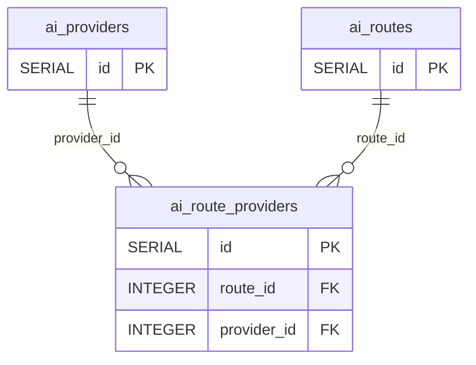

# AI 路由域（`tables/ai-routing.md`）

> 真相源 = 代码（GORM struct + `postgres_migrations.go`），本文件是投影。全局约定（FK 真相 / 向量维度 / 枚举 / 唯一与 CHECK 约束）见 [_conventions.md](_conventions.md)；完整表清单与导航见 [_index.md](../_index.md)。

### 3.1 ai_providers（AI 供应商）

| 字段名 | 类型 | 约束/默认/索引 | 用途 |
| -------- | ------ | ------ | ------ |
| `id` | SERIAL | PK | 主键 |
| `name` | VARCHAR(100) | UNIQUE NOT NULL; index | 供应商名称 |
| `provider_type` | VARCHAR(50) | NOT NULL DEFAULT 'openai_compatible'; index | 供应商类型 |
| `base_url` | VARCHAR(500) | NOT NULL | API 地址 |
| `api_key` | TEXT | — | API 密钥（可空） |
| `model` | VARCHAR(100) | NOT NULL | 模型名称 |
| `enabled` | BOOLEAN | NOT NULL DEFAULT true; index | 是否启用 |
| `timeout_seconds` | INTEGER | NOT NULL DEFAULT 120 | 超时时间 |
| `max_tokens` | INTEGER | —（`*int`，可空） | 最大 token 数 |
| `temperature` | FLOAT | —（`*float64`，可空） | 温度参数 |
| `enable_thinking` | BOOLEAN | NOT NULL DEFAULT false | 是否启用模型推理（传播 `chat_template_kwargs.enable_thinking`） |
| `model_kind` | VARCHAR(20) | NOT NULL DEFAULT 'llm'; index | 模型类型：`llm`（默认，对话/推理）/ `embedding`（向量嵌入）。与 `provider_type`（协议维度）正交 |
| `start_command` | TEXT | —（可空） | 本地模型进程启动命令（如 llama.cpp `llama-server ...`）。非空=本地托管进程，启动健康检测可按总开关 `auto_start_models` 自动拉起；空=外部托管服务 |
| `metadata` | TEXT | — | 扩展元数据 |
| `created_at` | TIMESTAMP | — | 创建时间 |
| `updated_at` | TIMESTAMP | — | 更新时间 |

> `model_kind` 列由 AutoMigrate 添加（默认 `'llm'`）；版本化迁移 `20260802_0001` 执行 backfill：将挂在 embedding 路由的 provider 批量置为 `embedding`（幂等，仅更新仍为 `llm` 且确属 embedding 路由者）；同时挂在 embedding + llm 路由的**冲突** provider 不自动改，仅 `logging.Warnf` 告警，需手动拆分路由绑定。

> `enable_thinking` 语义曾从「事后剥离 `<think>` 标签」翻转为「启用模型推理」；迁移 `20260626_0001` 部署时批量 reset 为 false，避免旧 true 值意外拖慢打标签。

### 3.2 ai_routes（AI 路由）

| 字段名 | 类型 | 约束/默认/索引 | 用途 |
| -------- | ------ | ------ | ------ |
| `id` | SERIAL | PK | 主键 |
| `name` | VARCHAR(100) | NOT NULL; 复合唯一 `idx_ai_routes_capability_name(name, capability)` | 路由名称 |
| `capability` | VARCHAR(50) | NOT NULL; 复合唯一同上; index | 能力标识 |
| `enabled` | BOOLEAN | NOT NULL DEFAULT true; index | 是否启用 |
| `priority` | INTEGER | NOT NULL DEFAULT 100; index | 优先级（数值越小越高） |
| `strategy` | VARCHAR(50) | NOT NULL DEFAULT 'ordered_failover' | 路由策略 |
| `description` | VARCHAR(255) | — | 描述 |
| `max_concurrency` | INTEGER | NOT NULL DEFAULT 0 | 最大并发（0 = 用各能力的默认值） |
| `created_at` | TIMESTAMP | — | 创建时间 |
| `updated_at` | TIMESTAMP | — | 更新时间 |

唯一约束：`idx_ai_routes_capability_name (name, capability)`。`AIRoute.RouteProviders` 为逻辑关联（无 OnDelete）。

### 3.3 ai_route_providers（AI 路由-供应商绑定）

| 字段名 | 类型 | 约束/默认/索引 | 用途 |
| -------- | ------ | ------ | ------ |
| `id` | SERIAL | PK | 主键 |
| `route_id` | INTEGER | NOT NULL; 复合唯一 `idx_ai_route_provider_link(route_id, provider_id)` | 路由 ID |
| `provider_id` | INTEGER | NOT NULL; 复合唯一同上 | 供应商 ID |
| `priority` | INTEGER | NOT NULL DEFAULT 100; index | 优先级（数值越小越高） |
| `enabled` | BOOLEAN | NOT NULL DEFAULT true; index | 是否启用 |
| `created_at` | TIMESTAMP | — | 创建时间 |
| `updated_at` | TIMESTAMP | — | 更新时间 |

### 3.4 ai_call_logs（AI 调用日志）

| 字段名 | 类型 | 约束/默认/索引 | 用途 |
| -------- | ------ | ------ | ------ |
| `id` | SERIAL | PK | 主键 |
| `operation` | VARCHAR(80) | NOT NULL; 复合索引 `idx_call_logs_op_time(operation, created_at)` priority:1 | 业务操作名（如 `daily_report.cluster_tags`） |
| `capability` | VARCHAR(50) | NOT NULL; index | 能力标识 |
| `route_name` | VARCHAR(100) | NOT NULL | 路由名称 |
| `provider_name` | VARCHAR(100) | NOT NULL | 供应商名称 |
| `model` | VARCHAR(100) | — | 实际调用的模型名 |
| `success` | BOOLEAN | NOT NULL; index | 是否成功 |
| `is_fallback` | BOOLEAN | DEFAULT false | 是否为降级调用 |
| `latency_ms` | INTEGER | — | 延迟（毫秒） |
| `error_code` | VARCHAR(100) | — | 错误码 |
| `error_message` | TEXT | — | 错误信息 |
| `prompt` | TEXT | — | 完整 messages 文本（超 20000 runes 截断标注） |
| `request_meta` | TEXT | — | 请求元数据 |
| `response_snippet` | TEXT | — | 响应片段（截取前 10000 runes） |
| `token_usage` | JSONB | — | prompt/completion/total token 用量 JSON |
| `trace_id` | VARCHAR(64) | — | OpenTelemetry trace ID |
| `session_id` | VARCHAR(120) | index（`idx_call_logs_session`） | 编排分组键（同一次编排内共享） |
| `created_at` | TIMESTAMP | index（`idx_ai_call_logs_created_at`） | 创建时间 |

`operation` / `prompt` / `token_usage` / `session_id` / `model` 五列由迁移 `20260704_0001` 补齐（R2 必记字段）。

### 3.5 ai_embedding_cache（embedding 结果缓存）

`Router.Embed` 层的持久化缓存（`nightly-throughput-embedding-cache-parallel-crawl` 引入）：仅白名单 operation（`tagmanagement.embedding`，tag 固定属性输入、跨文章重复）参与缓存——白名单外 operation（`section.embedding` / `tagmanagement.auxlabel_embedding` / `discovery.route_embedding` 等一次性内容输入）不查不写（实测命中率 0-10%，纯存储浪费）。命中则跳过 provider HTTP 与信号量，直接返回；由 `job_log_cleanup` 清理 14 天前记录（命中集中在写入后 1-2 天的夜间窗口内）。

| 字段名 | 类型 | 约束/默认/索引 | 用途 |
| -------- | ------ | ------ | ------ |
| `cache_key` | VARCHAR(64) | PK | `SHA-256(provider.Model + "\\x00" + join(Input, "\\x00"))` 的 hex |
| `model` | VARCHAR(100) | index | 落缓存时的模型名（参与 key，防跨模型串向量空间） |
| `operation` | VARCHAR(80) | — | 业务操作名（仅白名单值会写入） |
| `embedding` | JSONB | — | `[][]float64` 序列化 |
| `dimensions` | INTEGER | — | 向量维度 |
| `input_preview` | VARCHAR(200) | — | 输入预览（前 200 runes） |
| `created_at` | TIMESTAMP | index | 创建时间（14 天 TTL 依据） |

---

## 索引

### AI 调用日志索引（迁移 `20260704_0001`）

| 索引名 | 表 | 列 |
| -------- | ------ | ------ |
| `idx_call_logs_session` | ai_call_logs | `(session_id)` |
| `idx_call_logs_op_time` | ai_call_logs | `(operation, created_at)` |

## 域 ER 图

> 实线关系 = GORM 逻辑关联；标注「真实DB FK」的边 = DB 物理外键（共 6 条，全清单见 [_conventions.md](_conventions.md)）。外域邻居表仅标名，字段见其所属域文档。

