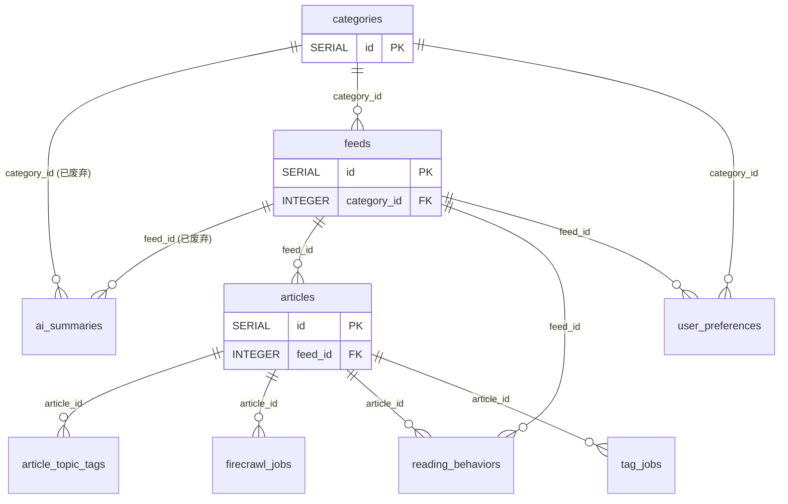

# 内容域（`tables/content.md`）

> 真相源 = 代码（GORM struct + `postgres_migrations.go`），本文件是投影。全局约定（FK 真相 / 向量维度 / 枚举 / 唯一与 CHECK 约束）见 [_conventions.md](_conventions.md)；完整表清单与导航见 [_index.md](../_index.md)。

### 1.1 articles（文章表）

存储 RSS 文章的核心数据。

| 字段名 | 类型 | 约束/默认/索引 | 用途 |
| -------- | ------ | ------ | ------ |
| `id` | SERIAL | PK | 主键 |
| `feed_id` | INTEGER | NOT NULL; index | 所属订阅源 ID（逻辑关联 `feeds.id`，无 DB FK） |
| `title` | VARCHAR(500) | NOT NULL | 文章标题 |
| `description` | TEXT | — | 文章描述（参与全文检索，权重 B） |
| `content` | TEXT | — | RSS 原始内容（HTML 片段） |
| `link` | VARCHAR(1000) | — | 文章链接 |
| `image_url` | VARCHAR(1000) | — | 封面图 |
| `pub_date` | TIMESTAMP | — | 发布时间 |
| `author` | VARCHAR(200) | — | 作者 |
| `read` | BOOLEAN | DEFAULT false | 是否已读（索引 `idx_articles_read`） |
| `favorite` | BOOLEAN | DEFAULT false | 是否收藏（索引 `idx_articles_favorite`）；归档免死标记 |
| `archived` | BOOLEAN | DEFAULT false（迁移 `20260818_0001`） | 归档标记：超出 feed `max_articles` 活跃窗口的超限文章置 true。归档行**保留全部文本字段**（日报线索按 ID 反查），但 topic tags 边 / reading_behaviors 已删、`search_vector` 置 NULL；reader 列表与统计默认过滤归档行，按 ID 详情豁免（见 `flow/reading.md` §业务约束 6） |
| `summary_status` | VARCHAR(20) | DEFAULT 'complete' | AI 总结状态：`incomplete` / `pending` / `complete` / `failed` |
| `summary_generated_at` | TIMESTAMP | — | AI 总结生成时间 |
| `summary_processing_started_at` | TIMESTAMP | — | AI 总结开始处理时间 |
| `completion_attempts` | INTEGER | DEFAULT 0 | AI 总结重试次数 |
| `completion_error` | TEXT | — | AI 总结错误信息 |
| `ai_content_summary` | TEXT | — | AI 生成的优化总结内容（Markdown） |
| `content_form` | VARCHAR(20) | —（可空，AutoMigrate 自动加列） | 内容形态标记：`mono`（单主题）/ `aggregate`（聚合型合集）/ 空（存量文章或模型未输出标记）。由摘要链路解析首行 HTML 注释产出，下游打标按此分流（见 `flow/reading.md` §业务约束 3） |
| `firecrawl_status` | VARCHAR(20) | DEFAULT 'pending' | Firecrawl 抓取状态：`pending` / `processing` / `completed` / `failed` |
| `firecrawl_error` | TEXT | — | Firecrawl 抓取错误信息 |
| `firecrawl_content` | TEXT | — | Firecrawl 抓取的完整网页内容（Markdown） |
| `firecrawl_crawled_at` | TIMESTAMP | — | Firecrawl 抓取时间 |
| `search_vector` | tsvector | — | 全文检索向量（触发器维护，见下） |
| `created_at` | TIMESTAMP | — | 创建时间 |

**全文检索（已废弃，2026-08-20）**：`search_vector` 列（tsvector）与触发器 `articles_search_vector_trigger`、GIN 索引 `idx_articles_search_vector` 自迁移 `20260417_0002` 引入，但业务零引用（代码 grep + idx_scan=0 双证据），索引与触发器已删除（列保留，重建分钟级）；归档 cleanup 置 `search_vector = NULL` 的行为保留。

**虚拟字段（`gorm:"->"` 计算列，非持久化）**：`tag_count`（文章标签数）、`relevance_score`（相关度评分）。

> ⚠️ 旧文档曾列 `feed_summary_id` / `feed_summary_generated_at`：**代码 `Article` struct 无此字段**，已删除，请勿引用。

**复合索引（迁移 `20260417_0001`）**：`idx_articles_feed_pub_date(feed_id, pub_date DESC)`、`idx_articles_feed_id_title(feed_id, title)`。

### 1.2 feeds（订阅源表）

| 字段名 | 类型 | 约束/默认/索引 | 用途 |
| -------- | ------ | ------ | ------ |
| `id` | SERIAL | PK | 主键 |
| `title` | VARCHAR(200) | NOT NULL | 订阅源标题 |
| `description` | TEXT | — | 描述 |
| `url` | VARCHAR(500) | UNIQUE NOT NULL | RSS URL |
| `category_id` | INTEGER | index（`idx_feeds_category_id` 迁移补） | 所属分类 ID（逻辑关联 `categories.id`） |
| `icon` | VARCHAR(1000) | DEFAULT 'rss' | 图标值（iconify id 或图片 URL） |
| `icon_source` | VARCHAR(20) | DEFAULT 'fallback' | 图标来源状态机：`auto` / `custom` / `fallback` |
| `color` | VARCHAR(20) | DEFAULT '#8b5cf6' | 颜色 |
| `last_updated` | TIMESTAMP | — | 最后更新时间 |
| `created_at` | TIMESTAMP | — | 创建时间 |
| `max_articles` | INTEGER | DEFAULT 100 | 最大文章数 |
| `refresh_interval` | INTEGER | DEFAULT 60 | 刷新间隔（秒） |
| `refresh_status` | VARCHAR(20) | DEFAULT 'idle' | 刷新状态 |
| `refresh_error` | TEXT | — | 刷新错误信息 |
| `last_refresh_at` | TIMESTAMP | — | 最后刷新时间 |
| `article_summary_enabled` | BOOLEAN | DEFAULT false | 是否启用文章级 AI 总结（依赖 Firecrawl） |
| `completion_on_refresh` | BOOLEAN | DEFAULT true | 刷新时是否自动触发内容补全 |
| `max_completion_retries` | INTEGER | DEFAULT 3 | AI 总结最大重试次数 |
| `firecrawl_enabled` | BOOLEAN | DEFAULT false | 是否启用 Firecrawl 抓取 |
| `tagging_enabled` | BOOLEAN | DEFAULT true | 是否启用自动打标签 |

> ⚠️ 旧文档曾列 `ai_summary_enabled`（DEFAULT true）：**代码无此字段**。实际是 `article_summary_enabled`（DEFAULT false），两者曾被混淆，请勿再引用 `ai_summary_enabled`。

`Feed.Articles` 声明了 `constraint:OnDelete:CASCADE`（GORM 层）；`Feed.Category` 为逻辑关联。

### 1.3 categories（分类表）

| 字段名 | 类型 | 约束/默认/索引 | 用途 |
| -------- | ------ | ------ | ------ |
| `id` | SERIAL | PK | 主键 |
| `name` | VARCHAR(100) | UNIQUE NOT NULL | 分类名称 |
| `slug` | VARCHAR(50) | UNIQUE | URL 友好标识 |
| `icon` | VARCHAR(50) | DEFAULT 'folder' | 图标 |
| `color` | VARCHAR(20) | DEFAULT '#6366f1' | 颜色 |
| `description` | TEXT | — | 描述 |
| `created_at` | TIMESTAMP | — | 创建时间 |

`Category.Feeds` 声明了 `constraint:OnDelete:CASCADE`（GORM 层）。

---

## 字段用途说明：文章三个内容字段

| 字段 | 来源 | 格式 | 特点 | 用途 |
| -------- | ------ | ------ | ------ | ------ |
| `content` | RSS Feed 解析 | HTML 片段 | 可能不完整，含 HTML 标签 | 基础内容展示 |
| `firecrawl_content` | Firecrawl 抓取 | Markdown | 完整网页内容，过滤广告/导航栏 | AI 总结输入源，不对用户直接展示 |
| `ai_content_summary` | AI 生成 | Markdown | 保留核心，移除冗余 | 前端默认展示内容 |

---

## 域 ER 图

> 实线关系 = GORM 逻辑关联；标注「真实DB FK」的边 = DB 物理外键（共 6 条，全清单见 [_conventions.md](_conventions.md)）。外域邻居表仅标名，字段见其所属域文档。

