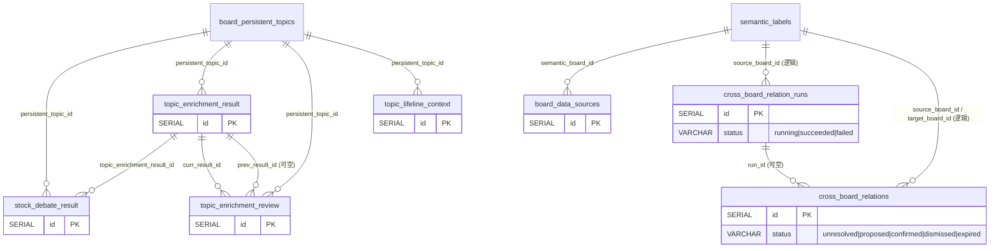

# 数据增强域（`tables/data-enrichment.md`）

> 真相源 = 代码（GORM struct + `postgres_migrations.go`），本文件是投影。全局约定（FK 真相 / 向量维度 / 枚举 / 唯一与 CHECK 约束）见 [_conventions.md](_conventions.md)；完整表清单与导航见 [_index.md](../_index.md)。

> 本域 5 张表由 `internal/dataenrichment` 的 `RegisterModels`（`init()`）注册。

### 10.1 board_data_sources（板块数据源绑定）

| 字段名 | 类型 | 约束/默认/索引 | 用途 |
| -------- | ------ | ------ | ------ |
| `id` | BIGSERIAL | PK | 主键 |
| `semantic_board_id` | BIGINT | NOT NULL; 复合唯一 `idx_board_src` | 所属板块 ID |
| `source_type` | VARCHAR(40) | NOT NULL; 复合唯一同上 | 数据源类型枚举（受代码 `ValidateSourceType` 校验）。**内置金融源 `etf_quote`/`exchange_rate`/`gdelt_event` 已移除**（data-enrichment-structural-depth），当前无内置枚举值；枚举可扩展（`repository.RegisterSourceType` 运行时注册），保留为未来接入结构化外部源的扩展点。`web_search`/`fetch_page`/内部导航为 always-on 工具，不依赖本表绑定。 |
| `config` | JSONB | DEFAULT '{}'（serializer:json） | 板块级参数，schema 由 source_type 决定 |
| `enabled` | BOOLEAN | NOT NULL DEFAULT true | 是否启用 |
| `created_at` | TIMESTAMPTZ | — | 创建时间 |
| `updated_at` | TIMESTAMPTZ | — | 更新时间 |

### 10.2 topic_lifeline_context（话题分层新闻汇总上下文，循环 A）

按 `granularity + period` 存储各周期新闻叙事汇总。档案式存储——历史周期独立保留不覆盖。

| 字段名 | 类型 | 约束/默认/索引 | 用途 |
| -------- | ------ | ------ | ------ |
| `id` | BIGSERIAL | PK | 主键 |
| `persistent_topic_id` | BIGINT | NOT NULL; 复合唯一 `idx_topic_gran_period` | 持久话题 ID |
| `granularity` | VARCHAR(10) | NOT NULL; 复合唯一同上 | 粒度：`week` / `month` / `year` / `all` |
| `period` | VARCHAR(12) | NOT NULL; 复合唯一同上 | 具体周期（`2026-W27` / `2026-06` / `2026` / `all`） |
| `content` | TEXT | NOT NULL | 新闻叙事汇总 + 数据波动快照 |
| `as_of_date` | DATE | NOT NULL | 汇总截止日（时效判断 + 检查自愈扫描缺口的依据） |
| `source` | VARCHAR(12) | NOT NULL DEFAULT 'manual' | 来源：`manual` / `llm_assisted` |
| `created_at` | TIMESTAMPTZ | — | 创建时间 |
| `updated_at` | TIMESTAMPTZ | — | 更新时间 |

### 10.3 topic_enrichment_result（数据增强结果快照，循环 B）

一次增强一行，**不可变**——存档不修改，确保 review 有对比基准。不含 `report_id`（循环 B 不挂日报管线）。

| 字段名 | 类型 | 约束/默认/索引 | 用途 |
| -------- | ------ | ------ | ------ |
| `id` | BIGSERIAL | PK | 主键 |
| `persistent_topic_id` | BIGINT | NULL; index（board 档为 NULL） | 持久话题 ID（board-level-deep-analysis 迁移 `20260826_0001` 起 NOT NULL 放宽） |
| `analysis_scope` | VARCHAR(20) | NOT NULL; DEFAULT 'topic'（迁移 `20260826_0001`） | 分析档位：`topic`=单泳道 / `board`=版块级 |
| `result_kind` | VARCHAR(32) | NOT NULL; DEFAULT 'topic_analysis'（迁移 `20260828_0001`） | 结果种类：`topic_analysis` / `board_brief`（版块简报）/ `board_investigation`（问题调查）/ `legacy_board_analysis`（v1 论文式存量回填）；CHECK `chk_topic_enrichment_result_kind` + 形状约束见下 |
| `semantic_board_id` | BIGINT | NULL; index; 复合唯一 `uq_topic_enrichment_result_id_board (id, semantic_board_id)`（复合 FK 靶） | 版块级 result 所属板块（board 档必填，topic 档 NULL） |
| `parent_result_id` | BIGINT | NULL（`*uint`）；复合 FK 见下 | 调查的父简报 result ID（仅 board_investigation 非空） |
| `question_key` | VARCHAR(64) | NULL（`*string`）；CHECK `~ '^[0-9a-f]{64}$'` | 调查问题的规范化 hash（trim+空白折叠后 SHA-256；generated/custom 同算法；仅 board_investigation 非空） |
| `evolution_assessment` | TEXT | — | ⚠️ causal-analysis-agent 起弃用（旧演进定位产物）；字段保留对齐后端 JSON，新分析产出存 `sectors.{form,lens,analysis}` |
| `sectors` | JSONB | — | 复合对象，按 `result_kind` 多态：topic 档 `{form, lens, analysis}`；`board_brief` 载 `{summary, observations, relationships, uncertainties, research_questions, lane_refs, degraded?, retry_reason?}`；`board_investigation` 载 `{question, hypotheses, conclusion, evidence_chain, lane_refs, method_refs, retry_reason?}`（lane evidence 持久化统一使用十进制字符串 `ref`；provider 的安全数值 `lane_id` 别名只在 parser 内归一，不落双字段）；legacy 原样透传 v1 五字段。免 DDL 复用列 |
| `causal_chain` | TEXT | — | ⚠️ causal-analysis-agent 起弃用（旧演进定位产物）；字段保留对齐后端 JSON |
| `tool_calls` | JSONB | — | 工具调用记录（名/参数/返回摘要/耗时；调查档为共享研究循环完整有序记录） |
| `input_snapshot` | JSONB | — | 编排元数据（读的 context 层 / as_of / section 范围 / 引用 review ID；调查档含父简报投影/方法选择 trace/假设重试码/研究覆盖，以及综合 generation 的 `attempts`/`retry_reason`/窄修复 `repair_reason=terminal_root_delimiter` 等） |
| `session_id` | VARCHAR(120) | — | 编排分组键，关联 `ai_call_logs.session_id` |
| `created_at` | TIMESTAMPTZ | — | 创建时间 |

**result_kind 约束体系（迁移 `20260828_0001`，全库唯三真实 DB FK 之一在此）**：

- **形状约束** `chk_topic_enrichment_result_parent_shape`：`topic_analysis` = scope topic + topic owner + 无父无 key；`board_brief`/`legacy_board_analysis` = scope board + board owner + 无父无 key；`board_investigation` = scope board + board owner + 父非空 + 64-hex key 非空（owner 互斥，scope 与 owner 不符的脏行无法落库）。
- **复合 FK** `fk_topic_enrichment_result_parent_board (parent_result_id, semantic_board_id) → (id, semantic_board_id)` `ON DELETE RESTRICT`（靶靠唯一约束 `uq_topic_enrichment_result_id_board` 存在）：父必存在且同板块。
- **触发器** `trg_validate_topic_enrichment_result_parent`（`BEFORE INSERT OR UPDATE OF result_kind, parent_result_id, semantic_board_id`，函数 `validate_topic_enrichment_result_parent`）：调查父必须是同板块 `board_brief`；有子调查的 brief 不得改 kind/换板块——直写 SQL/GORM 也被拦。
- **索引**：`idx_topic_enrichment_result_board_kind_id (semantic_board_id, result_kind, id DESC)`（kind 列表/上一份同 kind 查询）；`idx_topic_enrichment_result_parent_question_id (parent_result_id, question_key, id DESC)` partial `WHERE parent_result_id IS NOT NULL`（同父同题重跑对比）。
- **回填与拒绝**：升级时旧 board 行回填 `legacy_board_analysis`、旧 topic 行回填 `topic_analysis`，sectors JSON 原样不动；存在 mixed/missing owner 行或非法调查父行则**拒绝迁移**（不掩盖数据损坏）；迁移仅向上（无 Down）。
- `EffectiveResultKind`（代码层兼容）：空 kind 的内存历史 fixture 按 scope 兑底（board→legacy，topic→topic_analysis），与 DB 默认一致。

### 10.4 topic_enrichment_review（数据增强认知演进反思）

两次 result 快照间的偏差记录，追加写入。`applied` 不回写 result 表，仅标记认知已纳入。

| 字段名 | 类型 | 约束/默认/索引 | 用途 |
| -------- | ------ | ------ | ------ |
| `id` | BIGSERIAL | PK | 主键 |
| `persistent_topic_id` | BIGINT | NOT NULL; index | 持久话题 ID |
| `prev_result_id` | BIGINT | —（`*uint`）; index | 上次 result ID（可空，手动批注时无 prev 对比） |
| `curr_result_id` | BIGINT | NOT NULL; index | 本次 result ID |
| `verdict` | JSONB | — | 认知对比：`{should_review, reason, new_findings, overturned, confidence_shift, affected_context, confidence}`。causal-analysis-agent 起从「定位变化对比」改为「新发现/推翻对比」，免 DDL 复用列 |
| `deviation_summary` | TEXT | NOT NULL | 偏差说明（LLM 基底 + 人工可调） |
| `affected_context` | VARCHAR(10) | — | 建议关注的粒度层：`week` / `month` / `year` |
| `confidence` | REAL | —（`*float64`） | review_judge 置信度 |
| `applied` | BOOLEAN | NOT NULL DEFAULT false | 用户采纳标记（不回写 result，仅标示认知已纳入） |
| `source` | VARCHAR(12) | NOT NULL DEFAULT 'llm_assisted' | 来源：`llm_assisted` / `manual` |
| `created_at` | TIMESTAMPTZ | — | 创建时间 |
| `updated_at` | TIMESTAMPTZ | — | 更新时间 |

### 10.5 stock_debate_result（FinGenius 个股辩论结果）

FinGenius 多角色辩论输出，按 `(result_id, sector, code)` 维度 append-only（同一 result 内可多次辩论，最新覆盖）。独立存档，不回写前述三表。

| 字段名 | 类型 | 约束/默认/索引 | 用途 |
| -------- | ------ | ------ | ------ |
| `id` | BIGSERIAL | PK | 主键 |
| `topic_enrichment_result_id` | BIGINT | NOT NULL; index `idx_stock_debate_result_id` | 关联的增强结果 ID |
| `persistent_topic_id` | BIGINT | NOT NULL; index `idx_stock_debate_topic` | 持久话题 ID（冗余，便于按 topic 查） |
| `sector` | VARCHAR(80) | NOT NULL | 关联分析员输出的 sector 名 |
| `code` | VARCHAR(20) | NOT NULL | 标的代码（如 `161129`） |
| `name` | VARCHAR(60) | — | 标的名称 |
| `verdict` | VARCHAR(8) | NOT NULL | 综合结论：`up` / `down` / `flat` |
| `consensus` | VARCHAR(12) | — | 共识度文本（如 `"4/6"`） |
| `agents` | JSONB | — | 各 agent 立场提炼：`[{role, stance, note, raw_vote}]` |
| `votes` | JSONB | — | 三档统计：`{up:N, flat:N, down:N}` |
| `fingenius_research` | JSONB | — | FinGenius 原始研究输出（提炼失败时降级展示） |
| `fingenius_battle` | JSONB | — | FinGenius 原始辩论输出 |
| `fingenius_task_id` | VARCHAR(120) | — | FinGenius 异步任务 ID |
| `distill_status` | VARCHAR(12) | NOT NULL DEFAULT 'done' | 提炼状态：`done` / `failed` / `skipped` |
| `html_content` | TEXT | — | FinGenius 完整 HTML 报告字符串（前端 iframe `srcdoc` 渲染） |
| `created_at` | TIMESTAMPTZ | — | 创建时间 |

**字段分工**：提炼后字段（`verdict` / `consensus` / `agents` / `votes`）由 Syntopica LLM `debate_distill` 产出；原始字段（`fingenius_research` / `fingenius_battle`）为 FinGenius 原始输出，提炼失败时降级展示原文。

### 10.6 topic_enrichment_qa（报告追问记录，多轮 append-only）

报告（`topic_enrichment_result`）生成后保持不可变。用户对同一报告发起的多轮追问，每轮追加一行（`source="qa"`），报告本身从不被改写。`sedimented` 标记用户手动 pin 的持久笔记，仅翻转 qa 行 flag，不回写 result。话题档（`/results/:id/qa`）与板块档（`/semantic-boards/:id/.../results/:rid/qa`）共用本表，按 `topic_enrichment_result_id` 归属（board 档三种 kind——简报/调查/legacy——均可追问）。

| 字段名 | 类型 | 约束/默认/索引 | 用途 |
| -------- | ------ | ------ | ------ |
| `id` | BIGSERIAL | PK | 主键 |
| `topic_enrichment_result_id` | BIGINT | NOT NULL; index | 关联的增强结果 ID（报告快照） |
| `question` | TEXT | NOT NULL | 本轮追问问题 |
| `answer` | TEXT | — | 本轮追问答案（追问 agent 产出） |
| `tool_calls` | JSONB | — | 本轮工具调用记录（名/参数/返回摘要） |
| `source` | VARCHAR(12) | NOT NULL DEFAULT 'qa' | 来源：`qa`（追问 agent 追加） |
| `sedimented` | BOOLEAN | NOT NULL DEFAULT false | 用户手动 pin 为持久笔记的标记（report 本身仍不可变） |
| `created_at` | TIMESTAMPTZ | — | 创建时间（多轮按此列升序排列） |

**不变量**：`sediment` 仅翻转 `sedimented` flag，`topic_enrichment_result` 表永不重写（业务约束：result 不可变）。`sedimented` 列由迁移 `20260723_xxxx` 补齐（幂等 `ADD COLUMN IF NOT EXISTS`）。

---
### 10.7 reference_roles（旧参考角色/方法论画像，已退役只读）

v1 方法论画像库（如「内部看美国」分析基因），**已退役**：所有 topic/board prompt 均不再注入本表内容。GET API 保留一版本供迁移查看；写 API（POST/PUT/DELETE）一律 410，指向 `analysis_methods`（见 §10.8）。

| 字段名 | 类型 | 约束/默认/索引 | 用途 |
| -------- | ------ | ------ | ------ |
| `id` | BIGSERIAL | PK | 主键 |
| `name` | VARCHAR(120) | NOT NULL; UNIQUE | 唯一短名（如 inside-america） |
| `title` | VARCHAR(200) | — | 展示标题 |
| `content` | TEXT | NOT NULL | 画像正文（退役前注入 prompt；>4000 字符 rune 计整条丢弃） |
| `enabled` | BOOLEAN | NOT NULL | 历史启停位（现无 prompt 调用方，仅历史状态展示） |
| `created_at` / `updated_at` | TIMESTAMPTZ | — | 时间戳 |

**退役迁移**：`20260828_0002` 将全部旧角色按原文字节复制为 `analysis_methods` 的 `enabled=false`/`legacy=true` 行（`ON CONFLICT(name) DO NOTHING`，不覆盖用户编辑）；`20260831_0001` 将未被用户编辑过的系统 seed 画像（identity 钉死 name+seeded title+frozen content 字节）翻 `enabled=false`，**用户编辑过的行不动**（已无调用方，无论如何都不再注入）。原表与原文字节保留，不删除。

### 10.8 analysis_methods（分析方法卡库，board-level-deep-analysis）

全局方法卡库：声明适用/禁用/证据/失败模式边界，仅在调查链（board_method_select）按问题选中 0-2 张、经清洗后注入 hypothesize/synthesize；简报/事实阶段永不注入。设置页「分析方法」section 即本表。

| 字段名 | 类型 | 约束/默认/索引 | 用途 |
| -------- | ------ | ------ | ------ |
| `id` | BIGSERIAL | PK | 主键 |
| `name` | VARCHAR(120) | NOT NULL; UNIQUE | 唯一短名（重名创建/改名 → 409） |
| `title` | VARCHAR(200) | — | 展示标题 |
| `summary` | TEXT | — | 摘要 |
| `selection_meta` | JSONB | NOT NULL DEFAULT '{}' | 强类型选择元数据：`{applicable_when[], avoid_when[], required_evidence[], failure_modes[]}`（保存时 normalize；选择器只看本字段不读正文） |
| `content` | TEXT | NOT NULL | 方法卡正文（注入前经 `method_sanitizer` 清洗固定修辞；原始字节参与 content_hash） |
| `enabled` | BOOLEAN | NOT NULL（默认 false） | 启停，即时生效（每次调查现查 enabled 卡） |
| `legacy` | BOOLEAN | NOT NULL DEFAULT false | 旧参考角色迁移标记（默认停用，提示人工整理后启用） |
| `deleted_at` | TIMESTAMPTZ | NULL; index（GORM 软删除） | 软删除；历史调查 `method_refs`（含 content_hash）仍可追溯 |
| `created_at` / `updated_at` | TIMESTAMPTZ | — | 时间戳 |

**迁移**：`20260828_0002` 从 `reference_roles` 按原文字节复制（summary 固定迁移提示语、selection_meta 四空数组、enabled=false、legacy=true），`ON CONFLICT(name) DO NOTHING` 幂等——同名新方法（用户已建）存在时跳过，不覆盖用户编辑。

### 10.9 cross_board_relation_runs（跨版块关系发现 run 审计，add-evidence-backed-cross-board-relations）

一次发现运行的不可变审计快照（source 原文冻结、预算快照、全部工具调用与 gap）。run 只增不改；relation 生命周期的溯源入口。

| 字段名 | 类型 | 约束/默认/索引 | 用途 |
| -------- | ------ | ------ | ------ |
| `id` | BIGSERIAL | PK | 主键 |
| `semantic_board_id`/`source_board_id` | BIGINT | NOT NULL; index `idx_cbr_runs_board` | 发起板块 |
| `parent_result_id` | BIGINT | NOT NULL | 父简报 result ID（跨表引用 topic_enrichment_result，逻辑外键） |
| `source_kind` | VARCHAR(20) | NOT NULL; CHECK ∈ observation/question | 来源类型 |
| `source_key` | VARCHAR(40) | NOT NULL | 父简报内的观察/问题 id（如 o1/q1） |
| `source_text` | TEXT | NOT NULL | 冻结的来源原文（父简报不可变，双保险） |
| `trigger_kind` | VARCHAR(10) | NOT NULL; CHECK ∈ manual/auto | 手动按钮 or 简报落库自动 |
| `status` | VARCHAR(20) | NOT NULL; CHECK ∈ running/succeeded/failed | run 终态（失败也不删，审计保留） |
| `budget_snapshot` | JSONB | DEFAULT '{}' | 预算快照（搜索/抓取/loop/timeout 与 skipped 记录） |
| `tool_calls` | JSONB | DEFAULT '[]' | 全部工具调用留痕（可追溯要求） |
| `gaps` | JSONB | DEFAULT '[]' | 诚实降级记录（search_budget_exhausted/web_search_error 等） |
| `error` | TEXT | — | 失败原因（成功为空） |
| `created_at`/`updated_at` | TIMESTAMPTZ | — | 时间戳 |

### 10.10 cross_board_relations（跨版块关系生命周期）

关系行本体 + 证据。生命周期 `unresolved → proposed → confirmed/dismissed`；confirmed 到期转 `expired`（读取路径即时判 + `relation_expire` 每小时批量转）。

| 字段名 | 类型 | 约束/默认/索引 | 用途 |
| -------- | ------ | ------ | ------ |
| `id` | BIGSERIAL | PK | 主键 |
| `run_id` | BIGINT | NULL; index | 产生本行的 run（rejected 只留 run 无 relation） |
| `source_board_id` | BIGINT | NOT NULL; index `idx_cbr_source`/`idx_cbr_target` | 关系起点版块 |
| `target_board_id` | BIGINT | NULL | 解析成功的目标版块（unresolved 为 NULL——外部概念暂无内部目标） |
| `target_lane_id` | BIGINT | NULL | 可选进一步定位的泳道 |
| `target_concept` | TEXT | NOT NULL | 外部检索提到的目标概念原文（如「日债收益率」） |
| `relation_type` | VARCHAR(30) | NOT NULL; CHECK ∈ causal/common_driver/divergence/correlated/contextual/unclear | 关系类型枚举 |
| `claim` | TEXT | NOT NULL | 关系主张（一句话） |
| `mechanism` | TEXT | — | 传导机制说明 |
| `verification_verdict` | VARCHAR(20) | NOT NULL; CHECK ∈ supported/contested/insufficient/rejected | 盲验结论 |
| `quality_grade` | VARCHAR(10) | NOT NULL DEFAULT 'none'; CHECK ∈ high/medium/low/none | 机械质量分级（程序计算，非模型自评） |
| `evidence` | JSONB | DEFAULT '[]' | 支持证据（url/quote/institution/date/verified；quote 与工具原文保守 substring 核对） |
| `counterevidence` | JSONB | DEFAULT '[]' | 反证（verifier 反证检索所得） |
| `status` | VARCHAR(20) | NOT NULL; CHECK ∈ unresolved/proposed/confirmed/dismissed/expired | 生命周期状态 |
| `suggestion_hash` | VARCHAR(32) | NOT NULL; **部分唯一索引** `uq_cross_board_relations_open (suggestion_hash) WHERE status IN ('unresolved','proposed')` | 幂等指纹（mode+source+target 概念归一）——open 态防重复，终态后可重生 |
| `evidence_version` | VARCHAR(20) | — | 证据版本（quote 核对通过标记） |
| `expires_at` | TIMESTAMPTZ | NULL | confirmed 有效期（TTL 默认 720h） |
| `confirmed_at`/`confirmed_by` | TIMESTAMPTZ/VARCHAR(20) | NULL | 用户确认时间/操作者（"user"） |
| `dismissed_at`/`dismiss_reason`/`dismissed_by` | TIMESTAMPTZ/TEXT/VARCHAR(20) | NULL | 驳回留痕（reason 必填；同 hash 冷却默认 14 天防重现） |
| `expired_at` | TIMESTAMPTZ | NULL | 批量过期时间戳 |
| `created_at`/`updated_at` | TIMESTAMPTZ | — | 时间戳 |

**迁移**：`20260901_0001`（CHECK 枚举 + 部分唯一索引 + 两个 board 索引）。

**关联**：`semantic_labels.relation_auto_discovery_enabled` BOOLEAN DEFAULT false——板级自动发现开关（同迁移加列）。

## 域 ER 图

> 实线关系 = GORM 逻辑关联；标注「真实DB FK」的边 = DB 物理外键（共 6 条，全清单见 [_conventions.md](_conventions.md)）。外域邻居表仅标名，字段见其所属域文档。

