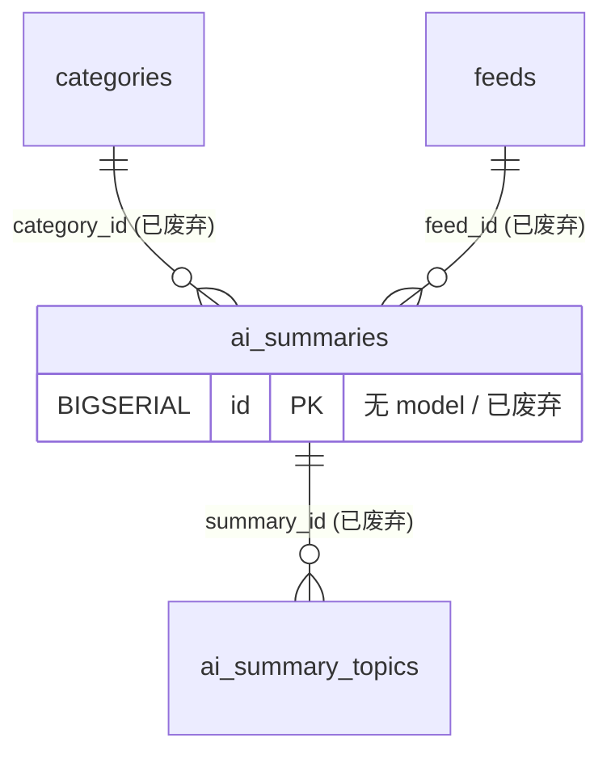

# 已废弃 / 预留 / 框架表（`tables/deprecated-framework.md`）

> 真相源 = 代码（GORM struct + `postgres_migrations.go`），本文件是投影。全局约定（FK 真相 / 向量维度 / 枚举 / 唯一与 CHECK 约束）见 [_conventions.md](_conventions.md)；完整表清单与导航见 [_index.md](../_index.md)。

以下表当前无 Go 代码引用，保留标注以避免误用。

### 13.1 ai_summaries / ai_summary_feeds / ai_summary_topics

对应旧版 Feed 级 AI 批量摘要功能，模型已从 `internal/models/` 移除。**数据库中可能存有旧数据**。

> ⚠️ 旧文档曾称「`articles.feed_summary_id` 仍然指向 `ai_summaries.id`」：**代码 `Article` struct 无 `feed_summary_id` 字段**，此关联已不存在。

字段（仅供历史参考）：

- `ai_summaries`：`id`(BIGSERIAL PK) / `feed_id` / `category_id` / `title`(VARCHAR 200) / `summary`(TEXT) / `key_points` / `articles` / `article_count` / `time_range` / `created_at` / `updated_at`
- `ai_summary_feeds`：`id` / `summary_id` / `feed_id` / `feed_title` / `feed_icon` / `feed_color` / `article_count` / `created_at`
- `ai_summary_topics`：`id` / `summary_id` / `topic_tag_id` / `score` / `source` / `created_at`

### 13.2 topic_analysis_jobs（主题分析任务队列，已废弃）

无 migrator 注册。字段（历史参考）：`id`(VARCHAR(64) PK) / `topic_tag_id` / `analysis_type` / `window_type` / `anchor_date` / `priority` / `status` / `retry_count` / `error_message` / `progress` / `created_at` / `started_at` / `completed_at`。

### 13.3 digest_configs（Digest 推送配置，预留）

无 Go 代码引用，0 行数据。字段（历史参考）：`id` / `daily_enabled` / `daily_time` / `weekly_enabled` / `weekly_day` / `weekly_time` / `feishu_enabled` / `feishu_webhook_url` / `feishu_push_summary` / `feishu_push_details` / `obsidian_enabled` / `obsidian_vault_path` / `obsidian_daily_digest` / `obsidian_weekly_digest` / `created_at` / `updated_at`。

---

## 框架表

### schema_migrations

迁移版本追踪表，由 GORM 迁移框架管理，不计入业务表。

---

## 域 ER 图（已废弃 AI Summaries 面，简化）

