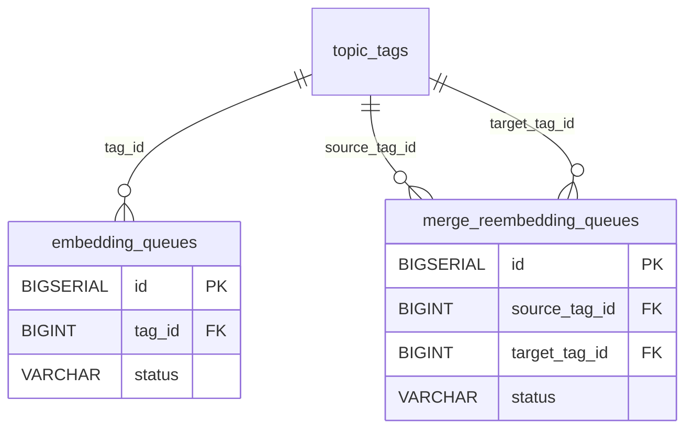

# 向量域（`tables/embeddings.md`）

> 真相源 = 代码（GORM struct + `postgres_migrations.go`），本文件是投影。全局约定（FK 真相 / 向量维度 / 枚举 / 唯一与 CHECK 约束）见 [_conventions.md](_conventions.md)；完整表清单与导航见 [_index.md](../_index.md)。

### 6.1 embedding_config（向量配置，键值对）

| 字段名 | 类型 | 约束/默认/索引 | 用途 |
| -------- | ------ | ------ | ------ |
| `id` | SERIAL | PK | 主键 |
| `key` | VARCHAR(100) | UNIQUE NOT NULL; index | 配置键 |
| `value` | TEXT | NOT NULL | 配置值 |
| `description` | VARCHAR(200) | — | 说明 |
| `created_at` | TIMESTAMP | — | 创建时间 |
| `updated_at` | TIMESTAMP | — | 更新时间 |

> ⚠️ **默认配置项已变更**：`high_similarity_threshold` / `low_similarity_threshold` / `embedding_dimension` / `embedding_model` 曾由迁移 `20260413_0002` seed，但已被迁移 `20260614_0001` **DELETE 清除**，现由运行时代码管理，不再 seed。`narrative_board_embedding_threshold` / `narrative_board_hotspot_threshold` 亦已删（迁移 `20260522_0001`，已废弃）。
> 当前仍 seed 的键：`event_cluster_kw_min_overlap`、`event_cluster_sem_threshold`（迁移 `20260514_0002`）。

### 6.2 embedding_queues（向量生成队列）

| 字段名 | 类型 | 约束/默认/索引 | 用途 |
| -------- | ------ | ------ | ------ |
| `id` | BIGSERIAL | PK | 主键 |
| `tag_id` | BIGINT | NOT NULL; index | 关联标签 ID（逻辑关联 `topic_tags.id`，无 DB FK） |
| `status` | VARCHAR(20) | NOT NULL DEFAULT 'pending'; index | 状态：`pending` / `processing` / `completed` / `failed` |
| `error_message` | TEXT | — | 错误信息 |
| `retry_count` | INTEGER | DEFAULT 0 | 重试次数 |
| `created_at` | TIMESTAMP | — | 创建时间 |
| `started_at` | TIMESTAMP | —（`*time.Time`） | 开始时间 |
| `completed_at` | TIMESTAMP | —（`*time.Time`） | 完成时间 |

> 关联为逻辑关联（无 OnDelete，DB FK 已 drop）。
> 保留策略（2026-08-20 起）：`status='completed'` 且 `created_at` 早于 30 天的行由 `job_log_cleanup` 周期清理（部分索引 `idx_embedding_queues_completed_created` 支撑，迁移 `20260820_0002`）；`pending`/`processing`/`failed` 不受影响。

### 6.3 merge_reembedding_queues（合并后重算向量队列）

| 字段名 | 类型 | 约束/默认/索引 | 用途 |
| -------- | ------ | ------ | ------ |
| `id` | BIGSERIAL | PK | 主键 |
| `source_tag_id` | BIGINT | NOT NULL; index | 源标签 ID（逻辑关联，无 DB FK） |
| `target_tag_id` | BIGINT | NOT NULL; index | 目标标签 ID（逻辑关联，无 DB FK） |
| `status` | VARCHAR(20) | NOT NULL DEFAULT 'pending'; index | 状态：`pending` / `processing` / `completed` / `failed` |
| `error_message` | TEXT | — | 错误信息 |
| `retry_count` | INTEGER | DEFAULT 0 | 重试次数 |
| `created_at` | TIMESTAMP | — | 创建时间 |
| `started_at` | TIMESTAMP | —（`*time.Time`） | 开始时间 |
| `completed_at` | TIMESTAMP | —（`*time.Time`） | 完成时间 |

---

## 域 ER 图

> 实线关系 = GORM 逻辑关联；标注「真实DB FK」的边 = DB 物理外键（共 6 条，全清单见 [_conventions.md](_conventions.md)）。外域邻居表仅标名，字段见其所属域文档。

