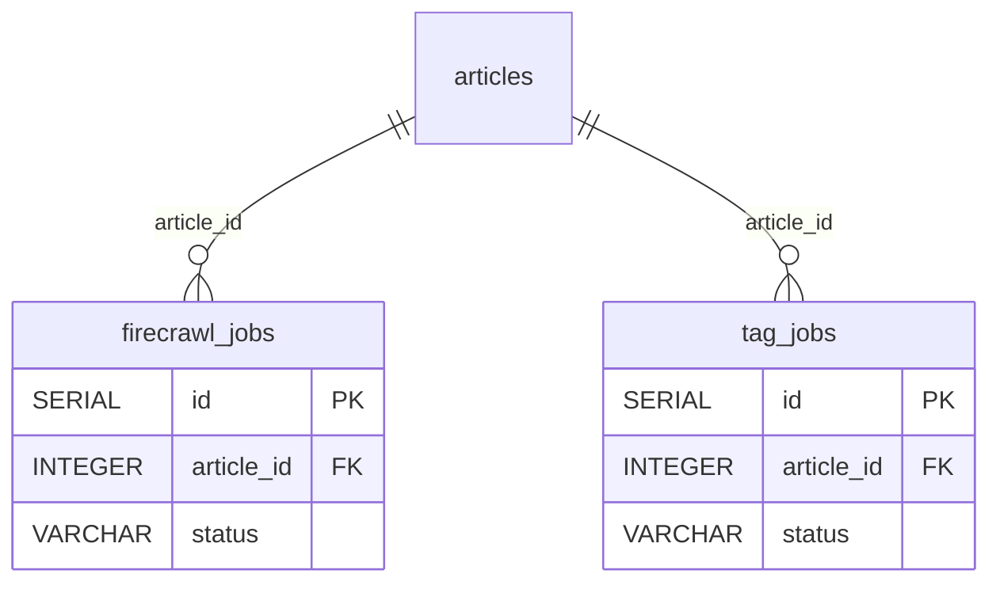

# 任务队列域（`tables/job-queues.md`）

> 真相源 = 代码（GORM struct + `postgres_migrations.go`），本文件是投影。全局约定（FK 真相 / 向量维度 / 枚举 / 唯一与 CHECK 约束）见 [_conventions.md](_conventions.md)；完整表清单与导航见 [_index.md](../_index.md)。

### 7.1 firecrawl_jobs（Firecrawl 抓取任务）

| 字段名 | 类型 | 约束/默认/索引 | 用途 |
| -------- | ------ | ------ | ------ |
| `id` | SERIAL | PK | 主键 |
| `article_id` | INTEGER | NOT NULL; index | 关联文章 ID（GORM 声明 OnDelete:CASCADE） |
| `status` | VARCHAR(20) | NOT NULL DEFAULT 'pending'; index | 状态：`pending` / `leased` / `completed` / `failed` |
| `priority` | INTEGER | DEFAULT 0; index | 优先级 |
| `attempt_count` | INTEGER | DEFAULT 0 | 尝试次数 |
| `max_attempts` | INTEGER | DEFAULT 5 | 最大尝试次数 |
| `available_at` | TIMESTAMP | NOT NULL; index | 可执行时间 |
| `leased_at` | TIMESTAMP | —（`*time.Time`，无 gorm tag 普通列） | 租约获取时间 |
| `lease_expires_at` | TIMESTAMP | —（`*time.Time`）; index | 租约过期时间 |
| `last_error` | TEXT | — | 最近错误 |
| `url_snapshot` | VARCHAR(1000) | — | URL 快照 |
| `created_at` | TIMESTAMP | — | 创建时间 |
| `updated_at` | TIMESTAMP | — | 更新时间 |

### 7.2 tag_jobs（标签任务）

| 字段名 | 类型 | 约束/默认/索引 | 用途 |
| -------- | ------ | ------ | ------ |
| `id` | SERIAL | PK | 主键 |
| `article_id` | INTEGER | NOT NULL; index | 关联文章 ID（GORM 声明 OnDelete:CASCADE） |
| `status` | VARCHAR(20) | NOT NULL DEFAULT 'pending'; index | 状态：`pending` / `leased` / `completed` / `failed` |
| `priority` | INTEGER | DEFAULT 0; index | 优先级 |
| `attempt_count` | INTEGER | DEFAULT 0 | 尝试次数 |
| `max_attempts` | INTEGER | DEFAULT 5 | 最大尝试次数 |
| `available_at` | TIMESTAMP | NOT NULL; index | 可执行时间 |
| `leased_at` | TIMESTAMP | —（`*time.Time`） | 租约获取时间 |
| `lease_expires_at` | TIMESTAMP | —（`*time.Time`）; index | 租约过期时间 |
| `last_error` | TEXT | — | 最近错误 |
| `feed_name_snapshot` | VARCHAR(200) | — | Feed 名称快照 |
| `category_name_snapshot` | VARCHAR(100) | — | 分类名称快照 |
| `force_retag` | BOOLEAN | DEFAULT false | 是否强制重新打标签 |
| `reason` | VARCHAR(50) | — | 入队原因 |
| `created_at` | TIMESTAMP | — | 创建时间 |
| `updated_at` | TIMESTAMP | — | 更新时间 |

> ⚠️ `firecrawl_jobs` / `tag_jobs` 的 `status`、`available_at`、`lease_expires_at` 均为各自单列索引（非旧文档所写复合索引）。

---

---

## 域 ER 图

> 实线关系 = GORM 逻辑关联；标注「真实DB FK」的边 = DB 物理外键（共 6 条，全清单见 [_conventions.md](_conventions.md)）。外域邻居表仅标名，字段见其所属域文档。

