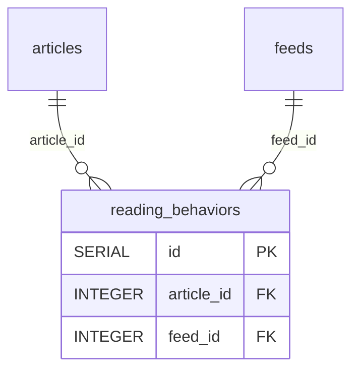

# 用户行为与偏好发现域（`tables/preference-discovery.md`）

> 真相源 = 代码（GORM struct + `postgres_migrations.go`），本文件是投影。全局约定（FK 真相 / 向量维度 / 枚举 / 唯一与 CHECK 约束）见 [_conventions.md](_conventions.md)；完整表清单与导航见 [_index.md](../_index.md)。

### 11.1 reading_behaviors（阅读行为）

| 字段名 | 类型 | 约束/默认/索引 | 用途 |
| -------- | ------ | ------ | ------ |
| `id` | SERIAL | PK | 主键 |
| `article_id` | INTEGER | NOT NULL; index | 文章 ID（逻辑关联，无 OnDelete） |
| `feed_id` | INTEGER | index | 订阅源 ID |
| `category_id` | INTEGER | —（`*uint`）; index | 分类 ID |
| `session_id` | VARCHAR(100) | index | 会话 ID |
| `event_type` | VARCHAR(20) | index | 事件类型 |
| `scroll_depth` | INTEGER | DEFAULT 0 | 滚动深度 |
| `reading_time` | INTEGER | DEFAULT 0 | 阅读时间 |
| `created_at` | TIMESTAMP | index | 创建时间 |

> `feed_id` / `created_at` 均为各自单列索引（非复合）。

### 11.2 preference_vectors（偏好向量画像）

按 SemanticBoard（`board_id=NULL` 为全局桶）聚合的偏好向量。`source=behavior` 由 scheduler 全量重算（不覆盖 `seed` 行）；`source=seed` 由问答加权合并累积。pgvector 列写法沿用 `topic_tag_embeddings`。

| 字段名 | 类型 | 约束/默认/索引 | 用途 |
| -------- | ------ | ------ | ------ |
| `id` | SERIAL | PK | 主键 |
| `board_id` | INTEGER | `*uint`（NULL=全局桶）；`uniqueIndex:idx_preference_vectors_board_source` + index | 所属 SemanticLabel（版块） |
| `source` | VARCHAR(20) | `uniqueIndex:idx_preference_vectors_board_source` | `behavior` \| `seed` |
| `embedding` | vector | type:vector; column:embedding | 偏好向量（运行时维度） |
| `dimension` | INTEGER | — | 向量维度 |
| `model` | VARCHAR(50) | — | 生成模型 |
| `tag_weights` | JSONB | default `'{}'`（MetadataMap serializer） | 画像可视化用 `{tag_label: weight}` top 列表 |
| `last_computed_at` | TIMESTAMP | — | 最后计算时间 |
| `created_at` | TIMESTAMP | — | 创建时间 |
| `updated_at` | TIMESTAMP | — | 更新时间 |

> `UNIQUE(board_id, source)`：board_id 非 NULL 组合由 GORM uniqueIndex 保证；全局桶（board_id IS NULL）单行由 service 层 upsert 保证（PG 普通 unique 允许多 NULL）。

### 11.3 rsshub_routes（RSSHub 路由目录）

从自建 RSSHub 实例 `/api/namespace` 同步的路由元数据。`requires_parameters`/`usable_directly` 入库时按 path 参数段解析。

| 字段名 | 类型 | 约束/默认/索引 | 用途 |
| -------- | ------ | ------ | ------ |
| `id` | SERIAL | PK | 主键 |
| `namespace` | VARCHAR(100) | `uniqueIndex:idx_rsshub_routes_ns_path` | 命名空间 |
| `path` | VARCHAR(255) | `uniqueIndex:idx_rsshub_routes_ns_path` | 路由路径（含 `:param`/`:param?`） |
| `name` | VARCHAR(255) | — | 路由名 |
| `url` | TEXT | — | 源 URL 模板 |
| `description` | TEXT | — | 描述 |
| `parameters` | JSONB | column:parameters | 原始 JSON 参数说明（数组/对象） |
| `example` | TEXT | — | 示例路径 |
| `requires_parameters` | BOOLEAN | — | path 存在必填 `:param` |
| `usable_directly` | BOOLEAN | — | path 无参数段或全可选 |
| `content_hash` | VARCHAR(64) | index | namespace+path+name+description+parameters 的 hash（diff 用） |
| `status` | VARCHAR(20) | index; default `'unknown'` | `unknown` \| `ok` \| `broken` \| `gone` |
| `last_checked_at` | TIMESTAMP | `*time.Time` | 最后可用性校验时间 |
| `created_at` | TIMESTAMP | — | 创建时间 |
| `updated_at` | TIMESTAMP | — | 更新时间 |

### 11.4 route_embeddings（RSSHub 路由向量）

路由的语义向量（文本取 namespace+name+description 摘要）。`UNIQUE(route_id)` 单路由单向量，`text_hash` 变更入队重算。

| 字段名 | 类型 | 约束/默认/索引 | 用途 |
| -------- | ------ | ------ | ------ |
| `id` | SERIAL | PK | 主键 |
| `route_id` | INTEGER | `uniqueIndex:idx_route_embeddings_route` | 关联 `rsshub_routes`（OnDelete CASCADE） |
| `embedding` | vector | type:vector; column:embedding | 路由向量（运行时维度） |
| `dimension` | INTEGER | — | 向量维度 |
| `model` | VARCHAR(50) | — | 生成模型 |
| `text_hash` | VARCHAR(64) | index | 源文本 hash（变更检测） |
| `created_at` | TIMESTAMP | — | 创建时间 |
| `updated_at` | TIMESTAMP | — | 更新时间 |

### 11.5 feed_recommendations（订阅源推荐卡片）

`recommendation_hash = hash(route_id + board_id)`，**不含 source**——qa 与 manual_refresh 共享幂等池与 dismiss 冷却池。

| 字段名 | 类型 | 约束/默认/索引 | 用途 |
| -------- | ------ | ------ | ------ |
| `id` | SERIAL | PK | 主键 |
| `route_id` | INTEGER | index; `index:idx_feed_rec_status` | 关联 `rsshub_routes` |
| `board_id` | INTEGER | `*uint`; index | 关联 `semantic_labels`（NULL=全局桶/问答） |
| `source` | VARCHAR(20) | — | `manual_refresh` \| `qa` |
| `score` | FLOAT | `index:idx_feed_rec_status` | 粗筛相似度 |
| `llm_reason` | TEXT | — | LLM 推荐理由 |
| `status` | VARCHAR(20) | `index:idx_feed_rec_status`; default `'pending'` | `pending` \| `accepted` \| `dismissed` |
| `accepted_feed_id` | INTEGER | `*uint`; index | 接受后创建的 `feeds.id` |
| `recommendation_hash` | VARCHAR(64) | `uniqueIndex:idx_feed_recommendations_hash` | route_id+board_id 幂等指纹 |
| `dismissed_at` | TIMESTAMP | `*time.Time` | 拒绝时间（冷却计算用） |
| `created_at` | TIMESTAMP | — | 创建时间 |
| `updated_at` | TIMESTAMP | — | 更新时间 |

### 11.6 route_param_options（路由参数可选值字典）

RSSHub 路由参数可选值字典（feed-param-options）。`source` ∈ {`manual`, `scraped`}，**拒 `llm`**（service 层 Create/Update 硬拒，LLM 不生成参数值铁律 D5）。注入 recommendation 响应 `param_options`（按 param_name 分组），驱动前端卡片参数 select/input 分流。

| 字段名 | 类型 | 约束/默认/索引 | 用途 |
 | -------- | ------ | ------ | ------ |
| `id` | SERIAL | PK | 主键 |
| `route_id` | INTEGER | index; `uniqueIndex:idx_route_param_option_uniq` | 关联 `rsshub_routes`（OnDelete CASCADE） |
| `param_name` | VARCHAR(100) | `uniqueIndex:idx_route_param_option_uniq` | 参数名 |
| `value` | VARCHAR(255) | `uniqueIndex:idx_route_param_option_uniq` | 可选值 |
| `label` | VARCHAR(255) | — | 展示标签 |
| `source` | VARCHAR(20) | default `'manual'` | `manual` \| `scraped`（拒 `llm`） |
| `created_at` | TIMESTAMP | — | 创建时间 |
| `updated_at` | TIMESTAMP | — | 更新时间 |

UNIQUE(route_id, param_name, value) 复合唯一索引防同参数重复录入同一值。链路与铁律见 `flow/discovery.md` §参数可选值字典。

### 11.7 discovery_runs / discovery_run_items（发现运行与产出，v2）

发现 v2（improve-discovery-recommendations）：ask/refresh 全部 run 化两段执行——受理（EnsureRun 秒回 run_id）+ 执行（后台粗筛→精排→原子发布）；失败落 failed+error_code 绝不发布，精排零选择也是合法成功。

| 表 | 关键字段 | 约束/索引 | 说明 |
| -------- | ------ | ------ | ------ |
| `discovery_runs` | `request_key` / `kind`(qa\|refresh) / `query` / `status`(running\|succeeded\|failed) / `error_code` / `started_at` / `finished_at` | `idx_discovery_runs_request_key` UNIQUE | 一次问答/刷新 = 一行；request_key 幂等，同 kind 已有 running 复用不重复执行 |
| `discovery_run_items` | `run_id` / `candidate_id`(→feed_candidates) / `recommendation_id` / `rank` / `recall_sources`(jsonb) / `reason_snapshot`(text) | `idx_discovery_run_item_uniq` UNIQUE(run_id, candidate_id) | 本轮精排选中清单（原子发布的证据） |

### 11.8 discovery_interest_entries（问答兴趣逐条独立，v2）

每条问答独立一行（**不合成单条平均向量**，v1 seed 合并语义已废弃）：`query_text`(≤500 rune)、`embedding`(vector)、`dimension`/`model`、`board_id`（阈值+margin 双条件匹配真实版块，失败保持 NULL）、`status`(active\|inactive\|legacy, default active)。参与推荐的种子按 seed policy（窗口/半衰期/成熟度/预算）取前 K，超窗置 inactive。`idx_discovery_interest_run` UNIQUE 防同 run 重复写入。

### 11.9 feed_candidates（候选源库，v2；入库 ≠ 订阅）

统一候选目录：RSSHub 目录同步联动 + 手动原生 RSS + 导入。**与真实订阅（feeds）完全分离**，增删改/导入不触发订阅或抓取。

| 字段名 | 类型 | 约束/默认/索引 | 用途 |
| -------- | ------ | ------ | ------ |
| `id` | SERIAL | PK | 主键（推荐协议 id / 精排身份） |
| `stable_key` | VARCHAR(128) | UNIQUE `idx_feed_candidates_stable_key` | 跨来源稳定身份（rsshub: `rsshub:<route_id>`；rss: `rss:sha256(规范化URL)`） |
| `kind` | VARCHAR(20) | — | `rsshub` \| `rss` |
| `route_id` | INTEGER | index | 关联 `rsshub_routes`（rss 候选 NULL） |
| `feed_url` | TEXT | — | 原生 RSS 地址（rsshub 候选 NULL） |
| `canonical_key` | VARCHAR(512) | index | 规范化去重键 |
| `manual_metadata` | JSONB | default `{}` | 人工元数据（键 name/description/language/region；**上游同步不覆盖**） |
| `recommendation_enabled` | BOOLEAN | default true（可空区分未设置） | 推荐资格开关，与订阅状态正交 |
| `access_scope` | VARCHAR(20) | default `'public'` | `public` \| `private_pending` \| `private_allowed`（私网显式授权） |
| `revision` | INTEGER | default 1 | 乐观锁版本（同步/编辑 +1；回补写库前复查） |

### 11.10 candidate_embeddings / candidate_availability（候选向量与可用性，v2）

| 表 | 关键字段 | 约束/索引 | 说明 |
| -------- | ------ | ------ | ------ |
| `candidate_embeddings` | `candidate_id` / `model` / `dimension` / `text_hash` / `embedding`(vector) | `idx_candidate_embedding_uniq` UNIQUE(candidate_id, model, dimension)；`text_hash` index | 有效介绍向量：文本 = 名称/网站/分类组/说明四段清洗限长（≤500 rune）拼装，指纹 = sha256(生成器版本+文本)，变化才重嵌（20 条/批）；不同模型旧行不删除也不得参与检索 |
| `candidate_availability` | `candidate_id` / `status`(unknown\|ok\|broken\|requires_parameters) / `next_check_at` / `last_error_code` / `last_endpoint_key` | `idx_candidate_availability_candidate` UNIQUE(candidate_id) | 实际端点可用性状态机：无记录=unknown 明示未验证不伪造时间；检查按实际配置地址发请求，单次超时不判坏 |

### 11.11 candidate_preferences（推荐生命周期，v2）

候选维度推荐状态（UNIQUE(candidate_id)）：accepted / expired（TTL 默认 14 天到期未入选，**≠ 拒绝**）/ snoozed（暂时不看，冷却默认 30 天）/ excluded（长期排除）/ restored；配套 `excluded_at`/`snoozed_until`/`last_selected_at` 等。状态变更只动推荐资格，**MUST NOT 取消或修改已有订阅**。链路与红线见 `flow/discovery.md` §业务约束 16-24。

---

## 索引

### 偏好/发现域索引（gorm tag）

| 索引名 | 表 | 列 |
| -------- | ------ | ------ |
| `idx_preference_vectors_board_source` | preference_vectors | UNIQUE `(board_id, source)` |
| `idx_rsshub_routes_ns_path` | rsshub_routes | UNIQUE `(namespace, path)` |
| `idx_rsshub_routes_content_hash` | rsshub_routes | `(content_hash)` |
| `idx_rsshub_routes_status` | rsshub_routes | `(status)` |
| `idx_route_embeddings_route` | route_embeddings | UNIQUE `(route_id)` |
| `idx_route_embeddings_text_hash` | route_embeddings | `(text_hash)` |
| `idx_feed_recommendations_hash` | feed_recommendations | UNIQUE `(recommendation_hash)` |
| `idx_feed_rec_status` | feed_recommendations | `(status, score)` |
| `idx_feed_recommendations_route_id` | feed_recommendations | `(route_id)` |
| `idx_feed_recommendations_board_id` | feed_recommendations | `(board_id)` |
| `idx_feed_recommendations_accepted_feed_id` | feed_recommendations | `(accepted_feed_id)` |

## 域 ER 图

> 实线关系 = GORM 逻辑关联；标注「真实DB FK」的边 = DB 物理外键（共 6 条，全清单见 [_conventions.md](_conventions.md)）。外域邻居表仅标名，字段见其所属域文档。

