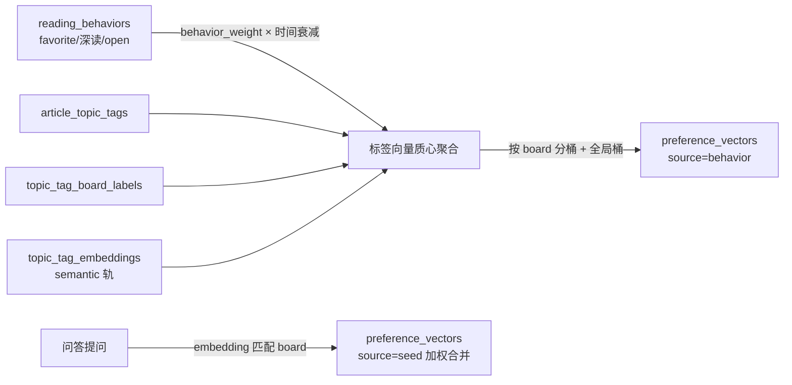
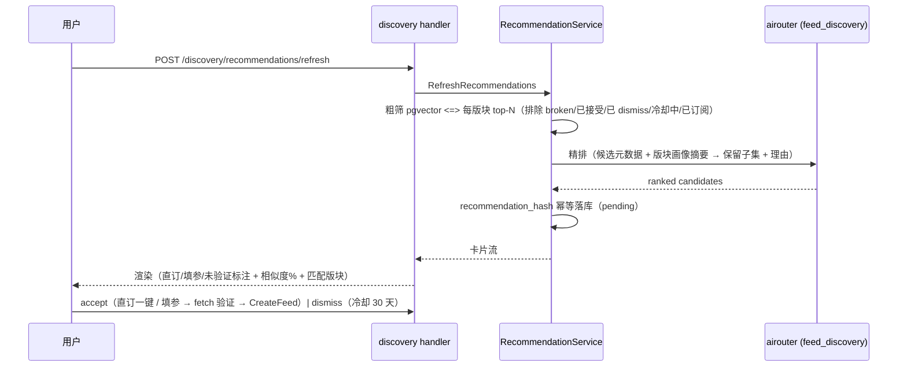
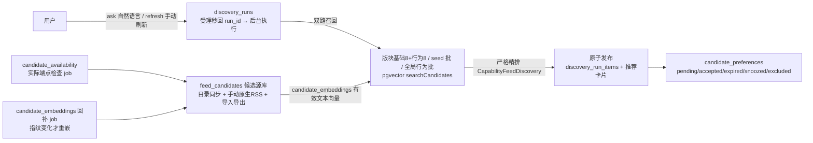

# 偏好向量画像与订阅源发现（Discovery）

<!-- doc-impact-applies: backend-go/internal/admin/service/, backend-go/internal/admin/handler/, backend-go/internal/admin/repository/ | section=业务约束与不变量 -->
> 大功能：阅读行为 → 偏好向量画像（按 SemanticBoard 聚合）→ 驱动 RSSHub 订阅源发现（向量粗筛 + LLM 精排 + 卡片状态机）→ 一键/填参订阅落地；问答式交互做冷启动。
> 跨端。互补：`flow/reading.md`（阅读行为采集，本 flow 的权重源）、`flow/scheduler.md`（`preference_profile_update` / `rsshub_catalog_sync` 两 job）。
>
> 本 change（preference-vector-feed-discovery）整体废弃旧「偏好分数」体系（`user_preferences` 表 / `preference_update` 调度器 / `/api/user-preferences/*` / `ReadingPreferencesPanel`），`reading_behaviors` 采集链路保留并改为向量画像的权重源。

## 需求说明

旧「阅读偏好」是 write-only 死功能：面板显示的 `read_score`/`interest_score` 后端从不返回（恒为 0），偏好分数零消费（排序、AI 总结、`getPreferenceScore()` 均无调用）。本功能基于「偏好」概念重做，让偏好产生真实价值——**驱动 RSSHub 订阅源发现**：

- **偏好画像重建**：以 `reading_behaviors` 为权重、`article_topic_tags × topic_tag_board_labels × topic_tag_embeddings` 为数据源，按 SemanticBoard 聚合出每版块一个偏好向量（+ 全局兜底行），scheduler 定期重算（零 LLM，纯向量算术）。
- **RSSHub 路由目录**：从自建 RSSHub 实例 `/api/namespace` 定时同步全量路由元数据，入库即解析 path 标记参数需求，对 example 路径异步限流可用性校验，为路由元数据生成 embedding。
- **订阅源推荐流**：偏好向量 × 路由向量余弦粗筛 top-N → LLM 精排生成推荐+理由 → 卡片流（pending/accepted/dismissed 状态机 + 已订阅去重 + dismiss 负反馈降权）。手动刷新为主（「换一批」）。
- **问答式交互**：发现页支持自然语言提问，LLM 即时从目录检索推荐；同时将兴趣表达 embedding 为**种子偏好**写入画像（冷启动）。
- **入口**：feeds 侧边栏「发现订阅源」入口 + 发现页；设置工作台 `preferences` section 由旧面板替换为「兴趣画像」视图。

**发现 v2（improve-discovery-recommendations，2026-09）**在保留上述架构的基础上重做发现链路：① ask/refresh 全部 run 化（`discovery_runs` 受理/执行两段异步 + 原子发布，失败绝不发布、零选择合法）；② 问答兴趣改为**逐条独立种子**（`discovery_interest_entries`，窗口/半衰期/成熟度衰减配额，不再合并进单条 seed 向量）；③ 召回改双路（版块 label 向量基础 8 + 版块行为 8 合并去重，基础路保底）+ seed 批 + 全局行为批；④ RSSHub 目录升级为**可维护候选源库** `feed_candidates`（目录同步 + 手动原生 RSS + 导入导出，**入库 ≠ 订阅**），配 `candidate_embeddings`（有效文本指纹增量重嵌）与 `candidate_availability`（实际端点可用性状态机）；⑤ 推荐生命周期（TTL 自动过期 / 暂时不看冷却 / 长期排除可恢复资格，`candidate_preferences`）。下文按 v2 现状描述，旧段保留作链路背景。

## 链路设计

### 偏好向量画像



画像读取 `GET /api/preference-profile` 返回各版块 top 标签/权重/来源/最后计算时间；空数据返回空列表。

### RSSHub 路由目录同步

```text
rsshub_catalog_sync scheduler（每日）
  → GET {rsshub_base_url}/api/namespace（全量路由元数据）
  → content_hash diff（新增/变更入库；消失标 status=gone）
  → 入库时解析 path 标记 requires_parameters / usable_directly
  → 异步：example 路径限流 GET 可用性校验（默认 2 req/s）→ status=ok/broken
  → 异步：新路由 / text_hash 变更入队生成 route_embeddings
```

### 订阅源推荐（粗筛 + 精排 + 状态机）



问答 `POST /discovery/ask`：问题 embedding → 粗筛 → 精排即时返回（同时 `source=qa` 落推荐表）+ 调种子写入（兴趣表达落 `source=seed`）。

### 参数可选值字典与卡片填参分流

### 发现 v2：run 化链路与候选源库（improve-discovery-recommendations）



问答与刷新均经 `POST /api/discovery/ask`（body: question）/ `POST /api/discovery/recommendations/refresh` 受理，秒回 `{run_id, status}`，前端轮询 `GET /api/discovery/runs/:id` 至 succeeded/failed；产出以 run 终态为准（响应里的计数字段恒 0 是兼容占位）。候选库 UI：发现页「候选源库」页签（搜索/筛选/新增/编辑/订阅/启停推荐/同步目录/导入导出），推荐历史与恢复入口在「历史」视图。
需填参路由（`requires_parameters=true`）推荐时，卡片填参表单按「参数可选值字典」分流渲染（feed-param-options）：

```text
recommendation 响应 route.param_options（按 param_name 分组的可选值，一次拿全，不二次请求）
  ↓ 前端 buildRouteParamSpecs(path, parameters, paramOptions, docUrl)
  ↓ 每个参数 spec：有 options → 下拉点选；无 options → 裸输入框兜底任意值
  ↓ 表单底部统一「官方文档」链接（docUrl = {doc_base}/routes/{namespace}#{slug}）
accept：选定值/输入值走原 accept parameters 路径（直订/填参验证不变）
```

字典来源铁律：可选值**只来自人工录入（`manual`）或文档抓取（`scraped`）**，LLM 绝不生成参数值（LLM 边界 = 仅推荐路由）。首版人工维护高频路由；冷门/缺数据路由退化为裸输入框 + 官方文档链接，不阻塞订阅。

## 业务约束与不变量

> 本节同时是 constraint-injection extension 的注入数据源——改 `internal/admin/`（偏好画像 / 发现 / 目录同步） 代码前会被自动注入 system prompt，必读。

1. **偏好向量必须按版块分桶以行为加权标签质心计算，全量重算只动 source=behavior 行、不得覆盖 seed 行**：`vec(board) = normalize(Σ w(tag)×tag_embedding(tag))`，`w(tag) = Σ behavior_weight × exp(-days/30)`，`behavior_weight`：`favorite=1.0 / 深读(scroll≥80% 或 time≥120s)=0.6 / 普通 open=0.3`。标签经 `topic_tag_board_labels` 分桶（一标签最多 3 版块都计入），未挂版块标签进全局桶。每桶最小标签数不足退全局桶。`RecomputeAll` 全量重建幂等——**只动 `source=behavior` 行，`source=seed` 行 MUST NOT 被覆盖**（种子与行为分行，重算清空 behavior 行重算，seed 行由问答独立维护）。改权重/衰减属于业务语义变更，非纯重构。
2. **问答种子向量必须合并累积写入 preference_vectors 的 seed 行，不得覆盖已有种子**：问答兴趣表达 embedding 与版块向量匹配（相似度 ≥ `SeedMatchThresholdDefault=0.5` 落对应版块，否则落全局桶），以 `source=seed` 写入 `preference_vectors`，**保 `UNIQUE(board_id, source)` 单行**：upsert 时 `new_vec = normalize(α×incoming + (1−α)×existing)`（`SeedMergeAlphaDefault=0.4`，均可配），`tag_weights` 同步合并 top 列表。多次问答落同版块 = 累积非覆盖。
3. **preference_vectors 与 route_embeddings 重算/粗筛前必须校验同 embedding_config 同维同模型，不一致报错阻断该轮**：`preference_vectors` / `route_embeddings` 入库记 `dimension` / `model`；重算 / 粗筛前校验与当前 `embedding_config` 同维同模型，不一致则**报错并阻断该轮**（不静默算错）。恢复路径：`source=behavior` 行下次重算自动按新 tag 向量重建（纯派生）；`source=seed` 行非派生不可自动重建，需重新问答或手动触发种子重嵌（重嵌时清空对应 seed 行让用户重新表达，避免用错维度向量污染画像）。
4. **recommendation_hash 不含 source，qa/manual_refresh 共享同一幂等池，同 hash 已有 pending 行不得重复入库**：`recommendation_hash = hash(route_id + board_id)`，**不含 source**——`qa` 与 `manual_refresh` 共享同一幂等池与 dismiss 冷却池。同 hash 已有 pending 行则不重复入库（符合「同源不重复推荐」语义）；问答先占坑的 route+board，手动刷新不再重复入库，反之亦然。此为预期，非 bug。
5. **被 dismiss 的推荐在默认 30 天冷却期内同 hash 不得再推，冷却跨 source 生效（qa/手动刷新换皮不重出）**：被 dismiss 的推荐在 `DismissCooldownDaysDefault=30`（可配）天内，同 hash 下一轮生成被 `countDismissedInCooldown` 拦截。**冷却同样按 hash 跨 source**：用户拒绝的源换皮（qa 重出 / 手动刷新重出）不再推。沿用 `board_upgrade_suggestions` 已验证的 `suggestion_hash` 幂等 + `CountDismissedInCooldown` 模式。
6. **粗筛必须按 route_id 状态机排除 broken/accepted/dismissed 路由与冷却期 hash，直订路由额外按已订阅 feeds.url 去重**：粗筛排除 `status=broken`、已 `accepted` 或 `dismissed` 的 route（按 **route_id 维度**状态机去重，`requires_parameters` 路由无需预判最终 url）、`usable_directly` 路由额外按 `feeds.url` 去重（已订阅的直订源不再推）、dismiss 冷却期内的 hash。每版块 top-`RecommendationTopNDefault=8`（可配）。
7. **可用性校验结果不得进粗筛硬过滤：仅 broken 硬排除，unknown（未验证）仍可被推荐**：example 路径异步限流 GET（默认 2 req/s 可配），`status=ok/broken/unknown`。校验**不进粗筛硬过滤**——`unknown`（无 example / 未校验）仍可被推荐，卡片标注「未验证」；仅 `broken` 硬排除。校验是后台异步，不阻塞目录同步主流程。
8. **路由参数需求必须在入库时解析并落 DB 字段（usable_directly/requires_parameters），推荐层按此分流**：解析 path 中 `:param` 段——`usable_directly` = 无参数段或全可选（`?`）；`requires_parameters` = 存在必填 `:param`。推荐层按此分流：`usable_directly` 一键订阅（example 或 path 直拼实例 host）；`requires_parameters` 展示 `parameters` 元数据（中文说明，目录自带）提示填参，填后走 `POST /feeds/fetch` 验证再 `POST /feeds`。
9. **accept 必须双路径分流：usable_directly 直接 CreateFeed，requires_parameters 填参 fetch 验证通过才建源**：`POST /discovery/recommendations/:id/accept`（body：`category_id?` + `parameters?`）——`usable_directly` 直订直接 `CreateFeed`；`requires_parameters` 用填参 fetch 验证通过才 `CreateFeed`；成功记录 `accepted_feed_id` 并置 `status=accepted`。
10. **Ask 问答推荐候选必须恒落全局桶（board_id=NULL），种子写入按阈值匹配版块，两者独立**：`Ask` 问答推荐的候选落库时 `board_id=NULL`（与 manual_refresh 的版块桶推荐仅在全局桶层面共享幂等池）。已知限制非 bug——避免问答与版块桶 hash 维度错位。问答的**种子写入**仍按阈值匹配版块（见约束 2），两者独立。
11. **RSSHub 目录同步必须按 content_hash diff 增量入库，消失路由标 status=gone、不得物理删除**：同步按 `content_hash`（namespace+path+name+description+parameters 的 hash）diff——新增/变更入库，消失的标 `status=gone`（不物理删除，保留供历史推荐回看）。`rsshub_base_url` 从 `ai_settings.rsshub_config` 读（缺省回落 `DefaultRSSHubBaseURL=http://rsshub.app`），实例不可达仅记日志保留旧目录（松耦合，失败不阻塞兄弟 job）。
12. **发现链路精排 LLM 必须走独立 capability CapabilityFeedDiscovery，不得与 CapabilitySummary 共用**：精排 LLM 走 `airouter` 独立 `CapabilityFeedDiscovery`（并发 2，手动刷新/问答低频突发），**不与 `CapabilitySummary` 共用**，便于分清用量与单独配模型；问答与路由 embedding 的 embedding 调用仍用通用 `CapabilityEmbedding`。所有 LLM/embedding 调用经 airouter + 写 `AICallLog`（operation：`discovery.recommendation_rerank` / `discovery.ask` / `discovery.route_embedding`），见 [`standard/backend/ai-logging.md`](../standard/backend/ai-logging.md)。
13. **route_param_options 的 source 只能取 manual/scraped，不得为 llm，service 层 Create/Update 硬拒**：`route_param_options` 表 `source` ∈ {`manual`, `scraped`}，**MUST NOT 为 `llm`**（service 层 Create/Update 硬拒）。LLM 在发现链路职责仅限推荐路由（向量粗筛 + 精排），参数可选值由人工/抓取提供真实枚举。**RSSHub 目录 `parameters` 自带的 `options` 数组也是真实数据源**（部分路由如 ifanr/jrj 已含枚举值），前端可直接消费，不违背 LLM 禁令。改 `source` 取值范围属业务语义变更。
14. **推荐卡片参数区必须按 options 分流（字典优先于目录自带），全无 options 时退化为输入框、不得阻塞订阅**：推荐卡片参数区按 options 分流——有可选值 → 下拉点选；无 → 裸文本输入框兜底任意值。**options 来源优先级：字典（`param_options`，manual/scraped）> 目录自带 options**（RSSHub 目录 `parameters` 枚举值）；两者都无时缺省。`buildRouteParamSpecs` 未传 `paramOptions` 且目录无该参数 options 时退化为 `{name,required,description}`（向后兼容）。**无 options 不能卡死订阅**，冷门路由靠输入框 + 官方文档链接兜底。`recommendation` 响应 `param_options` 必为非 nil map（无字典数据时为 `{}`，JSON 序列化空对象，向后兼容；目录 options 不进 `param_options`，由前端单独解析目录）。
15. **推荐卡片的官方文档链接必须始终出现：doc_base 存 ai_settings 可配，前端拉取失败兜底默认常量**：`docUrl = {doc_base}/routes/{namespace}#{slug}`，`doc_base` 存 `ai_settings.rsshub_doc_base`（经 `/api/settings/rsshub` 暴露，缺省 `https://docs.rsshub.app`）。官方文档站国内可能 `ERR_CONNECTION_RESET`，`doc_base` 可配换镜像。slug 基于 path 推导（首版去参数段，锚点精确规则待实测校准）。前端 `DiscoveryPanel` 初始化拉一次 `doc_base` 注入卡片，拉取失败兜底默认常量保证链接始终出现。
16. **发现 ask/refresh 必须 run 化两段执行：受理秒回 run_id，粗筛/精排/原子发布在后台，失败绝不发布、零选择合法**：`discovery_runs`（kind=qa/refresh，request_key 幂等唯一）受理（EnsureRun）+ 执行（Execute）分离；同 kind 已有 running run 时受理复用不重复执行。精排失败/召回失败落 failed+error_code，**不发布任何推荐**；精排明确零选择也是合法成功（写 run 不写推荐）；**不得静默把全部粗筛候选当精排结果**。前端「本轮是否产出」以 run 终态与精排选中数为准，不得读 refresh 受理响应里的占位计数字段（恒 0）。
17. **问答兴趣必须逐条独立入库 discovery_interest_entries，不得合成单条平均向量**：每条问答独立一行（query_text + embedding + board_id 阈值+margin 双条件匹配，匹配失败保持 NULL 不挂标签）；参与推荐的种子按窗口（默认 30 天）/行为成熟度衰减配额（默认预算 4、半衰期 7 天、上限 5 条）取前 K，名额未用完不转赠。**禁止把问答向量反复压进 preference_vectors 的 seed 行**（v1 合并语义已废弃，seed 行仅存迁移历史）。
18. **双路召回必须版块基础路与行为路合并去重，基础路保底不得被近期行为挤掉**：每个版块 = label 向量基础 top-8 + 版块行为画像 top-8 合并去重（每版块独立名额不跨版块争抢，cap 20）；label 无向量/维度不兼容时行为路独立成批，不伪造候选。同模型校验先行：召回侧与候选向量全表 (model,dimension) 一致性校验，不一致报 errRecallModelMismatch 阻断该轮，**不得跨模型混算、不得用旧向量兜底**。
19. **候选入库 ≠ 订阅：feed_candidates 增删改/导入导出 MUST NOT 触发订阅或文章抓取，上游同步不覆盖人工条目**：目录记录（`feed_candidates`）与真实订阅（`feeds`）完全分离，订阅只经通用建源端点（按 URL 精确去重，409=已存在）；目录同步只 upsert route 关联字段，**人工元数据（manual_metadata）与人工补充 MUST NOT 被上游同步覆盖**；路由从上游消失标 `rsshub_routes.status=gone`，候选保留、订阅不取消、仅禁止再次发起订阅。
20. **候选向量必须按有效文本指纹增量重嵌：先清洗格式再截取有效说明，不用 LLM 编造介绍；模型/维度不兼容不得用旧向量兜底**：有效文本 = 名称/网站/分类组/说明四段清洗（`SanitizeEffectiveText` 去表格/链接/提示块等格式噪音）+ rune 限长（总量 ≤500，供应商 512 token 上限）；指纹 = sha256(生成器版本+文本)，变化才重嵌（默认 20 条/批每小时）；生成携带 revision+指纹，写库前复查，任何变化即丢弃；无向量候选不编造（NoText 跳过），**不同模型的旧向量行不删除也不得参与检索**（同模型同维校验阻断）。
21. **候选展示出口必须清洗格式噪音，不得把上游文档 markdown 原文直接下发**：RSSHub 上游 description 是文档页源码（表格/链接/`<details>`/`::: tip`），`EffectiveMetadata` 出口统一过 `SanitizeEffectiveText`（人工与上游同洗，幂等；存储原文保留供搜索/指纹）；前端展示加 line-clamp 兑底，编辑回填用人工/上游原文（防把清洗值固化成人工覆盖阻断上游更新）。
22. **候选可用性检查是实际端点状态机：unknown（未验证）不得当作失效，gone（上游下架）不可再订阅但已有订阅不取消**：`candidate_availability` ∈ unknown/ok/broken/requires_parameters（无记录=unknown，明示未验证不伪造时间）；单次超时不得直接判坏（429/暂态给 retry-after）；检查按实际配置的 RSSHub/自建地址发请求。导入配置不得静默触发任意地址探测（私网/重定向逐跳校验，见 [`standard/backend/testing.md`](../standard/backend/testing.md) 数据安全红线）；导出默认脱敏（私有地址与凭据不导出）。
23. **推荐生命周期：自动过期 ≠ 拒绝，冷却/排除/恢复只动资格不动订阅**：推荐 TTL（默认 14 天）到期未入选自动退出默认列表（expired），**不是用户拒绝**；「暂时不看」冷却默认 30 天；长期排除（excluded）可恢复资格（restore 仅恢复推荐资格，不自动订阅不承诺立即出卡）；状态变更（accept/dismiss/expire/restore）**MUST NOT 取消或修改已有订阅**。
24. **v2 后台任务由 ai_settings.discovery_v2 开关控制（fail-open），关闭只停后台任务不回滚推荐引擎**：缺省/读取失败一律按**启用**处理（误读成禁用会让首次全量回补悄悄停摆）；开关管：可用性检查/向量回补/run 维护三个 job 的注册与 CheckCandidate/回补服务入口（关闭返回 configuration 错误→HTTP 503）；**不管**：ask/refresh 主链、候选 CRUD/导入导出、accept 建源。真正回滚旧推荐引擎需另做投影，本开关不包含。

## 代码入口

- **后端偏好画像（admin 域）**：`backend-go/internal/admin/service/preference_profile_service.go`（`RecomputeAll` D1 权重/衰减/分桶/幂等 + `WriteSeed` D7/A 加权合并 + `GetProfile`）、`backend-go/internal/admin/handler/preference_profile_handler.go`、`backend-go/internal/admin/scheduler/job_preference_profile_update.go`、路由 `/api/preference-profile` + `/recompute`。
- **后端 RSSHub 目录（admin 域）**：`backend-go/internal/admin/service/catalog_sync_service.go`（`SyncAll` /api/namespace + content_hash diff + 参数标记 + gone + `GetStatus`）、`catalog_extras.go`（`CheckAvailability` D4 异步限流 + `EmbedPendingRoutes` 路由向量）、`rsshub_config.go`（`resolveRSSHubBaseURL` 读 `rsshub_config`）、`backend-go/internal/admin/scheduler/job_rsshub_catalog_sync.go`、路由 `/api/discovery/catalog/{sync,status}`。
- **后端订阅源发现（admin 域）**：`backend-go/internal/admin/service/recommendation_service.go`（粗筛 pgvector `<=>` + route_id 状态机去重 + feeds.url/冷却 + 精排 LLM + accept/dismiss 状态机 + `Ask` 问答 + 种子写入）、`discovery_helpers.go`（`articleBehaviorLevel`/`timeDecay`/`normalizeVector`/`mergeSeedVectors`/`ComputeRecommendationHash`/`ParseRouteParameters` + 默认常量）、`backend-go/internal/admin/handler/discovery_handler.go`、路由 `/api/discovery/recommendations{,/:id/accept,/:id/dismiss,/refresh}` + `/api/discovery/ask`。
- **后端 RSSHub 设置**：`backend-go/internal/platform/aisettings/config_store.go`（`LoadRSSHubConfig`/`SaveRSSHubConfig`，key=`rsshub_config`；`LoadRSSHubDocBaseConfig`/`SaveRSSHubDocBaseConfig`，key=`rsshub_doc_base`，缺省 `https://docs.rsshub.app`）、路由 `/api/settings/rsshub`（GET/POST，响应附 `rsshub_doc_base` + `rsshub_doc_base_default`）。
- **后端参数可选值字典（admin 域）**：`backend-go/internal/admin/service/route_param_option_service.go`（`ListByRouteIDs` 批量 IN 查询 + `GroupByRouteAndParam` 按 param_name 分组 + CRUD + source 校验拒 `llm`）、`recommendation_service.go` 的 `attachParamOptions`（一次 IN 注入 `param_options`，禁 N+1，空 map 兜底 `{}`）、`backend-go/internal/admin/handler/route_param_option_handler.go`（字典 CRUD）、路由 `/api/admin/route-param-options`（GET/POST/PUT/DELETE）。
- **后端发现 v2 run 编排与候选源库（admin 域，improve-discovery-recommendations）**：`backend-go/internal/admin/service/discovery_run_service.go`（`EnsureAskRun`/`ExecuteAsk`/`EnsureRefreshRun`/`ExecuteRefresh` 受理+执行两段、后台执行 Start*InBackground、failRun 落 error_code、`GetRun`）、`discovery_recall.go`（`askBatches`/`refreshBatches` 双路召回 + `searchCandidates` pgvector 资格过滤 + seed policy 执行）、`recommendation_lifecycle.go`（TTL/冷却/排除/恢复）、`candidate_catalog_service.go`（CRUD/分页筛选/视图出口清洗）、`candidate_identity.go`（稳定键/人工字段校验/`EffectiveMetadata` 出口清洗）、`candidate_embedding_service.go`（有效文本指纹增量重嵌 `DirtyCandidateEmbeddings` + `SanitizeEffectiveText`）、`candidate_check_service.go`（实际端点可用性状态机 + retry-after）、`candidate_catalog_transfer.go`（导入预览/确认/脱敏导出）、`seed_policy.go`/`lifecycle_config.go`/`discovery_v2_switch.go`（ai_settings 三配置）、`discovery_run_maintenance.go`（僵尸 run 维护）；handler：`discovery_handler.go`（ask/refresh 异步受理 + runs/:id + interests + history/restore）、`candidate_catalog_handler.go`（candidates CRUD/导入导出）、`candidate_access_handler.go`；调度：`scheduler/job_discovery_v2.go`（可用性检查/向量回补/run 维护三 job，注册见 `internal/app/runtime.go`）。
- **数据模型**：`backend-go/internal/models/discovery.go`（`PreferenceVector` / `RSSHubRoute` / `RouteEmbedding` / `FeedRecommendation` / `RouteParamOption`（参数可选值字典，UNIQUE(route_id,param_name,value)），pgvector 列沿用 `topic_tag_embeddings` 写法）、`discovery_run.go`（`DiscoveryRun`/`DiscoveryRunItem`/`DiscoveryInterestEntry`/`CandidatePreference`/`CandidateEmbedding`）、`discovery_candidate.go`（`FeedCandidate`）、`candidate_availability.go`。表结构与索引详见 [`database/tables/preference-discovery.md`](../database/tables/preference-discovery.md)。
- **前端**：`front/app/features/discovery/`（`useDiscovery` + `DiscoveryPanel`（常驻查询区/独立 run 结果视图/历史与恢复） + `CandidateLibrary.vue`（候选库四态/分页/同步目录/导入导出） + `DiscoveryRunCard.vue`/`DiscoveryCard.vue` + 四弹窗）、`front/app/pages/discovery.vue`、`front/app/api/discovery.ts`（run 轮询/候选/导入导出契约，异步 run 受理响应计数字段不消费）、`front/app/stores/discovery.ts`（`pollRun` 共享轮询/`refresh` 按 run 终态判定/候选状态机）、`front/app/utils/routeParams.ts`（`buildRouteParamSpecs` 扩展 `options?`/`docUrl?` + `buildRouteDocUrl` + `DEFAULT_RSSHUB_DOC_BASE`）、`DiscoveryCard.vue`（`spec.options` 非空 → `<select>` 点选，否则 `AppInput` 兜底；表单底部「官方文档」链接）、`DiscoveryPanel.vue`（`onMounted` 拉 `/api/settings/rsshub` 取 `rsshub_doc_base` 注入卡片）、`front/app/composables/useRsshubConfig.ts`、`front/app/features/settings/components/{SettingsSectionPreferences,SettingsSectionRsshub}.vue`（兴趣画像 + RSSHub 实例配置）、`front/app/features/settings/composables/usePreferenceProfile.ts`、feeds 侧边栏「发现订阅源」入口（`AppSidebarView.vue`）。
- 应用装配：`backend-go/internal/app/router.go`、`backend-go/internal/app/runtime.go`（注册两新 scheduler）。

## 变更溯源

| 日期 | 变更 | 摘要 | 归档位置 |
|------|------|------|----------|
| 2026-07-25 | preference-vector-feed-discovery | 新增偏好向量画像（替代旧偏好分数）+ RSSHub 路由目录同步 + 订阅源发现（向量粗筛 + LLM 精排 + 卡片状态机）+ 问答冷启动；废弃删除旧 `user_preferences` / `preference_update` / `/api/user-preferences/*` / `ReadingPreferencesPanel` | [`openspec/changes/archive/2026-07-25-preference-vector-feed-discovery`](../../../openspec/changes/archive/2026-07-25-preference-vector-feed-discovery) |
| 2026-08-01 | feed-param-options | 路由参数可选值字典：`route_param_options` 表（route_id+param_name+value+label+source）；recommendation 响应附 `param_options`；DiscoveryCard 参数区下拉点选/文本输入分流 + 官方文档链接；`rsshub_doc_base` 配置 | [`openspec/changes/archive/2026-08-01-feed-param-options`](../../../openspec/changes/archive/2026-08-01-feed-param-options) |
| 2026-09-04 | constraint-declaration-redline | 约束节红线句格式化：本域「业务约束与不变量」节每条约束改写为首行加粗自含红线句 + 细节跟后（语义不变），declaration 注入降为红线层（上线后实测 bytes 降约 60%），细节层经关键词/JIT 全节注入按需补全；本域为格式改写，无业务行为变更 | [`openspec/changes/archive/2026-09-04-constraint-declaration-redline`](../../../openspec/changes/archive/2026-09-04-constraint-declaration-redline) |
| 2026-09-19 | improve-discovery-recommendations | 发现 v2 整体重做：ask/refresh run 化两段执行（失败绝不发布/零选择合法）、问答种子逐条独立+衰减配额（`discovery_interest_entries`）、双路召回基础路保底、RSSHub 目录升级可维护候选源库（`feed_candidates` 等 7 新表，入库≠订阅，导入导出/人工覆盖隔离/实际端点可用性状态机）、有效文本指纹增量重嵌（清洗+≤500 rune+指纹 v2）、推荐生命周期（TTL 过期≠拒绝/冷却/恢复仅恢复资格）、v2 开关（fail-open 只停后台任务）；约束节新增 16-24 九条红线 | [`openspec/changes/archive/2026-09-19-improve-discovery-recommendations`](../../../openspec/changes/archive/2026-09-19-improve-discovery-recommendations) |
