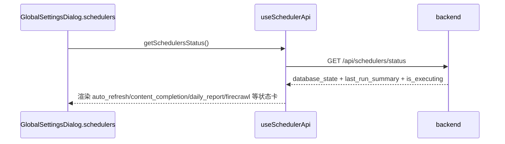

# 定时任务流程（Scheduler）

<!-- doc-impact-applies: backend-go/internal/admin/scheduler/ | section=业务约束与不变量 -->
> 大功能：横切的调度器集合（feed 刷新、内容增强、AI 总结、Digest/日报、标签、状态回传、手动 trigger）。
> 跨端。互补：`architecture/runtime.md` §Scheduler 状态、§优雅退出。

## 需求说明

Scheduler 解决「集中调度周期性后台任务」的问题。Syntopica 有大量无需用户干预的后台管线——feed 自动刷新、Firecrawl 全文抓取、内容补全（文章整理稿）、日报生成、标签质量分、阅读偏好聚合、版块升级建议、日志/辅助标签清理、生命线周/月/年刷新等。Scheduler 把这些任务统一为：

- **声明式注册**：在 `app/runtime.go` 用 `registry.Register` 注册即自动出现在状态接口与手动触发接口，无需在 handler 维护第二份清单。
- **状态可视化**：前端 GlobalSettings → Schedulers tab 实时显示每个 job 的 `database_state` + `last_run_summary` + `is_executing`，用户知道后台在忙什么。
- **手动触发**：用户可即时 trigger 任一 job（不必等定时点），后端返回真实的 accepted / started / reason 反馈，前端据实展示（不只看 HTTP 200）。

## 链路设计

### 调度器清单

调度器清单（按 `app/runtime.go` 注册顺序，共 14 个）：

| 注册名 | 中文名 | 触发 | 说明 |
| ------ | ------ | ------ | ------ |
| `log_cleanup` | 日志清理 | 86400s（启动延迟 5min） | 清理过期 `ai_call_logs` 与 `otel_spans` |
| `aux_label_cleanup` | 辅助标签清理 | 3600s（启动延迟 10min） | 先按 `tag_edge_retention_days`（默认 7 天）回收超窗 `article_topic_tags` 边 + `CleanupOrphanedTags` 收孤儿，再清理无活跃 topic_tag 引用的辅助标签 |
| `blocked_article_recovery` | 阻塞文章恢复 | 3600s | 恢复卡在 blocked 状态的文章 |
| `preference_profile_update` | 偏好向量画像重算 | 3600s | 以 `reading_behaviors` 为权重源，按 SemanticBoard 聚合偏好向量（纯向量算术，零 LLM）；见 `flow/discovery.md` |
| `rsshub_catalog_sync` | RSSHub 路由目录同步 | 每日 | 拉取自建 RSSHub 实例 `/api/namespace`，content_hash diff 入库 + 参数标记 + 增量可用性校验 + 新路由 embedding；见 `flow/discovery.md` |
| `tag_quality_score` | 标签质量分重算 | 3600s | 重算 topic tags 的持久化质量分；并对账辅助标签 ref_count 与 topic tags 反规范化 feed_count（打标路径不增量维护，靠此周期重算） |
| `auto_refresh` | Feed 自动刷新 | 60s | 刷新 `refresh_interval>0` 的 RSS feed，并种入后续链路状态位 |
| `content_completion` | 内容补全（别名 `ai_summary`） | 60s | 补全文章内容 + 生成文章级整理稿；持久化任务名/别名均为 `ai_summary` |
| `daily_report` | 日报生成 | 每日定时（TriggerNowWithDate 包装） | 为所有活跃版块生成日报，生成完当天后自动补档保留窗口内缺档日期（队列空前置、只补缺、顺延次日，超窗日期重建被拒；见 `flow/daily-report.md`） |
| `board_upgrade_suggest` | 版块升级建议 | 每日 06:30 固定点（松耦合） | discover_new 生成 + watch 观察池 GC，失败仅记日志 |
| `firecrawl` | Firecrawl 全文抓取 | 300s | 自动抓取文章全文 |
| `lifeline_weekly` | 生命线周度刷新 | 每周一 03:00（循环 A） | 刷新所有活跃话题的周度新闻汇总（含历史回填，见 `flow/data-enrichment.md`） |
| `lifeline_monthly` | 生命线月度刷新 | 每月1号 03:30（循环 A） | 月度新闻汇总（含历史回填） |
| `lifeline_yearly` | 生命线年度刷新 | 每年1月1号 04:00（循环 A） | 年度新闻汇总（含历史回填） |

> **offline-catchup 之后两个 job 的口径变化**：
> - **`aux_label_cleanup` 两步走**：① 标签边时间窗 GC——读 `ai_settings.tag_edge_retention_days`（缺失/非数字/≤0 回退默认 7 并 warn），删除 `created_at` 早于保留窗口下界日（本地日历天零点 − N 天，日历天口径，与重建守卫/补档扫描同口径）的 `article_topic_tags` 边（仅归档文章；下界日当天全天保留），随后对受影响 topic tag 复用 `CleanupOrphanedTags` 收孤儿；② 原有 aux label GC（无活跃 topic_tag 引用则 disable）。**孤儿回收职责整体从归档路径移交到此**（归档不再删边，见 `flow/reading.md` 约束 6）。属维护类，不受 `analysis_paused` 门禁约束。
> - **`daily_report` 自动补档**：生成完当天报告后，若 tag 队列无 pending/leased，则对窗口 `[today-N, today)`（N=`tag_edge_retention_days`，默认 7，不含今天）逐日 × 活跃板块检查 `(board, period_date)`，缺失才 `GenerateAndSaveReport` 重建（幂等 upsert，只补缺不重算已有）；队列未清则本轮跳过、次日 21:00 再试（缺档不丢）。`POST /api/daily-reports/generate` 与 `TriggerNowWithDate` 对 `date` 早于保留窗口下界日（本地日历天零点 − N 天，与边 GC 同口径）一律拒绝（4xx / accepted=false，防空报告覆盖好报告）。

> **已废弃 / 非调度器（旧清单误列，已删除）**：① 旧的独立 `auto_summary` 调度器 —— 已被 `content_completion`（兼容别名 `ai_summary`）取代；② 叙事摘要生成 / 叙事后处理 / 关注标签叙事维度总结 —— narrative 生成管线已废弃，生成能力并入日报（`daily_report`），watch 走日报的 `EvaluateWatchHits`，均非独立调度器；③ 标签自动合并 —— 改走 `merge-preview` 的 scan/evaluate SSE API（见 `flow/semantic-board.md`），非调度任务；④ SemanticBoard 匹配 —— tag 入库时同步触发（`semantic_board_matching.go`），非调度任务。

> **自动发现**：调度器清单由 `scheduler.Registry` 自动发现——在 `app/runtime.go` 用 `registry.Register` 注册即自动出现在 `GET /api/schedulers/status` 与 `POST /api/schedulers/:name/trigger`，无需在 handler 维护第二份 descriptor 列表。展示顺序 = runtime 注册顺序。展示元数据（Description/TaskName/Aliases）随 `scheduler.Config` 走，经 `BaseScheduler.GetConfig()` 暴露。

### scheduler 状态回传



### 手动 trigger 链路

```text
GlobalSettingsDialog.schedulers tab
  → useSchedulerApi.triggerScheduler(name)
  → POST /api/schedulers/:name/trigger
  → backend 判断 accepted / started / reason / message
  → 前端显示真实反馈（不只看 HTTP 200）
  → 短周期轮询刷新最新状态
```

### `auto_refresh` 状态流

```text
auto_refresh scheduler
  → 扫描 refresh_interval > 0 的 feed
  → 判断是否到点
  → 标记 feed.refresh_status=refreshing
  → 异步调用 feedService.RefreshFeed()
  → 扫描数/到点数/触发数/已在刷新数 写回 scheduler_tasks.last_execution_result
```

`auto_refresh` 状态位预埋（代码级细节）：feed 刷新不只是在「加文章」，还会把后续 Firecrawl / 内容补全链路需要的状态位一起种进去（`buildArticleFromEntry`）：

- 默认 `summary_status = complete`
- feed 开启 `firecrawl_enabled` → 文章先标记 `firecrawl_status = pending`
- 同时开启 `article_summary_enabled` → 再标记 `summary_status = incomplete`
- `cleanupOldArticles` 按 `max_articles` 清理旧文章（收藏文章跳过）

### `auto_summary` → 已并入 `content_completion`

历史上独立的 `auto_summary` 调度器（扫描 `ai_summary_enabled=true` 的 feed 聚合生成 summary）**已不存在**。其能力由 `content_completion` 调度器（兼容别名 `ai_summary`，TaskName 同为 `ai_summary`）承接——补全文章内容并生成文章级整理稿（见 `flow/content-enrichment.md`）。前端/历史文档若仍出现 `ai_summary` 名称，指的即是 `content_completion`。

## 业务约束与不变量

> 本节是 constraint-injection extension 的注入数据源：apply 改 `internal/admin/` 代码前会自动注入 system prompt，必须遵守。

1. **调度器清单必须由 scheduler.Registry 自动发现，不得在 handler 维护第二份 descriptor 列表**：调度器清单由 `scheduler.Registry` 自动发现——`registry.Register` 注册即出现在 `GET /api/schedulers/status` 与 `POST /api/schedulers/:name/trigger`。**禁止在 handler 维护第二份 descriptor 列表**（展示顺序 = runtime 注册顺序，重复维护会漂移）。
2. **同一 job 不得并发执行，TriggerNow 执行中再触发返回 409 + accepted=false**：`BaseScheduler.TriggerNow` 用 `isExecuting` 标志做重入保护——job 正在执行时再触发返回 `status_code=409` + `accepted=false`，**不并发执行同一 job**。
3. **trigger 的成败必须按响应 accepted 字段判定，不得只看 HTTP 200**：`respondTriggerResult` 按 `result["accepted"]` 决定 `success:true|false`；即便 HTTP 200，`accepted=false` 也要前端据 reason / message 实反馈。HTTP 409（执行中）/ 500（执行出错）按 status_code 透传。
4. **单 job 失败默认标 task failed，松耦合 job 须吞 error 仅记日志、不阻塞同轮兄弟 job**：单个 job 执行失败默认标记 task failed；但**松耦合 job（如 board_upgrade_suggest、preference_profile_update、rsshub_catalog_sync）刻意吞掉 error 返回 nil**，仅记日志，不阻塞同轮兄弟 job（design D4）。`rsshub_catalog_sync` 实例不可达时仅记日志保留旧目录，推荐继续用存量目录。
5. **auto_refresh 只扫描 refresh_interval > 0 的 feed，触发后先标 refresh_status=refreshing 再异步刷新**：只扫描 `refresh_interval > 0` 的 feed；触发后先标 `feed.refresh_status=refreshing` 防止重复触发，再异步 `RefreshFeed`。
6. **auto_refresh 刷新文章时必须按 feed 开关预埋 firecrawl_status / summary_status 初始状态位**：`auto_refresh` 刷新文章时必须按 feed 开关（`firecrawl_enabled` / `article_summary_enabled`）种入 `firecrawl_status` / `summary_status` 初始位，否则后续 Firecrawl / 内容补全链路会漏处理。
7. **analysis_paused 总闸开启时分析类 job 与 tag worker 池一律跳过不 lease（优雅停），auto_refresh 与维护类不受影响**：全局 `analysis_paused` 标志（存 `ai_settings`，重启保持）开启时，所有分析类调度 job（`content_completion` / `firecrawl` / `daily_report` / `board_upgrade_suggest` / `lifeline_weekly/monthly/yearly` / `tag_quality_score`）在 tick 自检直接返回 `skipped: analysis paused`、不 lease；tag worker 池（`TagQueue` / `EmbeddingQueue` / `MergeReembedding`）不消费队列。`auto_refresh`（入库）与维护类（`log_cleanup` / `aux_label_cleanup`（含标签边时间窗回收 `tag_edge_retention_days`，同属维护类不受暂停门禁）/ `blocked_article_recovery` / `rsshub_catalog_sync` / `preference_profile_update`）不受影响。优雅停：在跑批次跑完，不强杀。与 per-feed 的 `tagging_enabled`（分闸）共存——总闸关时分闸无效。开关经 `GET/POST /api/analysis/pause` 控制，前端顶部栏二态开关（`mdi:pause`↔`mdi:play`）+ favicon 暂停态 ⏸ 角标。

    **健康门维度（ai-model-health-gate）**：暂停判定含健康门——`有效暂停 = 用户暂停 || NOT 健康`。健康由 `aihealth` 启动探活决定（宽松判定：≥1 embedding 路由主 provider 通 **且** ≥1 llm 路由主 provider 通）；启动竞态期快照未就绪 → healthy=false → 有效暂停、分析不 lease，探活完成后自动恢复。**用户开关/按钮/favicon/API 的 `analysis_paused` 仍只反映用户意图**（`UserPaused()`），不受健康影响；前端在「意图运行但 !健康」时顶部 banner 提示（见 §代码入口）。

    **心跳与自愈（ai-health-reprobe）**：后台心跳器（`aihealth.StartPeriodicReprobe`，默认 60s 间隔）**无论快照健康与否均持续探测**（复用启动探测全流程：自动拉起/45s 轮询/10min 冷却/全局互斥）：NOT 健康时持续重探直至自愈；healthy 态探测发现端点失联时**连续 2 次失败才降级**（去抖，秒拒型最坏 ≈2×间隔；探测超时沿用 provider 自身 `timeout_seconds`，慢而活着的服务器在超时内应答不计失败，忙容忍由 provider 超时提供），降级即关健康门暂停分析，单次探通即恢复；心跳失败走既有拉起链路（受冷却约束）。`POST /api/ai/health/reprobe` 可手动异步触发一次重探（in-flight 时返回 skipped，不排队不并发），前端设置页「AI 健康状态」卡片与未就绪 banner 均有「重新检测」入口。**代理污染防线**：全局出站代理（httpclient）对回环地址（localhost/127.x/::1）一律直连，本地 llama-server 探测/推理不被代理 502 拦截；**代理进程本身挂掉时自动熔断降级直连**（2026-09-17 outbound-proxy-failover）：拨代理失败即开熔断 60s，窗口内全部出站请求（抓取/Firecrawl/LLM）直连零等待，到期单请求试探代理、通则自动接回——代理不可达不再拖垮直连可达的源；详见 `docs/reference/configuration.md` 出站代理节。

## 代码入口

- **后端调度框架**：`backend-go/internal/admin/scheduler/`（`base.go` BaseScheduler + `TriggerNow` 互斥 + `is_executing` 状态、`registry.go` 自动发现注册、`persistence.go` scheduler_tasks 持久化、`job_*.go` 各 job wrapper：`job_auto_refresh` / `job_firecrawl` / `job_content_completion` / `job_daily_report` / `job_tag_quality_score` / `job_board_upgrade_suggest` / `job_aux_label_cleanup` / `job_blocked_article_recovery` / `job_preference_profile_update` / `job_rsshub_catalog_sync` / `job_log_cleanup`）；生命线三 job（`lifeline_weekly`/`monthly`/`yearly`）的 JobFunc 由 `dataenrichment` 包提供，在 `runtime.go` 内联注册（无独立 `job_*.go` wrapper）。旧 `job_preference_update`（阅读偏好分数聚合）已删除（见 `flow/discovery.md`）。
- **后端装配**：`backend-go/internal/app/runtime.go`（`registry.Register` 注册所有 scheduler、优雅退出 `Stop`；`resetStaleStates` 之后异步触发 `aihealth.RunStartupProbe`，不阻塞 worker 启动）。
- **后端 handler**：`backend-go/internal/admin/handler/scheduler_handler.go`（status / trigger / reset stats，`respondTriggerResult` 透传 `accepted` + `status_code`；`GetSchedulersStatus` 顶层附 `analysis_paused`/`analysis_paused_at`（用户意图）+ `ai_healthy`/`ai_health_routes`（模型健康）全局态）；`backend-go/internal/admin/handler/ai_health_handler.go`（`GET /api/ai/health`、`PUT /api/ai/health/auto-start-models`、`POST /api/ai/health/reprobe`）。
- **后端分析暂停（pause-analysis）**：`backend-go/internal/platform/analysispause/gate.go`（`UserPaused`（用户意图）/`IsPaused`（有效暂停 = 用户暂停 \|\| 模型不健康）/`PauseReason`/`SetPaused`/`PausedAt`，fail-open）、`backend-go/internal/admin/scheduler/pause.go`（`PauseAware(job)` wrapper，paused 时返回 skipped JobResult 不计 failed）、`backend-go/internal/admin/handler/analysis_pause_handler.go`（`GET/POST /api/analysis/pause`）。分析类 job 在 `runtime.go` 注册时被 `scheduler.PauseAware(...)` 包裹；三个 worker（`tag_queue.go`/`embedding_queue.go`/`merge_reembedding_queue.go`）lease 循环各自 `analysispause.IsPaused()` 自检。
- **后端 AI 健康（ai-model-health-gate）**：`backend-go/internal/platform/aihealth/`（启动健康检测 + 自动拉起 + 内存快照；`Healthy()`/`GetSnapshot()`/`RunStartupProbe`/`TryStartProbe`/`StartPeriodicReprobe`，快照未就绪 fail-closed）。
- **前端**：`front/app/pages/settings.vue` + `front/app/features/settings/components/SettingsSectionSchedulers.vue`（新版设置工作台 Schedulers section）、`front/app/components/dialog/GlobalSettingsDialog.vue`（旧版 Schedulers tab，与 settings 页并存）、`front/app/components/dialog/SchedulerStatusPanel.vue`（状态卡）、`front/app/composables/useSchedulerStatus.ts`（状态轮询 + trigger + 暂停态 `analysisPaused`）、`front/app/api/scheduler.ts`、`front/app/composables/useAnalysisPauseFavicon.ts`（favicon ⏸ 角标切换）、`front/app/features/shell/components/AppHeaderView.vue`（顶部栏暂停二态开关）、`front/app/components/ai/AiHealthBanner.vue`（AI 模型未就绪全局 banner：意图运行但 !健康 时提示，跳设置页）。

## 变更溯源

| 日期 | 变更 | 摘要 | 归档位置 |
|------|------|------|----------|
| 2026-08-23 | fix-quality-audit-p0 | `tag_quality_score` job 新增 topic_tags 反规范化 `feed_count` 周期对账（重算 COUNT(DISTINCT articles.feed_id)，修打标不增量维护导致的排序漂移）；同期修复前端 AI 摘要开关字段错读（详见 reading.md） | [`openspec/changes/archive/2026-08-23-fix-quality-audit-p0`](../../../openspec/changes/archive/2026-08-23-fix-quality-audit-p0) |
| 2026-05-10 | global-settings-feed-controls | Feed 卡片新增 Firecrawl / 打标签 / 内容补全 3 个管线 toggle；后端 `tagging_enabled` 字段控制是否入 tag 队列；max_articles「无限制」上限修正 | [`openspec/changes/archive/2026-05-10-global-settings-feed-controls`](../../../openspec/changes/archive/2026-05-10-global-settings-feed-controls) |
| 2026-07-23 | board-discovery-expansion | 新增定时 job `job_board_upgrade_suggest`（默认每天 06:30 自动以 discover_new 模式生成升级建议入 `board_upgrade_suggestions` 表，HH:MM 可配） | [`openspec/changes/archive/2026-07-23-board-discovery-expansion`](../../../openspec/changes/archive/2026-07-23-board-discovery-expansion) |
| 2026-07-25 | preference-vector-feed-discovery | 删 `preference_update`（旧偏好分数聚合，1800s），新增 `preference_profile_update`（偏好向量画像重算，3600s，纯向量算术零 LLM）+ `rsshub_catalog_sync`（RSSHub 路由目录同步，每日，含可用性校验与路由 embedding）；两 job 均松耦合失败不阻塞兄弟 job | [`openspec/changes/archive/2026-07-25-preference-vector-feed-discovery`](../../../openspec/changes/archive/2026-07-25-preference-vector-feed-discovery) |
| 2026-08-02 | pause-analysis | 新增「分析暂停总闸」全局开关：暂停时 content_completion/firecrawl 不再 lease、tag worker 不消费，auto_refresh 仍入库；favicon 显示 ⏸；状态持久化重启保持；恢复后堆积任务续跑 | [`openspec/changes/archive/2026-08-02-pause-analysis`](../../../openspec/changes/archive/2026-08-02-pause-analysis) |
| 2026-08-04 | ai-model-health-gate | 健康门接入分析暂停：`IsPaused` 改为「用户暂停或模型不健康」；启动探针遍历路由主 provider 探活（宽松判定：embedding 主通且 ≥1 llm 主通），不健康时分析类 job 跳过；`auto_start_models` 开关 + provider `start_command` 启动自动拉起本地模型（fire-and-forget，不托管进程、不记 PID） | [`openspec/changes/archive/2026-08-04-ai-model-health-gate`](../../../openspec/changes/archive/2026-08-04-ai-model-health-gate) |
| 2026-08-18 | 自动拉起防重复（直接修复） | 修复慢启动模型导致的进程无限堆积：同一次探测内同 provider 多路由只探/拉一次；成功拉起后 10 分钟冷却窗口内 reprobe 不再执行 start_command 只继续轮询；`RunStartupProbe` 全局互斥，进行中时新触发的 reprobe 直接跳过 | 直接修复（用户豁免 openspec 流程），行为约束见 [`openspec/specs/ai-model-health/spec.md`](../../../openspec/specs/ai-model-health/spec.md) |
| 2026-08-19 | ai-health-reprobe | 健康门自愈：快照 not healthy 时后台定时重探（默认 60s，健康后停手）+ `POST /api/ai/health/reprobe` 手动异步重探（in-flight 返回 skipped）+ 前端设置页/banner「重新检测」入口；修复全局代理污染——httpclient 对回环地址（localhost/127.x/::1）直连，本地 LLM 探测不再被代理 502 拦截 | [`openspec/changes/archive/2026-08-19-ai-health-reprobe`](../../../openspec/changes/archive/2026-08-19-ai-health-reprobe) |
| 2026-08-24 | retire-narrative-legacy | 调度器职责描述「Digest/叙事」→「Digest/日报」（narrative 管线废弃清单保留为历史注记） | [`openspec/changes/archive/2026-08-24-retire-narrative-legacy`](../../../openspec/changes/archive/2026-08-24-retire-narrative-legacy) |
| 2026-08-22 | analysis-remediation | `job_log_cleanup` 扩展保留策略：新增 `embedding_queues` completed > 30 天清理（`idx_embedding_queues_completed_created` 索引支撑），防止 completed 历史行无限累积 | [`openspec/changes/archive/2026-08-22-analysis-remediation`](../../../openspec/changes/archive/2026-08-22-analysis-remediation) |
| 2026-09-04 | constraint-declaration-redline | 约束节红线句格式化：本域「业务约束与不变量」节每条约束改写为首行加粗自含红线句 + 细节跟后（语义不变），declaration 注入降为红线层（上线后实测 bytes 降约 60%），细节层经关键词/JIT 全节注入按需补全；本域为格式改写，无业务行为变更 | [`openspec/changes/archive/2026-09-04-constraint-declaration-redline`](../../../openspec/changes/archive/2026-09-04-constraint-declaration-redline) |
| 2026-09-16 | ai-health-heartbeat-reprobe | 健康心跳双向化：定时重探不再「健康即停」——每 60s 无条件复检，连续 2 次探测失败降级 `ai_healthy=false`（去抖防瞬断误判），单次探通即恢复；降级后分析任务自动停租约（走既有 IsPaused 门禁），provider 超时内的慢响应计成功、不误降级 | [`openspec/changes/archive/2026-09-16-ai-health-heartbeat-reprobe`](../../../openspec/changes/archive/2026-09-16-ai-health-heartbeat-reprobe) |
| 2026-09-16 | offline-catchup | 定时 job 两处调整：`aux_label_cleanup` 串接标签边时间窗回收（`tag_edge_retention_days` 默认 7 日历天，超窗边删 + 孤儿 tag 清理，AI 分析暂停不受影响）；`daily_report` 尾部补档扫描（tag 队列空时补齐窗口内缺档日期，队列未清空顺延次日） | [`openspec/changes/archive/2026-09-16-offline-catchup`](../../../openspec/changes/archive/2026-09-16-offline-catchup) |
| 2026-09-17 | failover-dead-proxy-to-direct | 全局出站代理故障熔断（outbound-proxy-failover）：拨代理失败即开熔断 60s，窗口内全部出站请求直连零等待，到期单请求试探自动接回（仅「拨代理失败」触发，目标侧失败不熔断）；代理配置变更对所有已构造 client 即时生效（原快照语义需重启才对抓取生效） | [`openspec/changes/archive/2026-09-17-failover-dead-proxy-to-direct`](../../../openspec/changes/archive/2026-09-17-failover-dead-proxy-to-direct) |
