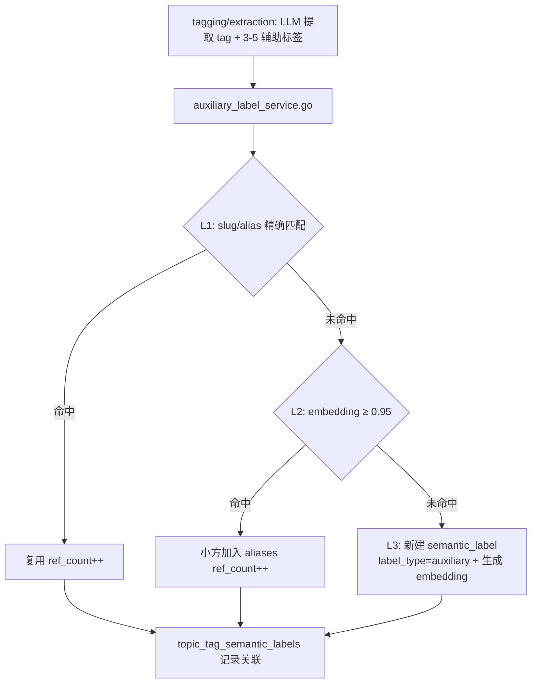
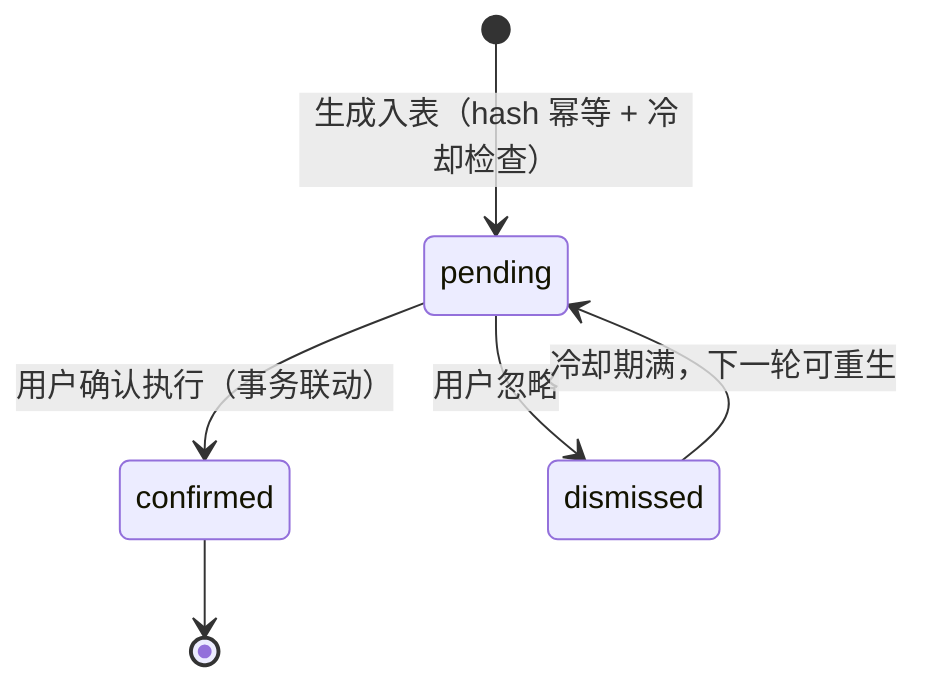
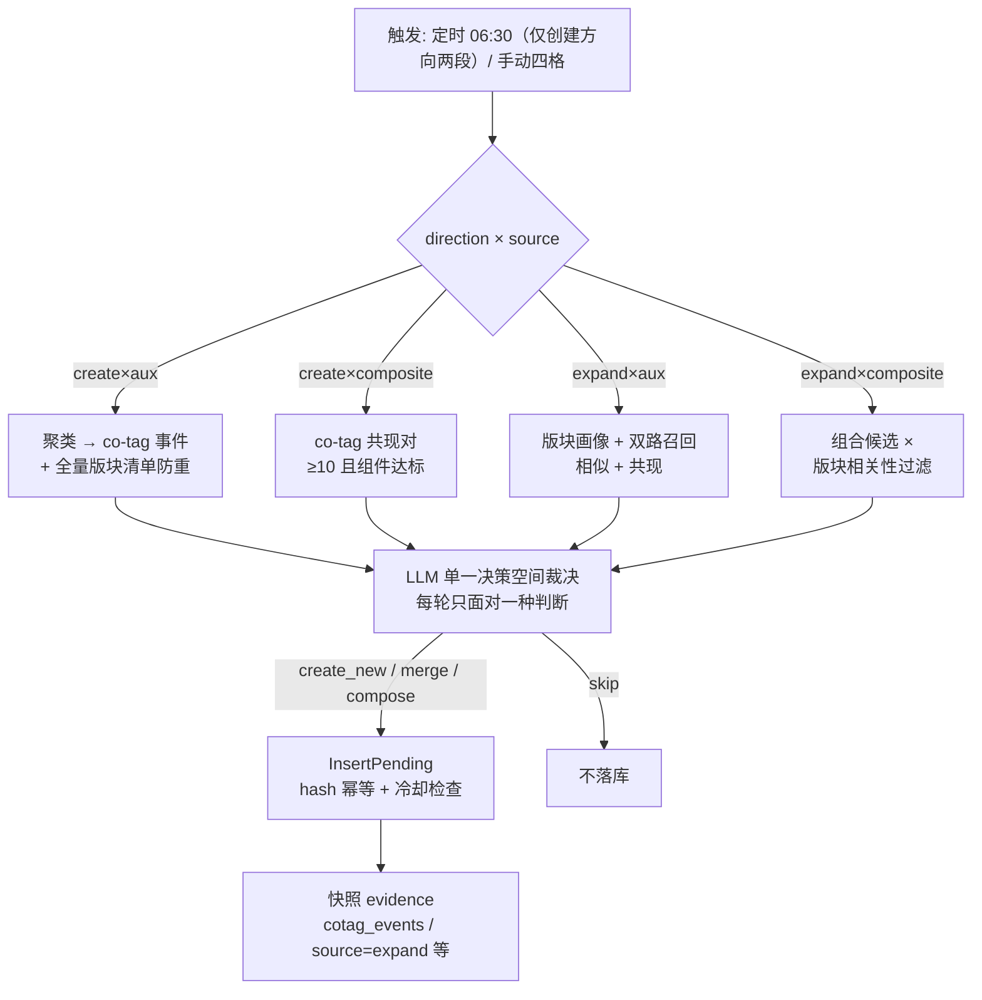
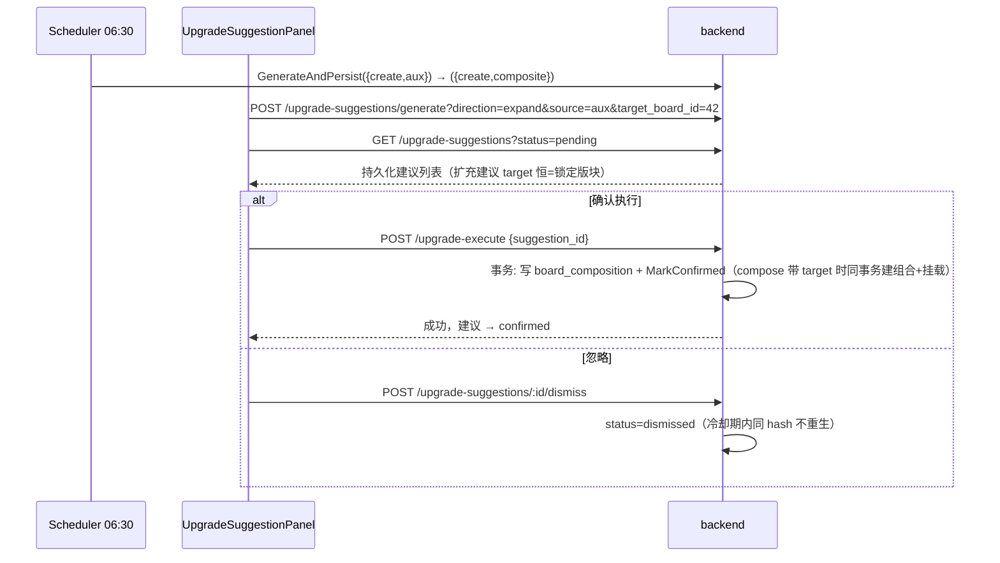

# 语义版块流程（Semantic Board）

<!-- doc-impact-applies: backend-go/internal/tagmanagement/, backend-go/internal/topicgraph/ | section=业务约束与不变量 -->
> 大功能：辅助标签与组合标签入库、SemanticBoard 匹配/升级/回填、版块治理面板。
> 跨端。互补：`flow/daily-report.md`、`flow/topic-graph.md`。

## 需求说明

SemanticBoard（语义版块）解决「把散装 event 标签组织成持久主题分区」的问题。event 标签每天产生数十上百个，用户无法在平铺列表里快速定位关心的领域。语义版块提供类似 BBS 论坛的持久概念版块（「AI 前沿」/「新能源」/「中美竞争」），让用户：

- **按版块浏览**：每个 section 通过辅助标签挂载到 1-3 个版块，形成折叠/钻取的分区阅读体验。
- **标签去重入库**：LLM 提取的辅助标签经 L1/L2/L3 三级去重，避免近义标签碎片化；组合标签（如「美债收益率」= 美国国债×收益率）按组件集合 L1 + 组合 embedding L2 两级去重。
- **版块自演进**：升级建议（board upgrade suggestion）按「方向 × 来源」四格生成——创建版块（标签簇→建新版）/ 版块扩充（锁定单版块→挂载候选）/ 创建组合（共现对→组合标签）/ 组合扩充（共现对→组合标签并挂载），每轮 LLM 只做一种判断（单一决策空间），用户确认执行或忽略；创建方向由定时任务自动涌现，扩充方向纯手动（必须选版块触发）。
- **粒度阶梯**：辅助标签（中性概念）→ 组合标签（指向性主题，匹配最强信号）→ 版块（持久分区）。组合标签是「中性概念无法表达方向」与「建版块太重」之间的中间粒度。

## 链路设计

### 辅助标签入库（L1/L2/L3）



> **L2 不会形成「合并黑洞」**：与主标签路径不同（`findOrCreateTag` 的 embedding 命中曾覆盖 label/slug → text_hash 变 → 重生成 embedding → 恶性循环，见 `v1.3.1/fix-tag-blackhole-embedding-match`），aux 的 L2 命中只 `addAlias`（append alias + ref_count++），**不改 Label、不重算 MergeEmbedding**（MergeEmbedding 仅 L3 新建时生成一次，之后恒定）。既有 aux 的「吸引力」= 固定 embedding 的 cosine，不随 alias 增多 / ref_count 升高而自我放大，无循环根因。阈值 `auxiliary_label_dedupe_sim` 可配（默认 0.95）。

### SemanticBoard 匹配（add-composite-labels 后五级优先）

```text
semantic_board_matching.go
  → 读取 tag 辅助标签 + tag 组合标签 + active Board composition（aux + composite）
  → composite_hit（组合交集 ≠ ∅，score=1.0，免方向校验）
  > direct_hit（aux 交集 ≥ min_overlap，score=direct_hit_score_factor 默认 0.7，强制方向校验）
  > hit_rate / max_sim / weighted（三间接规则，不变）
  → 写入 topic_tag_board_labels（最多 3 个 Board）
```

- **composite_hit**：tag 挂的组合标签（显式关联 ∪ **推导命中**：tag 挂齐某 active 组合的全部组件 aux 即视为挂该组合——确认组合后重算即生效的闭环来源）∩ board composition 挂的组合标签 ≠ ∅ 即命中，score 恒 1.0、`direction_mismatch=false`（组合命中即指向一致）；同 tag-board 同时满足单标签重叠时只记 composite_hit。组合 embedding 为 NULL（disabled/历史缺失）的组合不参与判定；全量组合组件集进匹配缓存（随 InvalidateBoardData 失效）。
- **direct_hit 降级**：单 aux 重叠是「话题域相同」的弱证据，score 从 1.0 降为 `semantic_board_match_direct_hit_score_factor`（默认 0.7，可配 1.0 恢复旧分数），且与间接规则一样强制方向校验（低于 `direction_sim_threshold` 标 `direction_mismatch=true`，前端默认隐藏）。0.7 让 direct_hit 仍强于典型 weighted 但弱于组合命中与高质量 hit_rate。
- 只挂组合（无 aux）的 board 不被 aux 数量预过滤拦下，仍可被 composite_hit 命中；board 组合数据进 board match cache（与 auxiliaries/embeddings 同失效语义，composition 变更即失效）。

### 组合标签（composite label，add-composite-labels）

```text
创建（手动 / 升级建议确认，同一服务）：
  composite_label_service.go CreateCompositeLabel
  → 组件校验（2-5 个不同 active aux，去重保序）
  → L1：组件 ID 集合与既有组合（含 disabled）完全一致 → 复用（ref_count++）
  → L2：组合 embedding cosine ≥ composite_label_dedupe_sim（默认 0.95，仅比 active）→ 只 addAlias（防黑洞纪律同 aux）
  → 均未命中：LLM 对「label. description」短语生成 embedding（禁组件向量合成）→ 建 semantic_label(label_type=composite) + composite_components（position 有序）

升级建议产线（compose 决策）：
  semantic_board_compose.go collectComposeCandidates
  → 同一文章内共现（CoTagWindowDays 窗口）的 aux 对/三元组，频次 ≥ semantic_board_upgrade_composite_min_cooccurrence（默认 10），组件 ref_count 达升级阈值
  → 三元组达标时吸收其子 pair；候选按频次降序限 top 20
  → 独立 LLM 裁决（mode=compose，坏 JSON/超时降级跳过本轮 compose 段）→ decision=compose 建议落库（evidence 带共现频次/窗口/代表事件标题）
  → 生命周期全复用：suggestion_hash 幂等 / dismiss 冷却 / 确认事务

确认执行（compose）：
  ConfirmSuggestion 同一事务内调 CreateCompositeLabel（含去重复用路径）+ MarkConfirmed；
  embedder 失败等任何错误整体回滚，建议保持 pending
```

冷启动序列：迁移 → 跑一轮 compose 建议 → 用户确认一批组合标签 → 一次性 `mode="all"` 匹配重算（direct_hit 存量降级重写、组合命中重算为 composite_hit）。

### 升级建议生命周期（split-board-upgrade-directions 四格矩阵）

> **split-board-upgrade-directions 变更**：生成入口从「discover_new/expand_existing 双模式（LLM 全决策空间混跑 + watch 观察池 + 高置信自动合并）」重构为「方向 × 来源四格矩阵 + 锁定单版块 + LLM 单一决策空间」。背景：旧模式 LLM 一次背三种决策，merge 目标产出不可信（实测 17 条全不在算法 shortlist、经常缺 target），前端被迫兜底成人工全量挑目标。watch 观察池与高置信自动合并退役；旧内存探索 UI（candidates/clusters/内存建议）退役，持久化建议为唯一数据源。

#### 四格矩阵与 LLM 决策空间

| 方向 | 来源 | LLM 只答 | 确认动作 |
| ------ | ------ | ------ | ------ |
| 创建版块 | 单标签 | 这个簇值得开新版块吗（create_new\|skip，prompt 带全量版块清单防重复，按簇质心相似度截断 top-60） | 建版块 + 挂 aux |
| 创建版块 | 组合标签 | 这对共现值得变组合吗（compose\|skip） | 建组合标签（去重复用） |
| 版块扩充 | 单标签 | 这个候选属于版块 B 吗（merge\|skip，二分类） | aux 挂进 B |
| 版块扩充 | 组合标签 | 值得组合且属于 B 吗（compose\|skip） | 建组合标签 + 同事务挂进 B |

- 单例簇（size=1）不产任何建议（不进 LLM、无观察池）；全部建议经 LLM 裁决（无合成旁路）；skip 不落库不返回。
- 扩充方向 target 由服务端注入（= 生成前锁定的版块），LLM 输出不含目标字段——从根上杜绝缺 target / off-target 兜底逻辑复活。
- 扩充候选召回（双路并集去重、排除已挂载/disabled、各路上限 40）：相似路（aux embedding 与版块 embedding 余弦距离 ≤ `semantic_board_expand_sim_distance` 默认 0.35）+ 共现路（与版块构成标签同文章共现 ≥ `semantic_board_expand_cooccurrence` 默认 3，窗口同 CoTagWindowDays）；组合路要求至少一组件 ∈ 召回集 ∪ 版块构成集。
- 版块画像 prompt：版块描述 + 构成标签（组合带标记）+ ≤8 条近期 section 标题（查询失败降级为名称+描述，不阻断）。
- days 时间窗仅创建×单标签生效（候选按文章活动时间过滤）；扩充路忽略 days。

#### 建议状态机



> watch 状态已退役（split-board-upgrade-directions）：存量 pending watch 行由迁移 20260905_0002 一次性清理；decision 枚举保留 watch 值仅为存量行 DTO 兼容，生成侧不再产生。

#### 生成链路



#### 触发方式

- **定时**：scheduler `job_board_upgrade_suggest`，默认每日 06:30（`semantic_board_upgrade_suggest_time` 可配），**仅创建方向两段**（{create,aux} → {create,composite}），段失败仅记日志继续兄弟段不阻塞；版块扩充纯手动（必须选版块触发，spec：定时生成仅创建方向）。
- **手动**：前端生成入口（方向两选 → 来源两选 → 扩充时版块单选）→ `POST /api/semantic-boards/upgrade-suggestions/generate?direction=&source=&target_board_id=&days=` → `GenerateAndPersist`，返回 `{inserted, skipped, cooldown_blocked}`。参数校验：expand 缺 target / create 带 target / target 非活跃版块 / 旧 mode 参数 → 400。

#### 跨端协作



#### 前端面板分区（UpgradeSuggestionPanel）

- **生成入口（顶部）**：方向两选（创建版块 / 版块扩充）→ 来源两选（单标签 / 组合标签）→ 扩充时版块单选下拉（可搜索，仅活跃版块）+ days 下拉（仅创建×单标签启用）；未选版块时生成禁用；生成错误行内提示；空态区分「未生成过（引导）」与「本轮无建议（扩充方向附覆盖提示）」。
- **持久化建议列表（唯一数据源）**：决策过滤 tab（全部 / 合并 / 新建 / 组合，观察池 tab 已删）+ evidence 展示（泳道标题 / 共现事件 / 组合证据，缺 key 降级不渲染）+ per-row aux 勾选子集 + 确认执行（带 suggestion_id）/ dismiss。扩充建议卡片展示锁定版块徽标（「→ 美债」），merge 行确认按钮直接合并进锁定版块（无「合并到...」改目标下拉——目标不合适应 dismiss 后换版块重新生成）；compose 建议带 target 时按钮为「创建并挂载」。
- **旧内存探索区（candidates/clusters/内存建议/「获取 LLM 建议」）已整体退役**。

#### 配置项（ai_settings，均可缺省）

| key | 默认 | 说明 |
| ----- | ------ | ------ |
| `semantic_board_upgrade_suggest_time` | `06:30` | 定时生成触发时间点（仅创建方向） |
| `semantic_board_upgrade_suggestion_dismiss_cooldown_days` | `14` | dismissed 冷却期（期内同 hash 不重生） |
| `semantic_board_expand_sim_distance` | `0.35` | 扩充召回相似路阈值（与版块 embedding 余弦距离） |
| `semantic_board_expand_cooccurrence` | `3` | 扩充召回共现路阈值（与版块构成同文章共现篇数） |

> 已退役配置键（残留行无害，代码不再读取）：`semantic_board_upgrade_watch_gc_days`、`semantic_board_upgrade_merge_confidence_margin`。suggestion_hash 的 mode 维度值改为 `direction:source`（create:aux / create:composite / expand:aux / expand:composite），新旧建议 hash 空间天然隔离。

### SemanticBoard 管理 / 回填

```text
SemanticBoard 管理面板
  → 辅助标签入库: L1 slug匹配 → L2 embedding合并 → L3 新建
  → SemanticBoard 匹配: 三规则挂载 → topic_tag_board_labels
  → 升级建议: 见上「升级建议生命周期」（持久化 + 双签名 + 观察池 + 定时生成）
  → 辅助标签治理: 禁用、alias合并、composition移除、suggest-auxiliaries、clusters、gc
  → 回填: all / unassigned / board 三种模式 + backfill-embeddings + rematch-all
```

#### 版块运维端点（`board_crud_handler.go` / `board_match_handler.go` / `board_upgrade_handler.go`）

| 端点 | 业务用途 |
| ---- | -------- |
| `POST /api/semantic-boards/backfill` | 入队一个 backfill job（`SemanticBoardBackfillRequest`，all/unassigned/board 三模式），返回 job 对象 |
| `GET /api/semantic-boards/backfill/:id` | 查询 backfill job 状态/进度（前端 `BackfillProgress.vue` 轮询） |
| `POST /api/semantic-boards/backfill-embeddings` | 为 `embedding IS NULL` 的版块生成 embedding（一次性补齐；`board-direction-check` 引入版块向量后的回填入口） |
| `POST /api/semantic-boards/rematch-all` | 取所有已挂载 `topic_tag`，逐个重跑 `MatchTopicTag`，返回 `{success, failed, total}`（匹配阈值调整后全量重算） |
| `GET/PUT /api/semantic-boards/matching-config` | 读/写匹配阈值（`ai_settings` 中 13 个 `semantic_board_match_*` key；PUT 后调 `InvalidateMatchingConfigCache` 失效缓存）。前端 `MatchingConfigDialog.vue` |

#### 辅助标签治理与建议（`board_crud_handler.go` + `service/auxlabel/`）

| 端点 | 业务用途 |
| ---- | -------- |
| `GET /api/semantic-boards/suggest-auxiliaries?label=&description=` | 全局建议：embed 查询文本 → 与 active aux cosine 排序，分页返回候选 |
| `GET /api/semantic-boards/:id/suggest-auxiliaries` | 版块级建议：以版块 `label+description` 为查询，排除已在该版块 composition 里的 aux |
| `GET /api/auxiliary-labels/clusters` | 聚类：cosine 距离 < 0.2 的连通分量（size≥2），10 分钟缓存，`?refresh=true` 强制重算 |
| `POST /api/auxiliary-labels/gc` | GC 回收，`mode` ∈ `dry_run/disable/delete/recalculate`，可选 `grace_days` |
| `POST /api/auxiliary-labels/merge-alias` | alias 合并（source→target） |
| `POST /api/auxiliary-labels/:id/disable` | 禁用单个 aux |
| `GET/POST /api/semantic-boards/:id/composition`、`DELETE /:id/composition/:aux` | 版块 composition 增删查 |

前端治理 UI（`features/tags/components/`）：`AuxiliaryLabelPool.vue`（辅助标签池）、`AuxiliaryLabelPicker.vue`（选择器）、`BoardCompositionPanel.vue`（版块 composition 管理）、`composables/useAuxiliaryLabels.ts`。

### 话题态势版图（board-topic-landscape）

版块内容 tab 首屏（`BoardCompositionPanel` 构成标签管理区下方）的态势总览，回答「版块里各持久话题处在什么阶段」——分区卡片墙 + 活力顶栏 + 话题节奏总览气泡图，卡片 click 跳话题总览 tab 深挖。接口契约见 `docs/reference/api/daily-reports.md` §`GET /semantic-boards/:id/topic-landscape`。

可视化自 `revamp-landscape-charts` 起统一为 ECharts（option 构建见 `chart-options.ts`）：

- **话题节奏总览气泡图**（`TopicRhythmChart.vue`）：一张图聚合全部话题近 N 日命中节奏，成为节奏信息的主载体——x=日期、y=话题（按态势分组序 + hit_count 排序）、气泡大小∝当日命中数、颜色=态势（legend 可过滤，archived 默认隐藏）、y 轴 dataZoom 滚轮/滑块缩放，点击气泡跳「话题总览」聚焦该话题。
- **话题卡片节奏图**（`MiniLifelineChart.vue`）：`active`/`stalled`/`pending`/`archived` 卡片内嵌 ECharts 迷你柱状图（柱高=当日命中数，空日 0 高占位保持日期轴连续，hover tooltip 显示「日期：N 节」）；`emerging`（新冒头）卡片命中 1-2 次信息量低，**不再渲染节奏图**，节奏信息由总览气泡图承载。
- **活力顶栏**（`VitalityBar.vue`）：近 N 日 section 数折线由手写 SVG polyline 改为 ECharts 面积图（轻量坐标轴 + tooltip），指标数字行不变。

- **核心约束**：态势只读 identity 轨字段派生（`status` / `hit_count` / `consecutive_hits` / `last_seen_date` / `is_vacuum`），**禁用 similarity 轨**（匈牙利二分法 section↔section 五态长跨度不可靠）。
- **态势派生**（主态势互斥，按序匹配第一个命中；N=7 天，包级常量 `topicLandscapeActiveWindowDays`）：

| 态势 | 图标 | 派生规则 |
| ---- | ---- | -------- |
| emerging | 🌱 | `status='candidate' AND 1 <= hit_count < upgrade_threshold`（hit=0 纯 orphan 不展示） |
| pending | 🔴 | `status='candidate' AND hit_count >= upgrade_threshold`（即 `CanActivate=true`） |
| active | 🟢 | `status='active' AND consecutive_hits > 0 AND days_since(last_seen_date) <= N` |
| stalled | ⏸️ | `status='active' AND (consecutive_hits = 0 OR days_since(last_seen_date) > N)` |
| archived | ⬛ | `status='archived'` |

  🌀 强吸引（`is_vacuum=true`）为与主态势正交的叠加标记，可叠加在活跃/停滞上（卡片角标附 `vacuum_strong` 数值）。
- **可见口径**：保留 `hit_count>=1` 全部（含 emerging 新苗头），仅剔 `hit=0` 纯 orphan——与话题管理 UI 的 `FilterVisibleTopics` 口径故意不同。
- **代码入口**：后端 `backend-go/internal/topicgraph/repository/topic_landscape_repository.go`（`GetBoardTopicLandscape` / `deriveTopicStance` / `filterLandscapeVisible`）、handler `getBoardTopicLandscape`（`backend-go/internal/topicgraph/handler/daily_report_handler.go`，`RegisterDailyReportRoutes` 同组）；前端 `front/app/features/tags/components/topic-landscape/`（`TopicLandscapePanel.vue` / `VitalityBar.vue` / `StanceCardWall.vue` / `TopicStanceCard.vue` / `TopicRhythmChart.vue` / `MiniLifelineChart.vue` / `useEcharts.ts` / `chart-options.ts`，挂载于 `BoardCompositionPanel.vue`）。

> 变更溯源见本文件 [§变更溯源](#变更溯源)。

### 标签级 watched tags（区别于话题级 topic-watch）

用户可在标签管理里关注（watch）任意标签，用于按标签筛选文章/日报。这与 `flow/daily-report.md` / `flow/topic-graph.md` 的**话题级** topic-watch（watch 持久话题 → 日报评估命中）是两套独立机制：一个 watch 的是**标签**，一个 watch 的是**持久话题**。

路由（`tagmanagement/handler/watched_tags_handler.go` + `service/watched/watched_tags_service.go`，挂在 `/api/topic-tags` 下）：

| 端点 | 语义 |
| ---- | ---- |
| `GET /api/topic-tags/watched` | 列出所有 `is_watched && status=active` 的标签，附 abstract 元信息（`is_abstract` + `child_slugs`，查 `topic_tag_relations`） |
| `POST /api/topic-tags/:tag_id/watch` | 标记 `is_watched=true`、`watched_at=now` |
| `POST /api/topic-tags/:tag_id/unwatch` | 取消关注（`is_watched=false`、`watched_at=NULL`） |

`GetWatchedTagIDsExpanded` 递归展开被关注标签（含抽象标签）的全部子标签 ID，供下游按 watched 标签集合做文章/日报筛选时使用。前端：`api/watchedTags.ts`。

### 标签合并预览（merge-preview，流式扫描/评估）

> 该工作流替代了已废弃的「标签自动合并 scheduler」（见 `flow/scheduler.md`，旧 scheduler 已不存在）。合并不再由定时任务自动执行，而是由用户驱动的 scan → evaluate → 分组 → dismiss/merge 流水线完成。

路由（`tagmanagement/handler/tag_merge_preview_handler.go` + `service/merge/` + `service/core/`，挂在 `/api/topic-tags` 下）：

| 端点 | 语义 |
| ---- | ---- |
| `POST /api/topic-tags/merge-preview/scan` | 启动异步全量扫描（`StartFullScan` 单例锁，已在跑返回 409） |
| `GET /api/topic-tags/merge-preview/scan/stream` | SSE 流式推送扫描进度 |
| `POST /api/topic-tags/merge-preview/evaluate` | 启动异步 LLM 评估（`StartEvaluation`，对候选对逐个裁决） |
| `GET /api/topic-tags/merge-preview/evaluate/stream` | SSE 流式推送评估进度 |
| `GET /api/topic-tags/merge-preview` | 读 pending 的 `TagMergeSuggestion`，过滤 `should_merge=false`，按目标标签分组返回 |
| `GET /api/topic-tags/merge-preview/status` | 返回 scan/eval 是否在跑 |
| `POST /api/topic-tags/merge-preview/add-to-group` | 手动把标签加入某合并组（`source=manual`，`OnConflict DoNothing`） |
| `POST /api/topic-tags/merge-preview/dismiss` | 标记候选对 `status=dismissed` |
| `POST /api/topic-tags/merge-with-name` | 真正执行硬合并：事务内 `FOR UPDATE` 锁两端 → 可选 rename + slug 冲突检测 → `HardMergeTags` → 提交后 `EnqueueMergeReembedding` 入重算队列 → 相关 suggestion 标 `merged` |

工作流：**scan**（全量扫描候选对，SSE 进度）→ **evaluate**（LLM 评估每对，SSE 进度）→ **merge-preview** 列表（按 target 分组）→ 用户对每组 **dismiss** / **add-to-group** / **merge-with-name**。合并后源标签的文章/关系迁移到目标标签，并触发 `merge-reembedding` 队列重算 embedding（见下「队列与回填运维」）。

前端（`features/tags/components/`）：`TagMergePreview.vue`、`TagMergeGroup.vue`、`composables/useTagMergePreview.ts`、`api/tagMergePreview.ts`。后端 service：`service/merge/tag_merge_suggest.go`、`service/core/merge_suggestions.go`、`service/core/hard_merge.go`、`service/core/merge_reembedding_queue.go`。

### 版块治理面板数据流

```text
SemanticBoardPanel
  → loadBoards() → GET /api/semantic-boards
  → viewBoard(id) → GET /api/semantic-boards/:id
  → viewComposition(id) → GET /api/semantic-boards/:id/composition
  → viewUpgradeCandidates() → GET /api/semantic-boards/upgrade-candidate
  → upgradeSuggest() → POST /api/semantic-boards/upgrade-suggest（旧，兼容期）
  → getUpgradeSuggestions() → GET /api/semantic-boards/upgrade-suggestions（持久化列表）
  → generateUpgradeSuggestions() → POST /api/semantic-boards/upgrade-suggestions/generate
  → dismissUpgradeSuggestion(id) → POST /api/semantic-boards/upgrade-suggestions/:id/dismiss
  → upgradeExecute(suggestion_id) → POST /api/semantic-boards/upgrade-execute（联动 confirmed）
  → backfill() → POST /api/semantic-boards/backfill
```

### Event 标签延迟 embedding

```text
Event 标签延迟 embedding: 描述+关键词生成后入队
  → 多行 embedding (semantic + event_keyword)
```

Event 类标签不随入库立即向量化，而是等描述与关键词生成后才入队，产出 semantic 与 event_keyword 两路 embedding。

## 业务约束与不变量

> 本节是 constraint-injection extension 的注入数据源：apply 改 `internal/tagmanagement/` 或 `internal/topicgraph/` 代码前会自动注入 system prompt，必须遵守。

1. **辅助标签按三级去重：L1 slug/alias 精确匹配复用、L2 embedding 相似命中只加 alias、L3 未命中才新建**：L1 slug/alias 精确匹配复用（`ref_count++`）；L2 embedding ≥ `auxiliary_label_dedupe_sim`（默认 0.95）命中只 `addAlias`（append alias + `ref_count++`）；L3 未命中才新建 `label_type=auxiliary` 的 `semantic_label`。
2. **辅助标签 L2 命中只 addAlias，不得改 Label 或重算 MergeEmbedding，以免形成合并黑洞**：aux 的 L2 命中**只 `addAlias`，不改 Label、不重算 MergeEmbedding**。`MergeEmbedding` 仅 L3 新建时生成一次，之后恒定——既有 aux 的「吸引力」= 固定 embedding 的 cosine，不随 alias 增多 / ref_count 升高自我放大。（对照主标签 `findOrCreateTag` 的 embedding 黑洞教训。）
3. **tag 挂版块按 composite_hit→direct_hit→hit_rate→max_sim→weighted 优先级判定，同 board 组合与单标签重叠同时满足只记 composite_hit，单 tag 最多挂 MaxBoards（默认 3）个版块**：composite_hit（tag 组合 ∩ board 组合 ≠ ∅）score=1.0 且免方向校验；单标签 direct_hit 交集 ≥ `direct_hit_min_overlap` 命中 score=`direct_hit_score_factor`（默认 0.7）；再后 hit_rate → max_sim → weighted（`semantic_board_matching.go`），单 tag 最多挂载 `MaxBoards`（默认 3）个版块写入 `topic_tag_board_labels`。（add-composite-labels：direct_hit 从 1.0 降级 + 免检特权取消。）
4. **除 composite_hit 外的匹配命中（含 direct_hit）必须校验 tag 与 board 向量 cosine，mismatch 仍记录但不计日报且前端默认隐藏**：除 composite_hit（组合命中即指向一致，天然免检）外所有匹配规则——含降级后的 direct_hit——命中后校验 tag identity embedding 与 board embedding 的 cosine；低于阈值标 `direction_mismatch=true`——**仍记录但不计入日报、前端默认隐藏**。（`board-direction-check` 引入；add-composite-labels 将 direct_hit 纳入强制校验。）
5. **max_sim ≥ 0.8 直接挂载必须同时满足 hits ≥ min(2, N) 且 hit_rate ≥ 0.3**：max_sim ≥ 0.8 直接挂载需同时满足 `hits ≥ min(2, N)` 且 `hit_rate ≥ 0.3`，防止单标签高相似度跨域误匹配。（`board-interaction-overhaul` 引入。）
6. **升级建议按 suggestion_hash 幂等，同 hash 已有 pending 行则 skipped 不重复入库**：`ComputeSuggestionHash(mode, decision, targetBoardID, auxIDs)` 为 32-hex 指纹（mode 维度值 = `direction:source` 四格键）；同 hash 已有 pending 行则 `skipped`（幂等 no-op），不重复入库。
7. **被 dismiss 的升级建议在冷却期（默认 14 天）内同 hash 不得重新生成**：被 dismiss 的建议在 `semantic_board_upgrade_suggestion_dismiss_cooldown_days`（默认 14 天）内，同 hash 下一轮生成被 `CountDismissedInCooldown` 拦截（`cooldown_blocked`），期满才可重生。
8. **watch 观察池已退役：单例簇不产任何建议，不得再生成 decision=watch 建议或恢复观察池 GC**（split-board-upgrade-directions）：单标签簇（size=1）既不进 LLM 也不入观察池（等待未来成簇后参与）；生成侧不得产生 watch/高置信自动合并等合成建议（升级建议生成路径单一化）；存量 pending watch 行已由迁移 20260905_0002 一次性清理，decision 枚举保留 watch 值仅为存量行 DTO 兼容。
9. **升级确认执行必须在同一事务内写 board_composition 并 MarkConfirmed，失败整体回滚不留半状态**：确认执行在同一事务内写 `board_composition` + `MarkConfirmed(suggestion_id)`，建议 → confirmed；`board_composition` 写失败则整体回滚，不留半状态。
10. **job_board_upgrade_suggest 定时仅跑创建方向两段、段失败仅记日志继续兄弟段，扩充方向不得自动执行**（split-board-upgrade-directions）：定时任务顺序跑 {create,aux} + {create,composite}，单段失败仅记日志继续下一段，返回 nil error（不标 task failed、不阻塞兄弟 job）；版块扩充纯手动（必须选版块触发），定时任务不得对任何版块自动生成扩充建议。
11. **任何将 semantic_labels 置 disabled 的路径必须同事务清空 embedding 与 merge_embedding，行本体与 aliases 保留**：任何将 `semantic_labels.status` 置为 `disabled` 的路径（API 删除 board、`DisableAuxiliaryLabel`、alias 合并源标记、GC disable 模式、更新接口）MUST 同事务同步置 `embedding=NULL, merge_embedding=NULL`（行本体与 aliases 保留）；重新启用由 backfill / llm_extract 重算。存量 disabled 向量已一次性清理。
12. **删除 topic_tags 行时其向量必须经 DB 层 FK ON DELETE CASCADE 自动级联删除**：`topic_tag_embeddings.topic_tag_id` 有 DB 层 `FK ON DELETE CASCADE`（迁移 `20260820_0001`）——删 `topic_tags` 行时向量自动级联删除。历史孤儿（GORM 声明 CASCADE 但 DB 无约束期间残留的 25.6 万行）已清理；`hard_merge` 等显式删 embedding 的代码路径保持不变（幂等）。
13. **跨版块关系发现只引用现有版块，不得自动创建/合并/修改版块，不影响 tag 版块归属**（add-evidence-backed-cross-board-relations）：跨版块关系发现是「证据→目标」的外部检索能力，目标解析只**引用**现有版块（唯一高分才 resolved，歧义/无目标保持 unresolved），**不强制映射、不自动创建/合并/修改版块、不做 board×board 全量扫描**；tag→版块的语义归属（embedding 匹配四规则）不受关系发现影响。确认关系只注入简报背景字段，不改版块成员。落地点：`dataenrichment/service/relation_resolver.go`（只读解析）/ 约束详见 `flow/data-enrichment.md` 24-27。
14. **组合标签去重 canonical 化：L1 组件 ID 无序集合完全一致复用、L2 组合 embedding ≥ composite_label_dedupe_sim 只 addAlias，命中不得改 label/重算 embedding，均未命中才新建**（add-composite-labels）：L1 与全体组合（含 disabled）比组件 canonical ID 集合；L2 仅比 active（disabled 向量已置 NULL），命中只 `addAlias` + `ref_count++`（防黑洞纪律同红线 2）；新建必须 2-5 个不同 active aux 组件，embedding 由 LLM 对「label + description」短语生成。
15. **组合标签 embedding 禁止组件向量合成/平均，必须由 LLM 对组合短语生成；生成失败创建整体回滚**（add-composite-labels）：组件向量加权/平均 ≈ 主题域泛化向量，恰好丢掉组合的指向性——这是组合标签参与匹配的物理基础；embedder 失败时不得落半成品行。
16. **compose 建议确认必须在同一事务内创建组合标签（含去重复用路径，扩充方向另含挂载 board_composition）+ MarkConfirmed，失败整体回滚建议保持 pending；compose 候选频次未达 semantic_board_upgrade_composite_min_cooccurrence（默认 10）不得进入 LLM，LLM 失败不产半成品**（add-composite-labels + split-board-upgrade-directions）：候选收集限同一文章内共现（窗口同 CoTagWindowDays），组件 ref_count 达升级阈值；确认遇 L1/L2 去重命中按成功处理（目的已达成，复用既有组合）；扩充方向（建议带 target）确认在同事务内建组合 + 挂载，目标版块非活跃则确认失败整体回滚。LLM 失败语义按入口分层：手动单入口（create×composite）诚实报错，定时任务段失败仅记日志继续兄弟段（红线 10）。

## 代码入口

- **后端辅助标签**：`backend-go/internal/tagmanagement/service/auxlabel/`（`auxiliary_label_service.go` L1/L2/L3 去重、`addAlias`、alias 合并、composition 移除、禁用；`composite_label_service.go` 组合标签创建/两级去重/禁用启用/列表）。
- **后端组合建议产线**：`backend-go/internal/tagmanagement/service/board/semantic_board_compose.go`（co-tag 共现候选收集 + compose prompt + 幂等过滤；`GenerateSuggestions` 内独立 LLM 轮，冷启动期聚类输入不足也照跑）。
- **后端版块匹配 / 升级 / 回填**：`backend-go/internal/tagmanagement/service/board/`（`semantic_board_matching.go` 五级优先规则 + 方向校验、`semantic_board_upgrade.go` 四格生成分发（GenerateSuggestions(UpgradeGenerateRequest)）+ compose 确认事务联动（扩充方向含挂载）、`semantic_board_expand.go` 扩充召回（相似+共现双路）+ 版块画像、`semantic_board_expand_prompt.go` 扩充二分类 prompt、`board_upgrade_suggestion_persist.go` `ComputeSuggestionHash` 幂等（mode=direction:source）+ `CountDismissedInCooldown` 冷却、`semantic_board_backfill.go` all/unassigned/board 三模式回填）。
- **后端版块 handler**：`backend-go/internal/tagmanagement/handler/`（`board_crud_handler.go` 版块 CRUD/运维端点/suggest-auxiliaries/clusters/gc、`board_match_handler.go` 匹配/rematch-all/matching-config（composite_hits 详情）、`board_upgrade_handler.go` 升级建议资源（含 compose 决策）/backfill job、`composite_label_handler.go` 组合标签 CRUD、`tag_management_handler.go`）。
- **后端标签关注 / 合并预览 / 队列 handler**：同目录下 `watched_tags_handler.go`（标签级 watched tags）、`tag_merge_preview_handler.go`（scan/evaluate SSE + dismiss/merge-with-name）、`tag_queue_handler.go`、`embedding_queue_handler.go`、`merge_reembedding_queue_handler.go`（见下「队列与回填运维」）。
- **后端 watched/merge service**：`service/watched/watched_tags_service.go`、`service/merge/tag_merge_suggest.go`、`service/core/{merge_suggestions,hard_merge,merge_reembedding_queue,person_metadata_backfill}.go`。
- **后端版块调度**：`backend-go/internal/admin/scheduler/job_board_upgrade_suggest.go`（定时 06:30，仅创建方向两段：{create,aux} → {create,composite}）。
- **后端版块时间线**：`backend-go/internal/topicgraph/`（`service/daily_report_*.go` 版块时间线、`handler/`）。
- **前端**：`front/app/features/tags/components/UpgradeSuggestionPanel.vue`（升级建议面板：四格生成入口 + 版块单选 + 持久化建议列表（含 compose 卡片与「组合」过滤 tab）；旧内存探索区已退役）、`CompositeLabelPool.vue` + `CompositeLabelEditDialog.vue`（组合标签治理页，未选版块时「组合标签」tab）、`MatchDetailPanel.vue`（匹配详情，composite_hit 组合链展示）、`TagsPage.vue`、`front/app/features/tags/composables/useTagsPage.ts`。

## 队列与回填运维

> settings 页 Queues section（`features/settings/components/SettingsSectionQueues.vue`）直接暴露下列三个队列给用户查看状态与 retry。

| 队列 / 回填 | 路由组 | 用途 |
| ----------- | ------ | ---- |
| tag-queue | `/api/tag-queue/{status,tasks,retry,retag-today}` | 文章打标签任务队列（`TagJob`）。`retag-today` 把今日文章批量重新入队（`force_retag=true`）；对应 `flow/reading.md` 的打标签时机。前端 `features/settings/components/TagQueuePanel.vue` |
| embedding/queue | `/api/embedding/queue/{status,tasks,retry}` | 标签/版块 embedding 生成队列（`EmbeddingQueueService`）。前端 `features/ai/components/EmbeddingQueuePanel.vue` |
| embedding/merge-reembedding | `/api/embedding/merge-reembedding/{status,tasks,retry}` | 标签合并后重算 embedding 的独立队列；`merge-with-name` 提交后由 `EnqueueMergeReembedding` 入队（`MergeReembeddingQueueService`） |
| person-metadata 回填 | `POST /api/embedding/queue/person-metadata/backfill` | 人物标签元数据回填（`service/core/person_metadata_backfill.go` 的 `BackfillPersonMetadata`） |

handler 出处：`tagmanagement/handler/{tag_queue,embedding_queue,merge_reembedding_queue}_handler.go`。

## 变更溯源

| 日期 | 变更 | 摘要 | 归档位置 |
| ------ | ------ | ------ | ---------- |
| 2026-09-05 | split-board-upgrade-directions | 升级建议生成重构为四格矩阵（方向 create/expand × 来源 aux/composite）：LLM 单一决策空间（每轮只做一种判断）、扩充锁定单版块（target 服务端注入）+ 双路召回（相似 + 共现，上限 40）+ 版块画像 prompt 二分类；watch 观察池与高置信自动合并退役（存量迁移 20260905_0002 清理）；定时任务收窄为创建方向两段，扩充纯手动；compose 确认支持「创建组合 + 同事务挂载版块」；旧内存探索 UI 与 upgrade-candidates 端点退役。归档前两批补修：①浮层样式误删事故（.usp-overlay 恢复 + 浮层展示锚测试 + 验收四维度规范）；②旧 discover_new 存量 150 条 pending 置 dismissed 留痕（迁移 20260907_0001）+ 已存在组合/已挂载组合防重复过滤（filterExistingComposeCandidates）；③聚簇阈值 0.35→0.25（贪心 average-link 传递混簇调研修调，见 scripts/research/candidate_freshness_probe.py） | [`openspec/changes/archive/2026-09-07-split-board-upgrade-directions`](../../../openspec/changes/archive/2026-09-07-split-board-upgrade-directions) |
| 2026-09-04 | add-composite-labels | 组合标签（composite label，指向性中间粒度）：semantic_labels 第三种 label_type + composite_components 组件表；匹配规则改五级优先（composite_hit 1.0 最强免方向校验 / direct_hit 降级 0.7 强制方向校验）；升级建议 compose 决策（co-tag 共现候选 → LLM 裁决，真实库通过率 75%）；组件齐全推导组合命中（确认→重算闭环）；治理 API + 版块上下文创建（本版块置顶/共现联动重排/创建即挂载）；真实库重算 composite_hit 44 行/direct_hit 342 行全降 0.7，过程修复 3 个链路缺口（composition 拒 composite、匹配缓存不失效、组合关联零写入） | [`openspec/changes/archive/2026-09-04-add-composite-labels`](../../../openspec/changes/archive/2026-09-04-add-composite-labels) |
| 2026-08-22 | analysis-remediation | 存储清理两不变量落地：disabled 标签向量置 NULL（四条禁用路径同步置 NULL，重启用由 llm_extract 重算）+ `topic_tag_embeddings` 孤儿一次性清理并加 DB 层 `FK ON DELETE CASCADE`（迁移 `20260820_0001`，与 GORM 声明对齐） | [`openspec/changes/archive/2026-08-22-analysis-remediation`](../../../openspec/changes/archive/2026-08-22-analysis-remediation) |
| 2026-08-02 | revamp-landscape-charts | 话题态势版图可视化改 ECharts：新增「话题节奏总览」气泡图（聚合全部话题节奏成主载体）；卡片节奏条改 ECharts 迷你柱图（柱高=数值），emerging 卡片去图；活力折线改面积图；引入 echarts 模块化按需引入 + `useEcharts` 封装 | [`openspec/changes/archive/2026-08-02-revamp-landscape-charts`](../../../openspec/changes/archive/2026-08-02-revamp-landscape-charts) |
| 2026-08-24 | restore-gorm-default-tags | 修复 a0b03bdc tag 剥离回归：TopicTag/TagMergeSuggestion.Status 恢复 default tag（GORM 零值显式 INSERT 病根）、SemanticLabel.ContextLayers 改 BeforeCreate 填默认（tag 语法不可表达 JSON 数组默认值）、迁移 constrain helper 尊重 notNull 参数（架空 bug）——版块/标签默认状态行为恢复 | [`openspec/changes/archive/2026-08-24-restore-gorm-default-tags`](../../../openspec/changes/archive/2026-08-24-restore-gorm-default-tags) |
| 2026-08-24 | retire-narrative-legacy | 叙事面板死路由 GET /semantic-boards/:id/narratives 下线；「板块」×29 修正为「版块」；叙事面板节改版块治理面板（NarrativePanel 已死块删除） | [`openspec/changes/archive/2026-08-24-retire-narrative-legacy`](../../../openspec/changes/archive/2026-08-24-retire-narrative-legacy) |
| 2026-08-01 | board-topic-landscape | 版块内容 tab 首屏「话题态势版图」：identity 轨态势派生（🌱emerging/🔴pending/🟢active/⏸️stalled/⬛archived + 🌀强吸引叠加）+ 分区卡片墙 + mini-lifeline + 活力顶栏；新增 `GET /semantic-boards/:id/topic-landscape` 聚合接口；禁 similarity 轨五态，可见口径保留 hit≥1（含 emerging 新苗头） | [`openspec/changes/archive/2026-08-01-board-topic-landscape`](../../../openspec/changes/archive/2026-08-01-board-topic-landscape) |
| 2026-07-23 | board-discovery-expansion | 升级建议持久化生命周期 + 双签名算法 + 观察池 watch + 定时 06:30 生成；`board_upgrade_suggestions` 表（suggestion_hash 幂等）；dismiss 冷却期 + watch GC；旧 upgrade-suggest 保留兼容期 | [`openspec/changes/archive/2026-07-23-board-discovery-expansion`](../../../openspec/changes/archive/2026-07-23-board-discovery-expansion) |
| 2026-05-29 | matching-quality-and-daily-report-redesign | hit_rate/weighted 加方向校验；文章按匹配质量排序；日报展示精简 | [`openspec/changes/archive/2026-05-29-matching-quality-and-daily-report-redesign`](../../../openspec/changes/archive/2026-05-29-matching-quality-and-daily-report-redesign) |
| 2026-05-29 | board-direction-check-and-board-editing | max_sim 方向性校验（direction_mismatch）；版块 embedding 生成 + 一次性 backfill；前端版块编辑 | [`openspec/changes/archive/2026-05-29-board-direction-check-and-board-editing`](../../../openspec/changes/archive/2026-05-29-board-direction-check-and-board-editing) |
| 2026-05-26 | board-interaction-overhaul | max_sim 双因子约束（hits ≥ min(2,N) + hit_rate ≥ 0.3）；升级建议 DTO 增强（label 替代 #id） | [`openspec/changes/archive/2026-05-26-board-interaction-overhaul`](../../../openspec/changes/archive/2026-05-26-board-interaction-overhaul) |
| 2026-05-10 | narrative-concept-boards | `board_concepts` 表，版块从「每日重建」变为跨日持久概念实体；LLM 扫描 + embedding 匹配的版块概念自动建议 | [`openspec/changes/archive/2026-05-10-narrative-concept-boards`](../../../openspec/changes/archive/2026-05-10-narrative-concept-boards) |
| 2026-09-04 | constraint-declaration-redline | 约束节红线句格式化：本域「业务约束与不变量」节每条约束改写为首行加粗自含红线句 + 细节跟后（语义不变），declaration 注入降为红线层（上线后实测 bytes 降约 60%），细节层经关键词/JIT 全节注入按需补全；本域为格式改写，无业务行为变更 | [`openspec/changes/archive/2026-09-04-constraint-declaration-redline`](../../../openspec/changes/archive/2026-09-04-constraint-declaration-redline) |
| 2026-09-05 | add-evidence-backed-cross-board-relations | 跨版块关系发现与版块语义归属正交：目标解析只引用现有版块（约束 13），不自动创建/合并/修改版块、不做 board×board 全量扫描、不强制映射；confirmed 关系只注入简报背景字段不改版块成员 | [`openspec/changes/archive/2026-09-05-add-evidence-backed-cross-board-relations`](../../../openspec/changes/archive/2026-09-05-add-evidence-backed-cross-board-relations) |
