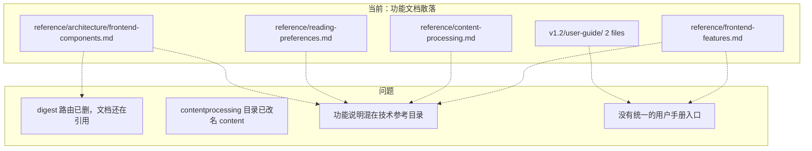
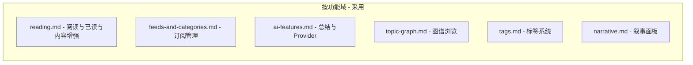

## Context

当前 docs/reference/ 下有 4 份功能说明文档，它们不属于"技术参考"范畴，更像用户手册：

| 文档 | 定位问题 |
|------|----------|
| frontend-features.md | 前端功能使用说明，不是 API 也不是架构 |
| content-processing.md | 文章处理链路说明，混合了"怎么用"和"代码在哪" |
| reading-preferences.md | 阅读偏好机制，2KB，信息密度低 |
| frontend-components.md | 组件职责分工，与 frontend.md 有重叠 |

同时 reference/architecture/ 下有 3 份文档包含过时代码路径（contentprocessing/、pages/digest/）。

现有的 milestone 目录里也有 user-guide/（v1.2），但这些是过程产物，不是统一入口。

## Goals / Non-Goals

**Goals:**
- 建立 docs/userguide/ 作为按功能域组织的用户手册入口
- 归档 reference/ 中不属于技术参考的功能文档到 docs/archive/
- 修正 architecture/ 文档中的过时代码路径
- 更新 docs/README.md 索引

**Non-Goals:**
- 不重写文档内容，userguide/ 从现有文档拆分提取，保持信息一致
- 不动 milestone 目录（v1.1/v1.2/v1.3）
- 不动 operations/、experience/、agents/
- 不动 reference/ 下的 API、database、development 等技术文档
- 不新建 features/ 目录（深度说明由 changes 承载）

## Decisions

### D1: userguide/ 按功能域而非页面拆分

**选择**：按功能域（reading、feeds、ai、topic-graph、tags、narrative）

**理由**：Topic Graph 页面横跨了图谱+标签+叙事三个功能域，按页面分会造成一个文件过于庞大，且用户通常按"我想了解 X 功能"而非"我想看 Y 页面"来查阅。

### D2: archive/ 而非删除

**选择**：移到 docs/archive/ 而非直接删除

**理由**：归档文件保留了历史信息，方便后续查阅。如果直接删除，git 历史虽然可恢复但查阅成本高。

### D3: userguide 内容来源策略

**选择**：从 frontend-features.md 按章节拆分，保持原文表述，只做重组

**理由**：frontend-features.md 内容已经比较完整，拆分比重写成本低，且信息不会在重写中丢失。content-processing.md 和 reading-preferences.md 的用户可见部分合并到对应 userguide 文件。

### D4: architecture 文档修正范围

**选择**：只修正确认过时的路径引用，不做内容重写

| 文件 | 修正项 |
|------|--------|
| frontend.md | 删 digest 路由引用，加 tags.vue，加 features/tags/ |
| frontend-components.md | 删 digest 路由引用 |
| backend.md | contentprocessing 改为 content，topicanalysis 改为 tagging/analysis，topicextraction 改为 tagging/extraction |

## Risks / Trade-offs

| 风险 | 缓解 |
|------|------|
| userguide 内容与 reference/architecture 仍有重叠 | 可接受：userguide 面向用户（怎么用），architecture 面向开发者（怎么实现），视角不同 |
| 归档文档可能被误引 | README.md 索引不再列出 archive/，降低误引概率 |
| v1.3 完成后 tags.md 和 narrative.md 需补充 | 这是预期行为，每个 milestone 结束后手动更新 userguide |
