# 语义标签板块系统 — 后端完整设计

> 包含用户故事、顺序图、类图、状态图，覆盖语义标签板块系统的后端完整设计。

---

## 白话概述：这个系统到底在做什么？

**一句话：把你的 RSS 订阅文章自动归到几个"长期话题板块"里，每个板块每天生成一份简报。**

举个例子——

你订阅了科技、国际新闻、财经几个 RSS 源。系统读每一篇文章时：
1. 从文章里抽出关键标签，比如读了篇"伊朗导弹袭击以色列"的新闻，抽取出事件标签「伊朗袭击以色列」、人物标签「内塔尼亚胡」
2. 同时给这些标签贴上"小标签"（辅助标签），比如「伊朗」「导弹袭击」「中东冲突」「地缘政治」
3. 系统积累了大量"小标签"后，自动发现「伊朗」「霍尔木兹海峡」「中东冲突」「地缘政治」这四个小标签经常一起出现，于是建议你建一个"中东局势"板块
4. 以后系统读到任何一篇文章，只要它的"小标签"跟"中东局势"板块能对上，文章就自动归入这个板块
5. 每天早晨，系统把"中东局势"板块下当天所有事件汇总成一份简报给你看

**核心思路：** 用"小标签"做中介，让文章和板块之间不再靠模糊的"相似度猜"，而是靠"小标签有没有交集"来精确判断。

---

## 术语表 —— 用人话解释每个概念

| 术语 | 英文 | 一句人话 | 打个比方 |
|---|---|---|---|
| **标签** | Tag | 从文章里抽取的关键词/事件/人物 | 你给文章加的"话题标签" |
| **辅助标签** | Auxiliary Label | 给标签再贴一层"小标签"，作为标签的语义锚点 | 就像你给"iPhone 16"贴上「苹果」「手机」「消费电子」这些小标签；系统用这些小标签判断一篇文章该归哪个板块 |
| **板块** | SemanticBoard | 一个长期存在的话题领域 | 比如"AI圈""中东局势""新能源"，这些板块不是临时的，而是一直在，每天收集当天相关新闻 |
| **每日简报** | NarrativeBoard | 每天自动生成的一份板块报道 | 每天早上，"AI圈"板块把昨天所有 AI 相关的新闻打包成一份摘要给你 |
| **板块构成** | Board Composition | 某个板块由哪些"小标签"组成 | "AI圈"板块由「AI」「大语言模型」「OpenAI」「深度学习」这些小标签构成 |
| **Embedding** | Embedding | 把文字变成一串数字，让计算机能算两个词"有多像" | 相当于给每个词一个坐标，靠得近的坐标意思相近 |
| **合并嵌入** | Merge Embedding | 只用标签名本身算的坐标 | 只比较「AI」和「人工智能」这两个词长得像不像 |
| **存储嵌入** | Storage Embedding | 用标签名 + 解释文字一起算的坐标 | 比较「AI + 人工智能技术领域」和「显卡风扇散热技术」——带解释后就能区分开，不会把完全不相关的词混到一起 |
| **聚类** | Clustering | 把一堆相似的东西自动分组 | 就像把一袋混合糖果按口味分成几堆——系统把相似的"小标签"分堆，然后问你这堆能不能变成一个新板块 |
| **回填** | Backfill | 把历史数据按最新规则重新算一遍归属 | 比如你新增了"量子计算"板块，回填就是把过去所有文章中跟量子计算相关的重新归到这个板块下 |
| **冷启动** | Cold Start | 系统刚上线、还没有板块的时候 | 刚开始用，系统还没有任何板块，需要积累一段时间数据后，由你手动触发创建第一批板块 |
| **别名** | Alias | 同一个意思的不同叫法 | 「AI」「人工智能」「Artificial Intelligence」其实是同一个东西，合并后「AI」是主名，其他都是别名 |

---

## 数据怎么流转 —— 一张图看懂

```
┌──────────────────────────────────────────────────────────────────────┐
│                        文章 → 标签 → 小标签 → 板块                     │
│                                                                      │
│  ① 文章到达                                                           │
│     │                                                                │
│     ▼                                                                │
│  ② LLM 抽取标签 + 小标签                                              │
│     ├─ 事件/人物标签 ──→ 自动附带 3-5 个小标签（如"伊朗袭击以色列"      │
│     │                      ──→「伊朗」「导弹袭击」「中东冲突」）         │
│     └─ 关键词标签 ──→ 自己直接做小标签（如"Claude Code" 就是它自身）    │
│     │                                                                │
│     ▼                                                                │
│  ③ 小标签入库（去重合并）                                             │
│     ├─ L1: 别名一模一样？→ 直接用已有                                  │
│     ├─ L2: 意思几乎一样？(相似≥95%) → 合并为一个                       │
│     └─ L3: 全新的 → 新建                                             │
│     │                                                                │
│     ▼                                                                │
│  ④ 标签匹配板块                                                       │
│     标签的"小标签" ──交集──→ 板块的"构成标签"                          │
│     有交集 → 挂载到该板块                                              │
│     没交集 → 暂时无归属                                                │
│     │                                                                │
│     ▼                                                                │
│  ⑤ 每日简报生成                                                       │
│     每个板块下当天的事件标签 → LLM 写摘要 → 生成每日简报                │
│                                                                      │
│  ★ 板块升级（手动触发）                                               │
│     高频小标签 → 聚类分堆 → LLM 建议 → 你确认 → 变成新板块             │
└──────────────────────────────────────────────────────────────────────┘
```

---

## 用户故事

### US-1：读文章自动打小标签
> **我是** 一个 RSS 阅读用户  
> **我想** 系统读完每篇文章后，不仅抽出事件/人物标签，还自动给这些标签贴上 3-5 个"小标签"  
> **这样我** 就不用自己去想这篇文章该归到哪个板块了，系统靠小标签就能自动判断

**怎么算完成：**
- 读到"伊朗袭击以色列"这篇文章，LLM 抽取出事件标签的同时，附带上「伊朗」「导弹袭击」「中东」这些小标签，每个小标签还带一句简短解释
- 读到包含"Claude Code"的文章，这个关键词本身直接当小标签用，不再绕一圈去生成额外小标签
- 小标签的解释不能为空、不超过 500 字、不能只是重复标签名（比如「伊朗」的解释不能只是"伊朗"）

---

### US-2：差不多的小标签自动合并
> **我是** 一个 RSS 阅读用户  
> **我想** 系统能自动把意思相同的小标签合并起来（比如「AI」「人工智能」「artificial intelligence」）  
> **这样我** 的标签池不会越来越臃肿，同样的意思不会出现好几个版本

**怎么算完成：**
- 名字完全一样或别名命中 → 直接用已有的，零成本
- 用"仅标签名"算出来的相似度 ≥ 95% → 自动合并，热度低的那一方变成另一方的别名
- 全新的小标签 → 正常新建
- 合并时永远保留用得更多的那个作为主名

---

### US-3：标签自动归到对应板块
> **我是** 一个 RSS 阅读用户  
> **我想** 每篇文章的标签能自动判断属于哪个话题板块  
> **这样我** 就不用手动分类了，文章自动出现在对应的板块里

**怎么算完成：**
- 判断方法不看"标签和板块名字像不像"，而是看"标签的小标签跟板块的构成标签有没有交集"
- 一个标签可以同时属于多个板块（比如"霍尔木兹海峡"既属于"中东局势"也属于"能源安全"），最多 3 个
- 匹配结果存下来，方便后续查看和回溯

---

### US-4：高频小标签升级为新板块
> **我是** 一个 RSS 阅读用户  
> **我想** 当某个话题反复出现时，系统能提醒我是否要把它立为一个新板块  
> **这样我** 不会漏掉新冒出来的热门话题，板块库能自然生长

**怎么算完成：**
- 某个小标签出现了 5 次以上，系统把它放进"升级候选池"
- 我点击"生成建议"后，系统先把候选标签按相似度分堆，然后问 LLM "这堆能不能叫一个板块？"
- LLM 返回建议，我逐条确认或拒绝
- 确认后会创建新板块，并自动把构成的小标签关联上

---

### US-5：手动调整板块的构成标签
> **我是** 一个 RSS 阅读用户  
> **我想** 能手动往板块里加小标签、或把不合适的小标签移除  
> **这样我** 能纠正 LLM 有时候判断不太对的地方，精确控制板块的覆盖范围

**怎么算完成：**
- 创建/编辑板块时，系统根据相似度推荐一批候选小标签
- 我可以通过搜索找到特定小标签并勾选添加
- 添加/移除后系统不会自动重算历史归属，而是提醒我"要不要手动回填一下"

---

### US-6：每天早上自动生成每日简报
> **我是** 一个 RSS 阅读用户  
> **我想** 每天早上系统自动按板块把昨天的事件汇成简报  
> **这样我** 不用一篇文章一篇文章看，每个话题板块一眼就能知道昨天发生了什么

**怎么算完成：**
- 每个板块（按分类范围或全局范围）收集昨天归属于它的所有事件标签
- 一篇文章如果属于多个板块，可以同时出现在多份简报里
- 简报能跟前一天的同一板块简报接续（形成连续叙事）
- 简报的内容上下文用的是板块自身的名称和描述

---

### US-7：改规则后重新算一遍归属
> **我是** 一个 RSS 阅读用户  
> **我想** 改了板块构成或者匹配参数后，能一键把历史标签的归属重新算一遍  
> **这样我** 调整规则后，历史数据也能同步更新，不会新旧混在一起

**怎么算完成：**
- 三种回填模式：全部重算 / 只算没归属的 / 只算某个板块的
- 后台异步执行，能看进度
- 重复跑不会出问题（幂等）

---

### US-8：清理低质量的小标签
> **我是** 一个 RSS 阅读用户  
> **我想** 能把不好用的小标签禁用掉、把分散的别名合并、把不相关的从板块里移除  
> **这样我** 长期维护下标签池不会变成垃圾堆

**怎么算完成：**
- 禁用后的小标签不再参与板块匹配和升级候选
- 手动合并别名时，原来关联的标签自动迁移到目标
- 修复操作不会自动删历史数据，需要时我再手动回填

---

## 顺序图

### 1. 文章标签提取 & 小标签入库

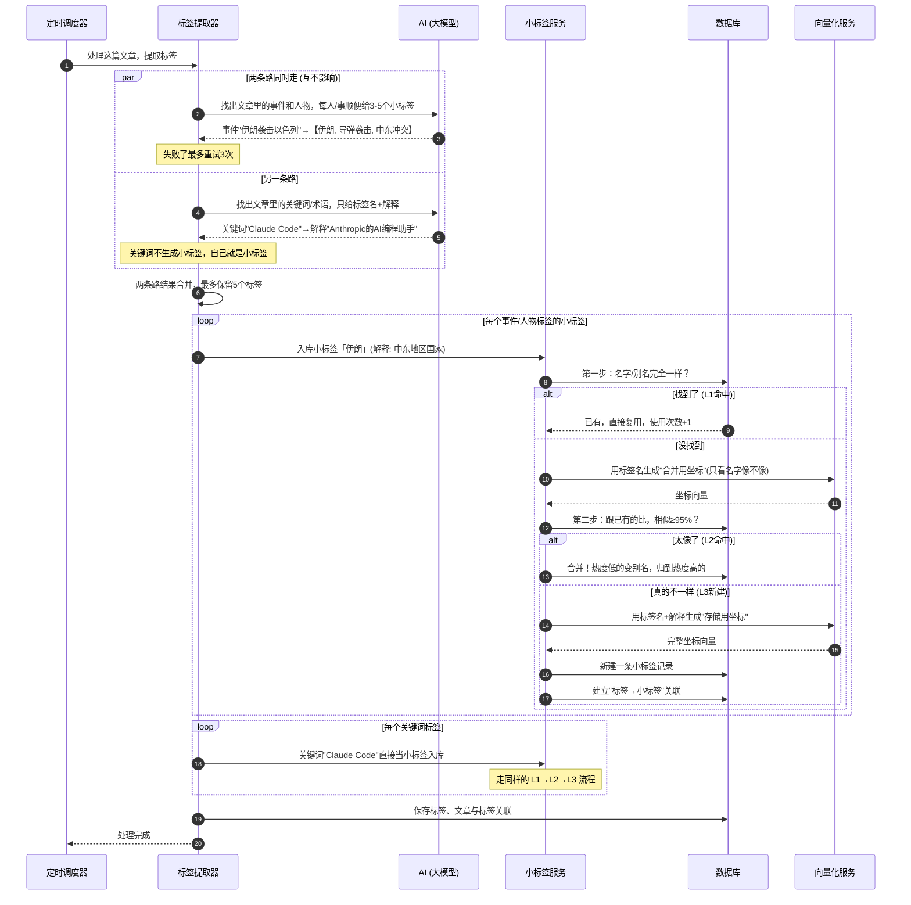

---

### 2. 标签匹配板块

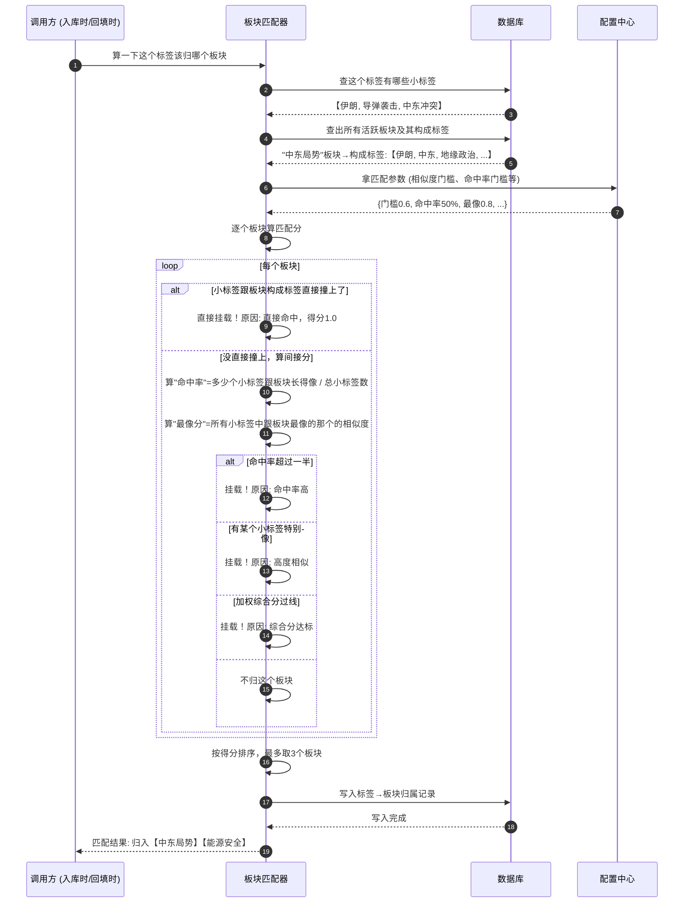

---

### 3. 板块升级建议 & 确认

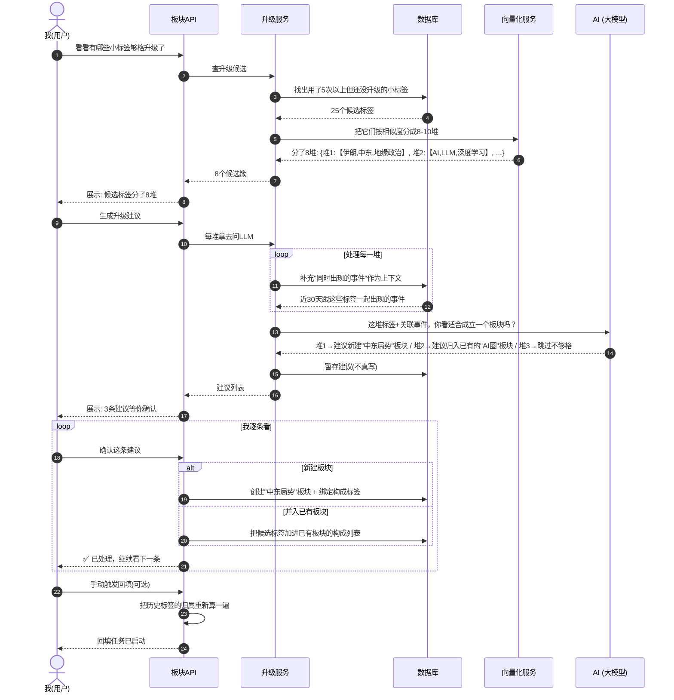

---

### 4. 回填流程

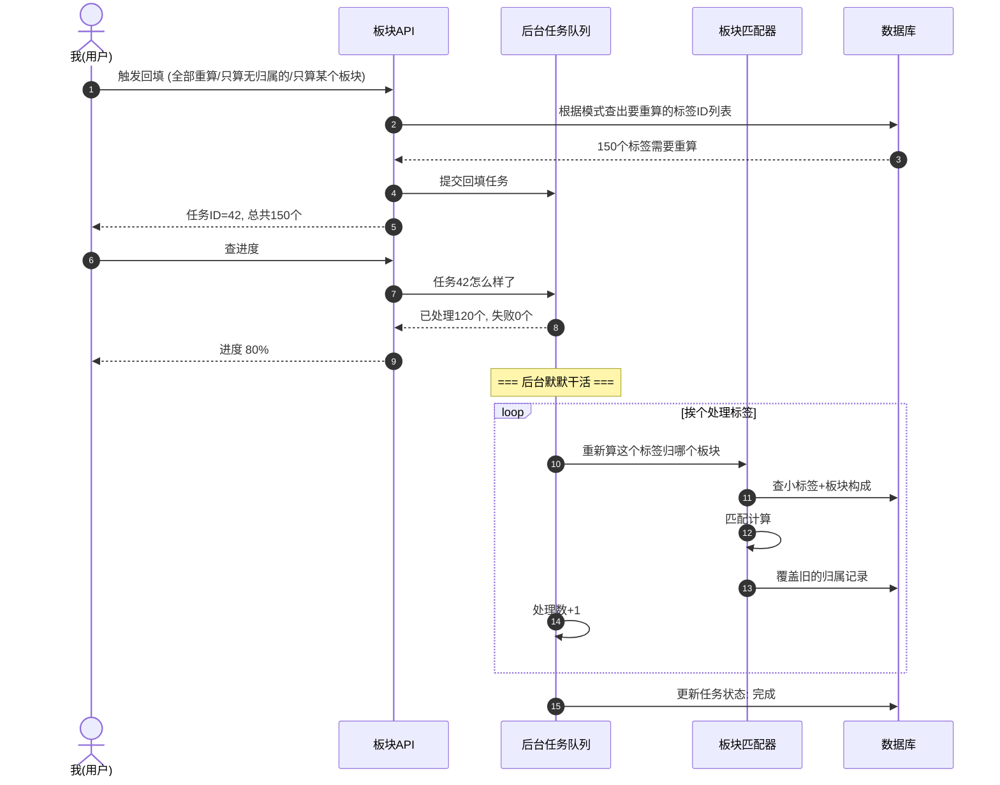

---

### 5. 每日简报生成

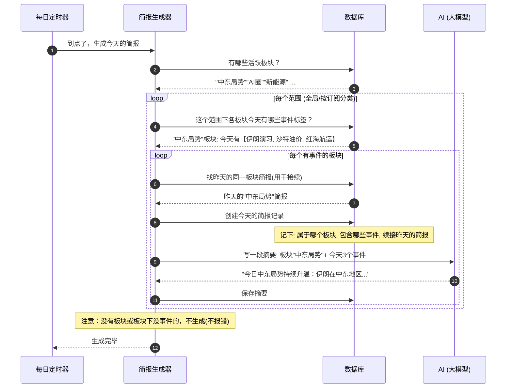

---

## 类图 — 数据模型（表结构）

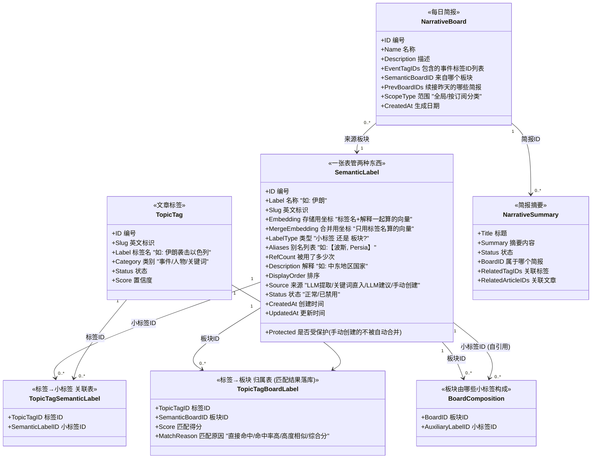

---

## 类图 — 核心服务

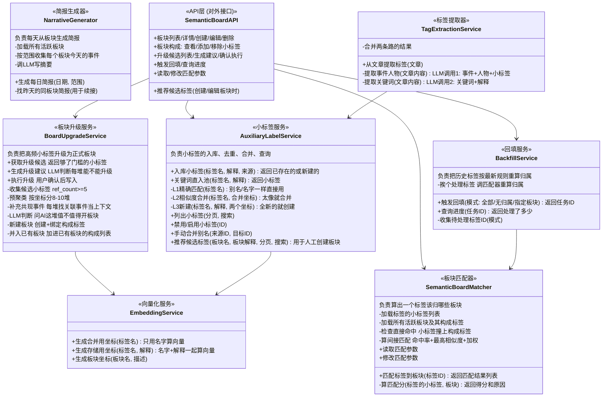

---

## 状态图

### 1. 小标签的一生

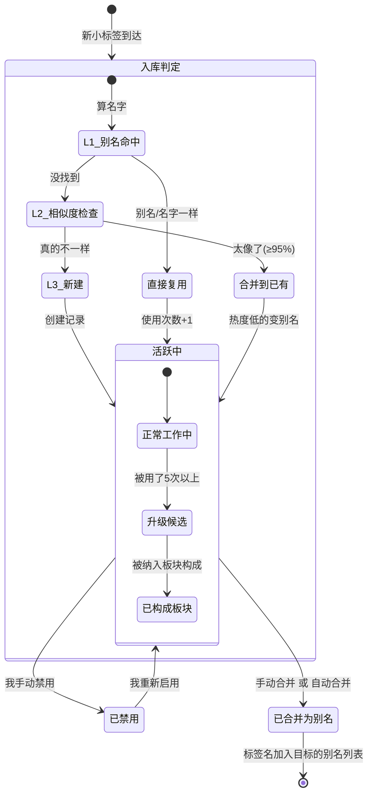

---

### 2. 标签提取任务状态

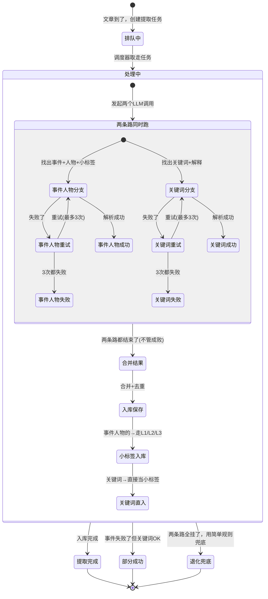

---

### 3. 板块升级流程

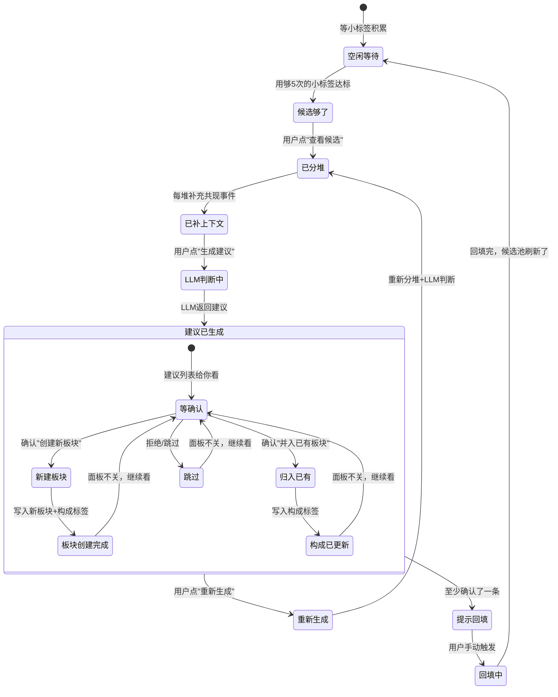

---

### 4. 回填任务状态

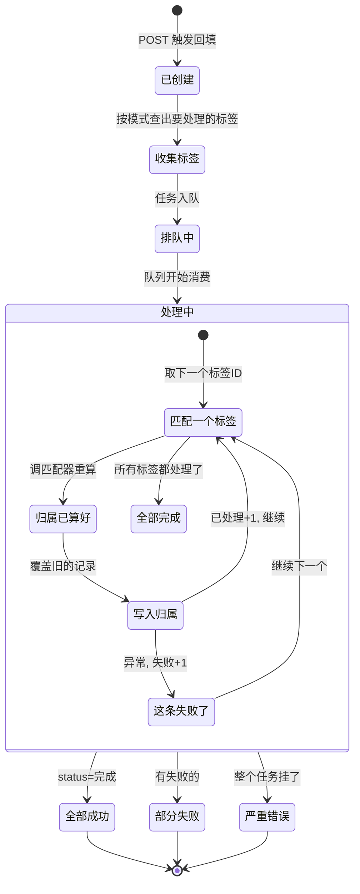

---

### 5. SemanticLabel 状态切换

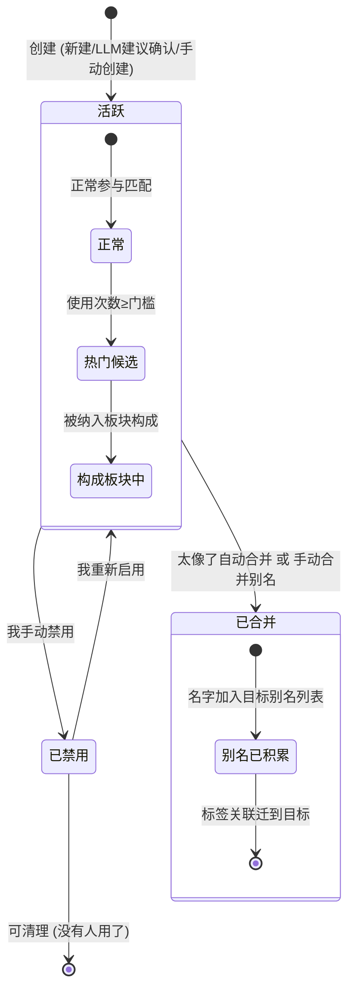

---

## 完整 ER 图

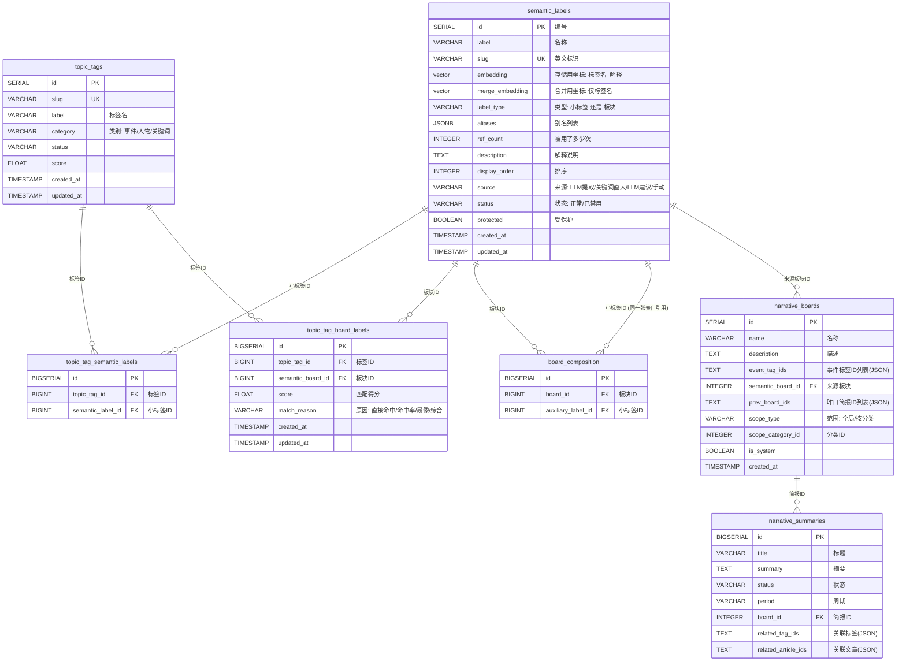

---

## 匹配算法 —— 用人话翻译

```
给一个标签 T，它有 n 个小标签，比如: 【伊朗, 导弹, 中东】
给一个板块 B，它有 m 个构成标签，比如: 【伊朗, 中东, 地缘政治, 霍尔木兹】

第一步：直接看有没有撞上的
  标签的小标签 = {伊朗, 导弹, 中东}
  板块的构成   = {伊朗, 中东, 地缘政治, 霍尔木兹}
  交集 = {伊朗, 中东} ← 直接撞上了！
  → 直接归入这个板块，原因: "直接命中"

第二步：如果没直接撞上，算"命中率"和"最像分"
  命中率 = 小标签里有多少个跟板块"长得像" / 总小标签数
  （"长得像" = 用存储坐标算余弦相似度 ≥ 0.6）
  最像分 = 所有小标签中跟板块最像的那个的相似度

第三步：三级判断
  规则1: 命中率 > 50% → 归入（大多数小标签都跟板块相关）
  规则2: 有某个小标签特别像板块 (≥0.8) → 归入（至少有一个强关联信号）
  规则3: 加权分 = 0.6×最像分 + 0.4×命中率 ≥ 门槛 → 归入
  三条都不满足 → 不归这个板块

最后：一个标签可能同时满足好几个板块的条件
  → 按得分从高到低排，最多取3个板块
```

---

## 核心配置参数

| 参数名 | 默认值 | 干啥用的 |
|---|---|---|
| `semantic_board_match_sim_threshold` | 0.6 | 小标签跟板块"多像"才算命中（计入命中率的最低门槛） |
| `semantic_board_match_direct_hit_rate` | 0.5 | 命中率超多少直接挂载 |
| `semantic_board_match_direct_max_sim` | 0.8 | 最像分超多少直接挂载 |
| `semantic_board_match_weight_sim` | 0.6 | 加权分里"最像"的权重 |
| `semantic_board_match_weight_density` | 0.4 | 加权分里"命中率"的权重 |
| `semantic_board_match_weighted_threshold` | 0.5 | 加权分门槛 |
| `semantic_board_match_max_boards` | 3 | 一个标签最多归几个板块 |
| `semantic_board_upgrade_ref_count_threshold` | 5 | 小标签被用了几次后才够格升级 |
| `semantic_board_merge_threshold` | 0.95 | L2自动合并的相似度门槛 |
| `semantic_board_cluster_distance` | 0.7 | 升级时分堆的距离门槛 |
| `semantic_board_cluster_max` | 10 | 升级时最多分几堆 |
| `semantic_board_cotag_window_days` | 30 | 升级时找共现事件看多少天内的 |
| `semantic_board_cotag_top_n` | 20 | 升级时最多取几个共现事件 |
| `semantic_board_cotag_dedup_threshold` | 0.85 | 共现事件去重的相似度门槛 |
| `semantic_board_cotag_hard_limit` | 15 | 每堆最多塞几个共现事件 |

---

## API 接口汇总

| 方法 | 路径 | 干啥的 |
|---|---|---|
| `GET` | `/api/semantic-boards` | 列出所有板块 |
| `GET` | `/api/semantic-boards/:id` | 看某个板块详情 |
| `POST` | `/api/semantic-boards` | 手动创建板块 |
| `PUT` | `/api/semantic-boards/:id` | 编辑板块 |
| `DELETE` | `/api/semantic-boards/:id` | 删板块 |
| `GET` | `/api/semantic-boards/:id/composition` | 看板块由哪些小标签构成 |
| `POST` | `/api/semantic-boards/:id/composition` | 往板块加小标签 |
| `DELETE` | `/api/semantic-boards/:id/composition/:labelId` | 从板块移除小标签 |
| `GET` | `/api/semantic-boards/suggest-auxiliaries` | 推荐候选小标签（创建板块时用） |
| `GET` | `/api/semantic-boards/:id/suggest-auxiliaries` | 推荐候选小标签（编辑已有板块时用） |
| `GET` | `/api/semantic-boards/upgrade-candidates` | 看哪些小标签够格升级了 |
| `POST` | `/api/semantic-boards/upgrade-suggest` | 让 LLM 生成升级建议 |
| `POST` | `/api/semantic-boards/upgrade-execute` | 确认执行某条升级建议 |
| `POST` | `/api/semantic-boards/backfill` | 触发回填重算归属 |
| `GET` | `/api/semantic-boards/backfill/:taskId` | 查回填进度 |
| `GET` | `/api/semantic-boards/matching-config` | 看匹配参数 |
| `PUT` | `/api/semantic-boards/matching-config` | 改匹配参数 |
| `GET` | `/api/auxiliary-labels` | 看所有小标签 |
| `PUT` | `/api/auxiliary-labels/:id/disable` | 禁用某小标签 |
| `PUT` | `/api/auxiliary-labels/:id/enable` | 启用某小标签 |
| `POST` | `/api/auxiliary-labels/merge-alias` | 手动合并别名 |
| `GET` | `/api/tags/:id/auxiliary-labels` | 看某个标签有哪些小标签 |
| `GET` | `/api/tags/:id/semantic-boards` | 看某个标签归了哪些板块 |
